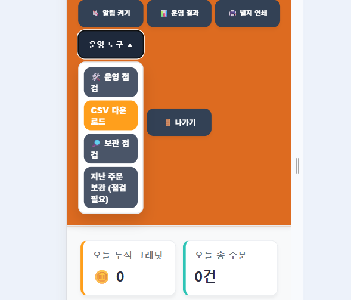
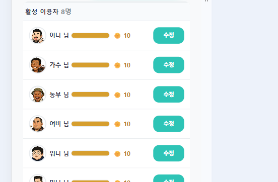
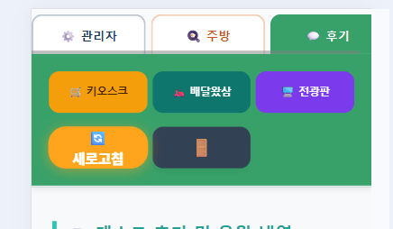
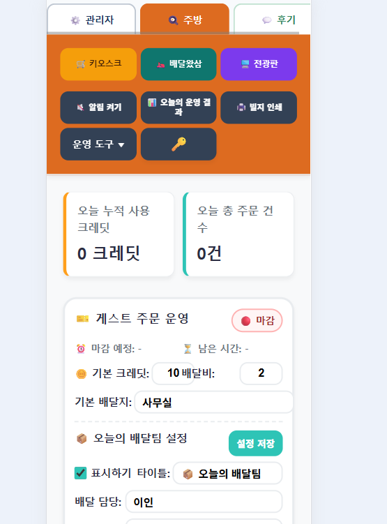

# 관리자 운영 설명서

이 문서는 `삼각지 카페 키오스크 & 배달왔삼`의 관리자, 주방, 후기 관리자가 실제 운영에 사용하는 절차를 설명합니다.

## 1. 운영 화면 구분

관리자 화면은 상단 탭으로 이동합니다.

| 탭 | 주 용도 |
| --- | --- |
| `⚙ 관리자` | 이용자, 간식, 간식 순서, 배달왔삼 이용 신청 관리 |
| `🔍 주방` | 주문 확인, 제공 완료, 통계, 재고, 운영 상태 |
| `💬 후기` | 후기 공개 여부, 답글, 사진 후기 검수 |

공통 이동 버튼은 다음과 같습니다.

- `🛒 키오스크`: 일반 키오스크 화면
- `🛵 배달왔삼`: 배달왔삼 주문 화면
- `🖥 전광판`: 준비·제공 완료 주문 표시 화면
- `🔄 새로고침`: 현재 화면의 최신 데이터를 다시 읽음
- `🚪 나가기`: 관리자 인증을 종료하고 로그인 게이트로 돌아감

## 2. 로그인과 잠금

1. 관리자, 주방 또는 후기 주소로 접속합니다.
2. 관리자 키를 입력하고 `잠금 해제`를 누릅니다.
3. 인증되면 해당 화면의 이용자·주문·후기 정보가 표시됩니다.
4. 자리를 비울 때는 상단의 `🚪 나가기`를 눌러 인증을 종료합니다.

관리자 키는 GitHub나 프론트엔드 파일에 저장하지 않습니다. GAS 스크립트 속성의 `ADMIN_TOKEN`과 일치해야 하며, 키를 잊었을 때는 코드를 수정하지 말고 GAS 스크립트 속성을 확인합니다.

> 화면에 데이터가 보이기 전에는 키오스크·주방·후기 정보를 표시하지 않는 것이 정상입니다.

## 3. 관리자 화면

### 3.1 이용자 관리

경로: `⚙ 관리자 → 이용자`

- 이용자별 현재 크레딧과 게이지를 확인합니다.
- `수정`을 누른 뒤 게이지를 조정합니다.
- 조정이 끝나면 `확인`을 눌러 저장합니다.
- 모바일에서는 이용자 이름, 크레딧 게이지, 수정 버튼이 한 줄에 표시됩니다.
- 이용자 크레딧은 `0~15` 범위입니다.
- 이용자를 숨기거나 신규 등록할 때는 운영 대상과 사진·닉네임을 다시 확인합니다.

### 3.2 간식 관리

경로: `⚙ 관리자 → 간식`

- 간식명, 사진, 가격, 판매 여부, 재고와 숨김 상태를 확인합니다.
- `수정`을 눌러 편집 모드로 들어갑니다.
- 게이지를 좌우로 조정한 뒤 `확인`을 눌러 재고를 저장합니다.
- 재고는 `0~30` 범위입니다.
- 재고가 `0`이면 품절 상태로 취급합니다.
- `숨김`은 판매 목록에 표시하지 않는 기능이며 재고를 삭제하지 않습니다.
- 가격이나 판매 대상을 변경할 때는 현재 운영일 주문에 영향을 주는지 확인합니다.

### 3.3 간식 순서

경로: `⚙ 관리자 → 간식 순서`

- 목록은 일반 키오스크에 표시되는 순서입니다.
- 위·아래 버튼 또는 모바일 조작 영역으로 위치를 변경합니다.
- 변경 후 저장 또는 확인 메시지가 표시되는지 확인합니다.
- 실제 주문 화면에서 순서가 바뀌었는지 한 번 확인합니다.

## 4. 주방 화면

### 4.1 운영 시작 전

1. `🔍 주방` 탭으로 이동합니다.
2. 관리자 인증을 해제합니다.
3. 운영 상태와 마감 예정 시간을 확인합니다.
4. `20분`, `30분`, `1시간` 중 필요한 운영 시간을 선택하거나 직접 입력합니다.
5. 주문을 받을 준비가 되면 운영 상태가 `운영중`인지 확인합니다.

### 4.2 주문 처리

- `주문` 탭에서 대기 주문을 확인합니다.
- 주문은 일반 키오스크, 배달왔삼 포장, 배달왔삼 배달 흐름으로 구분됩니다.
- 주문자 표시명, 간식명, 수량, 포장·배달 여부를 확인합니다.
- 준비가 끝나면 해당 주문을 제공 완료 처리합니다.
- 여러 주문을 한 번에 처리할 때는 같은 주문인지 확인한 뒤 일괄 처리합니다.
- 배달 주문은 배달지와 전달 방법을 반드시 확인합니다.

### 4.3 통계와 재고

- `통계` 탭에서 오늘 주문 건수와 사용 크레딧을 확인합니다.
- `재고` 탭에서 일반 키오스크와 배달왔삼 재고를 구분해 확인합니다.
- 재고 `0`은 품절이며, 낮은 재고는 주방에서 우선 보충하거나 판매 상태를 확인합니다.

### 4.4 운영 마감

1. 새 주문 접수를 멈출 시간이 되면 `지금 마감`을 누릅니다.
2. 이미 접수된 주문은 주문 상태와 운영 방침에 따라 끝까지 처리합니다.
3. 대기 주문과 제공 완료 목록을 확인합니다.
4. 필요한 경우 `빌지 인쇄`와 `주문보관`을 실행합니다.
5. 운영 결과에서 오늘 주문 수와 사용 크레딧을 기록합니다.

## 5. 후기 관리

경로: `💬 후기`

- 공개 후기와 비공개 후기를 구분해 확인합니다.
- 사진이 포함된 후기는 사진 노출 여부를 확인합니다.
- 부적절한 후기에는 공개하지 않거나 답글을 남깁니다.
- 답글 저장 후 후기 화면에 실제로 표시되는지 확인합니다.
- 후기 화면은 계속 목록을 불러올 수 있으므로, 장시간 사용할 때는 필요한 범위까지만 확인합니다.

## 6. 배달왔삼 이용 신청 관리

경로: `⚙ 관리자 → 신청`

- 대기 신청을 먼저 확인합니다.
- 상세 화면에서 이름, 관계, 연락처, 배달 장소와 희망 요일을 확인합니다.
- 처리 결과에 따라 `승인`, `반려`, `이용 중지`를 선택합니다.
- 기관 담당자가 전화나 문자로 안내한 뒤 `연락 완료`를 기록합니다.
- 관리자 메모에는 운영에 필요한 내용만 적고 불필요한 개인정보는 남기지 않습니다.
- 기본 시범 정원은 5명이며 신청 운영 설정에서 1~100명으로 조절할 수 있습니다.
- `대기 + 승인` 신청이 정원을 차지합니다. 반려·중지 신청은 정원에서 제외됩니다.
- 신청자 상태 조회 페이지나 자동 문자 발송은 현재 제공하지 않으므로, 결과는 기관 담당자가 직접 연락합니다.

### 개인정보 정리

1. 만료 대상 신청을 점검합니다.
2. 관리자가 정리 대상과 날짜를 확인합니다.
3. 확인 문구 `신청정보정리`를 정확히 입력합니다.
4. 익명화 후에는 신청번호, 상태, 처리 시각만 남습니다.

연락처와 배달 장소는 주문내역, 주방, 전광판, 빌지와 공유하지 않습니다.

## 7. 주문 보관과 빌지

- `빌지 인쇄`는 현재 주문의 출력과 배송 체크리스트에 사용합니다.
- `주문보관`은 오래된 주문을 운영 아카이브 시트로 옮겨 현재 주문내역을 정리하는 기능입니다.
- 보관 전에는 백업과 보관 점검을 먼저 실행합니다.
- 같은 주문번호가 이미 보관되어 있지 않은지 확인합니다.
- 보관 후 주문내역에서 과거 주문이 제거되었는지, 주문보관에 동일 주문이 한 번만 있는지 확인합니다.
- 주문보관은 운영 데이터 정리 기능이므로, 삭제 전 백업을 남기는 것을 원칙으로 합니다.

## 8. 일일 운영 체크리스트

### 시작 전

- [ ] 관리자·주방 인증 확인
- [ ] 이용자 크레딧과 간식 재고 확인
- [ ] 숨김 간식과 품절 간식 확인
- [ ] 배달왔삼 운영 시간·배달지·배달팀 확인
- [ ] 전광판과 빌지 인쇄 화면 확인

### 운영 중

- [ ] 대기 주문과 제공 완료 상태 확인
- [ ] 배달 주문의 배달지 확인
- [ ] 재고 부족·품절 확인
- [ ] 취소 주문과 후기 공개 상태 확인

### 마감 후

- [ ] 신규 주문 마감
- [ ] 남은 주문 처리
- [ ] 오늘 운영 결과 기록
- [ ] 필요한 경우 빌지·주문 보관 실행
- [ ] 관리자 화면에서 `🚪 나가기`

## 9. 문제 발생 시 확인 순서

1. 화면을 새로고침합니다.
2. 관리자 키가 만료되었거나 잘못 입력되지 않았는지 확인합니다.
3. GAS 웹앱이 최신 배포 버전인지 확인합니다.
4. Google Sheets의 시트명과 1행 헤더를 확인합니다.
5. 주문·재고·크레딧 문제는 중복 클릭을 반복하지 말고 주문내역과 관리자 로그를 먼저 확인합니다.
6. 문제가 계속되면 [handoff.md](../handoff.md)와 [검증 문서](handoff/verification.md)를 확인한 뒤 재현 시각과 화면을 기록합니다.

개발자가 수정할 때는 [README.md](../README.md), [architecture.md](handoff/architecture.md), [database-schema.md](handoff/database-schema.md)를 함께 확인합니다.

> 이 문서는 현재 운영 구조를 기준으로 작성되었습니다. 화면 버튼이나 운영 정책이 바뀌면 해당 변경과 같은 작업에서 이 문서도 함께 갱신합니다.
