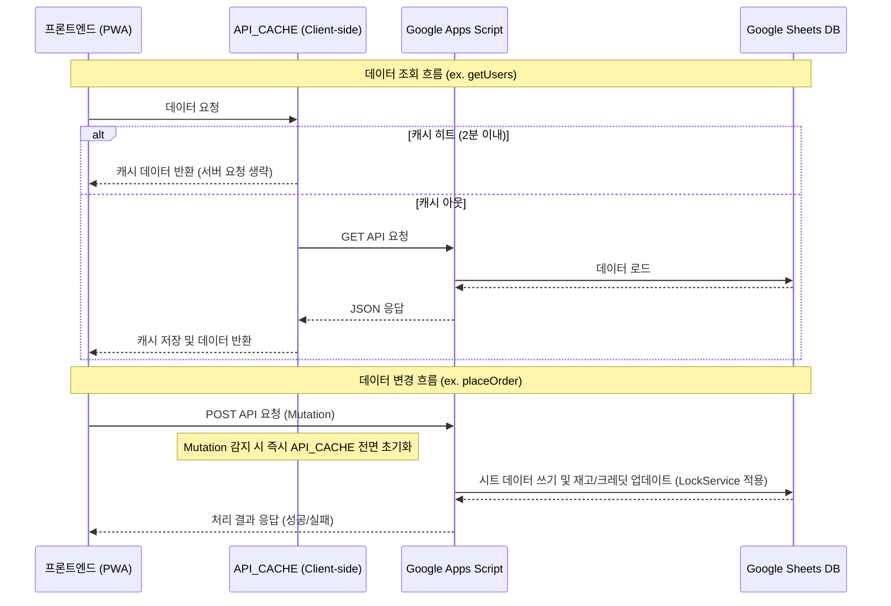

# Kiosk Project Handoff Document (For AI Agents)

This document is compiled for AI agents (like Antigravity) to easily grasp the project context, technical architecture, recent updates, and continue working on this repository seamlessly across different environments.

---

## 0. Active Issues Quick Start

### Active Issues
* **Critical Issues**: None. There are no currently reproducible critical bugs or pending security failures.

### Monitoring
1. **구글 시트 API 연결 안정성 및 폴링 부하 모니터링**
   - **현황**: API 지연(콜드 스타트 20초 대응) 및 동시 실행 제한 우회를 위해 client-side `API_CACHE` (getUsers 2분 캐시) 및 순차 대기형(`setTimeout` 재귀) 폴링을 적용함.
   - **관찰사항**: 실제 다수 기기 운영 환경에서 구글 계정 동시 실행 한도 초과(HTTP 429/503)나 락 획득 대기 시간 초과 에러가 재발하지 않는지 모니터링 필요.

### Analysis Queue
1. **P1 - Apps Script 성능 점검**
   - Google Sheets 읽기/쓰기 호출 최적화 가능성, 반복 조회, CacheService 적용 후보, 주문 처리 병목을 분석한다.
   - 구현 전 분석과 우선순위 제안이 목적이다.
   - **권장 방향**: 바로 최적화 코드를 넣지 말고, 성능 감사와 안전한 후보 선별부터 진행한다.
   - **안전한 진행 로드맵**
     1. 함수별 시트 호출 지도를 만든다: `placeOrder`, `getGuestSettings`, `getGuestCreditStatus`, `resolveGuestCreditWallet`, `getSnacks`, `getUsers`, `getOrdersToday`, `getGuestOrderByToken`, `getReviewsForAdmin`, `archiveOldOrders`를 우선 확인한다.
     2. 각 함수별로 읽는 시트, 쓰는 시트, `getValue/getValues/setValue/setValues/appendRow` 사용, 락 사용 여부, 실시간성 필요 여부, 캐시 가능 여부를 표로 정리한다.
     3. 위험도를 나눈다: 운영설정/간식목록/이용자목록/후기 목록 같은 조회는 저위험, 오늘 주문/게스트 주문/운영 결과 집계는 중위험, `placeOrder`/재고 차감/게스트 크레딧 차감·환불/주문 취소/주문 보관은 고위험으로 본다.
     4. 저위험 후보부터 검토한다: `getGuestSettings()` 짧은 캐시(30~60초)와 설정 변경 시 캐시 무효화, 같은 요청 안의 반복 조회 제거, `getValues()` 1회 읽기 후 메모리 필터링, 여러 셀 쓰기 묶기.
     5. `placeOrder`는 별도 설계로 다룬다: 주문 생성 중 설정 조회 횟수, 주문내역 전체 조회 필요성, 간식 재고 확인/차감의 락 일관성, 게스트 크레딧 계산과 주문 행 작성 사이 실패 가능성, 주문 행 일괄 쓰기 가능성을 검토한다.
     6. 적용 순서는 분석표 작성 → 캐시 금지 데이터 명시 → 저위험 조회 함수 개선 후보화 → 후기/통계 조회 최적화 → `placeOrder` 별도 설계 → 복사본 또는 낮은 운영 시간 검증 → GAS 새 배포 순으로 진행한다.
   - **금지선**: 주문내역, 크레딧, 재고를 긴 TTL로 캐시하지 않는다. 성능 이유만으로 `placeOrder`를 크게 리팩터링하지 않는다. 락 범위를 줄이기 전에 동시 주문 시나리오를 먼저 검토한다. 운영 시트 컬럼을 성능 개선 명목으로 재배열하지 않는다.
   - **1단계 호출 지도 결과 (완료)**
     | 함수 | 시트 접근/쓰기 요약 | 위험도/메모 |
     | --- | --- | --- |
     | `getUsers` | `이용자목록` 전체를 `getValues()` 1회 읽음. 쓰기/락 없음. | 저위험. 화면 표시용 짧은 캐시 후보이나 관리자 크레딧 변경 직후 반영성은 주의. |
     | `getSnacks` | `간식목록` 전체를 `getValues()` 1회 읽음. 쓰기/락 없음. | 저~중위험. 메뉴 표시 캐시는 가능하지만 재고 표시는 stale 가능. 주문 시 `placeOrder`가 재고를 재검증해야 함. |
     | `getGuestSettings` | `운영설정` 전체를 `getValues()` 1회 읽고, 누락 기본값이 있으면 `appendRow()`/`upsertSettingValue()`로 쓸 수 있음. | 저위험처럼 보이나 순수 조회가 아님. 캐시 전 기본값 보정/설정 저장 시 무효화 정책 필요. |
     | `resolveGuestCreditWallet` | `게스트크레딧` 전체를 `getValues()` 1회 읽고, 사용/환불/병합 시 `setValues()`/`appendRow()`/`deleteRow()` 수행. | 고위험. 지갑 데이터는 캐시 금지. 크레딧 정확성과 중복 병합 우선. |
     | `getGuestCreditStatus` | `resolveGuestCreditWallet(create:false)` 래퍼. 결과적으로 `운영설정`과 `게스트크레딧`을 읽을 수 있음. | 중~고위험. 시작 화면 체감에 영향은 있지만 지갑 캐시는 금지. 설정 캐시만 별도 후보. |
     | `placeOrder` | 락 사용. `간식목록`, `주문내역`, 게스트 설정/크레딧, 일반 이용자 크레딧을 함께 읽고 주문 행/재고/크레딧을 씀. 상품 수만큼 `appendRow()`와 재고 `setValue()` 반복. | 최고위험/최우선 분석 대상. 속도보다 재고·크레딧·중복 주문 일관성이 우선. |
     | `getOrdersToday` | `ensureOrderHeaders()` 후 `주문내역` 전체를 `getValues()` 1회 읽고 오늘 주문만 메모리 필터링. | 중위험. 주방/전광판 폴링 체감에 영향. 주문 데이터라 긴 캐시는 부적절. |
     | `getGuestOrderByToken` | `ensureOrderHeaders()` 후 `주문내역` 전체를 `getValues()` 1회 읽고 토큰 매칭. | 중위험. 토큰 수는 작지만 주문 행이 늘면 전체 스캔 비용 증가. |
     | `getReviewsForAdmin` | `후기내역` 전체를 `getValues()` 1회 읽고 최신순 변환. | 저위험. 짧은 캐시나 프론트 캐시 후보. 답글/공개상태 변경 시 무효화 필요. |
     | `archiveOldOrders` | 락 사용. `주문내역` 전체 읽기 1회, `주문보관` 일괄 `setValues()`, `주문내역` `clearContent()` 후 일괄 `setValues()`. | 고위험이지만 저빈도. 이미 bulk 처리라 성능보다 백업/검증/낮은 운영 시간 실행이 중요. |
   - **1단계 관찰**: Apps Script `CacheService`는 현재 사용되지 않는다. 반복 호출이 잦은 조회 함수는 대부분 `getValues()` 1회 구조라 기본 형태는 나쁘지 않지만, `ensureOrderHeaders()`가 조회 API마다 붙어 헤더 검사 비용이 반복되고, `placeOrder`는 주문시트 전체 읽기와 상품별 쓰기가 겹쳐 가장 큰 병목 후보이다.
   - **2단계 개선 후보 선별 결과 (완료)**
     1. **1순위 후보 - 주문 조회 API의 반복 헤더 보정 비용 줄이기**
        - 대상: `getOrdersToday`, `getOrderStatus`, `getGuestOrdersToday`, `getGuestOrderByToken`, `getGuestOrdersByGuestKey`.
        - 이유: 이 함수들은 읽기 API인데 `ensureOrderHeaders()`가 먼저 실행되어 주문 시트 전체 헤더 확인/보정 흐름이 반복된다. 이후 각 함수가 다시 `getDataRange().getValues()`를 호출하므로, 정상 운영 시에도 중복 읽기 비용이 생긴다.
        - 호출 빈도: `board.html`은 `getOrdersToday`를 10초마다, `kitchen.html`은 `getOrdersToday`를 30초마다, `complete.html`은 `getOrderStatus`를 5초마다 호출한다. 일반 키오스크 취소 알림도 `getOrdersToday`를 반복 확인한다.
        - 안전한 방향: 읽기 API에서 무조건 헤더 보정을 실행하지 말고, 쓰기/관리/진단 경로에서만 보정하거나, 헤더가 이미 정상이라는 전제하에 읽기 전용 헤더 해석 헬퍼를 따로 둔다. 단, 실제 운영 시트가 정상이라는 진단 결과를 먼저 확인하고 적용한다.
     2. **2순위 후보 - `getGuestSettings()`의 짧은 캐시 또는 요청 내 재사용**
        - 대상: `getGuestSettings`, `getGuestCreditStatus`, `placeOrder`, 게스트/주방/관리자 설정 로딩.
        - 이유: 운영설정은 자주 읽히고 상대적으로 작지만, 현재 함수가 누락 기본값을 자동으로 쓰는 부작용을 가질 수 있다.
        - 안전한 방향: 먼저 기본값 보정이 끝난 운영 시트를 기준으로 `getGuestSettings()`를 순수 조회에 가깝게 만들 수 있는지 확인한다. 캐시를 적용한다면 15~60초 짧은 TTL만 사용하고, `updateGuestSettings()`에서 반드시 캐시를 무효화한다.
     3. **3순위 후보 - `getOrdersToday` 계열의 매우 짧은 서버 캐시 검토**
        - 대상: 전광판/주방/일반 키오스크가 반복 조회하는 오늘 주문 목록.
        - 이유: 여러 화면이 동시에 같은 주문 데이터를 읽으면 Google Sheets 전체 스캔이 겹칠 수 있다.
        - 안전한 방향: 주문 상태 반영성이 중요하므로 긴 캐시는 금지한다. 검토하더라도 2~5초 이하의 초단기 캐시 또는 프론트 호출 간격 조정만 후보로 둔다. 주문 생성/취소/제공 처리 직후에는 stale 데이터가 보일 수 있음을 반드시 수용 가능한지 확인해야 한다.
     4. **보류 후보 - `placeOrder` 쓰기 최적화**
        - 대상: 상품 수만큼 반복되는 `appendRow()`와 재고 `setValue()`, 오늘 주문 전체 읽기, 게스트 크레딧 갱신.
        - 이유: 실제 병목 가능성은 가장 크지만, 재고·크레딧·중복 주문 일관성이 걸린 최고위험 구간이다.
        - 안전한 방향: 바로 구현하지 않는다. 별도 설계에서 주문 행 일괄 쓰기, 재고 차감 일괄 쓰기, 오늘 주문 번호 계산 범위 축소를 각각 독립 검토한다.
   - **2단계 판단**: 첫 실제 개선은 `placeOrder`가 아니라 주문 조회 API의 반복 `ensureOrderHeaders()` 비용 제거/분리 설계가 가장 안전하다. 그 다음 `getGuestSettings()` 짧은 캐시를 검토하고, 주문 목록 캐시는 반영 지연 위험 때문에 마지막까지 보수적으로 다룬다.
   - **3단계 1순위 적용 결과 (완료)**
     - `getOrdersToday`, `getOrderStatus`, `getGuestOrdersToday`, `getGuestOrderByToken`, `getGuestOrdersByGuestKey`에서 읽기 전 `ensureOrderHeaders()` 호출을 제거했다.
     - 의도: 조회 API 1회마다 주문내역을 헤더 보정용으로 먼저 읽고, 다시 실제 데이터 조회로 읽는 중복 비용을 줄인다.
     - 영향 범위: 주문 생성, 취소, 제공 처리, 후기 등록, 보관 처리 같은 쓰기/관리 경로의 `ensureOrderHeaders()` 호출은 유지했다.
     - 검증: `node check_syntax.js` 통과. GAS 배포 후 전광판, 주방, 완료 화면, 게스트 주문조회에서 주문 상태가 정상 표시되는지 수동 확인 필요.
   - **4단계 2순위 적용 결과 (완료)**
     - `getGuestSettings()`에 Apps Script `CacheService` 기반 30초 캐시를 추가했다.
     - 캐시는 최종 응답 전체가 아니라 원시 설정값만 저장한다. `isGuestOpenNow`, `remainingSeconds`, 운영 메시지는 매 호출마다 `buildGuestSettingsResponse()`에서 현재 시각 기준으로 다시 계산한다.
     - `updateGuestSettings()` 성공 시 `clearGuestSettingsCache()`를 호출해 게스트 운영 열기/닫기, 기본 크레딧, 배달비, 기본 배달지, 배달팀 설정 변경이 즉시 다음 조회에 반영되도록 했다.
     - 의도: `guest.html`, `admin.html`, `kitchen.html`, `getGuestCreditStatus`, `placeOrder` 등에서 반복되는 운영설정 시트 읽기 부담을 줄인다.
     - 검증: `node check_syntax.js` 통과. GAS 배포 묶음 검증 시 게스트 운영 열기/닫기, 기본 배달지/배달팀 설정 저장 후 즉시 재조회, 게스트 시작 화면 크레딧 표시, 주문 가능/마감 판단을 확인한다.
   - **5단계 3순위 적용 결과 (완료)**
     - 주문 조회 함수들이 공유하는 `getOrderValuesForRead()`를 추가하고, `CacheService` 기반 2초 캐시를 적용했다.
     - 대상: `getOrdersToday`, `getOrderStatus`, `getGuestOrdersToday`, `getGuestOrderByToken`, `getGuestOrdersByGuestKey`.
     - 주문 생성, 제공 상태 변경, 관리자 취소, 이용자 직접 취소, 후기 등록의 `reviewed` 업데이트, 지난 주문 보관, 주문 헤더 보정 성공 시 `clearOrderReadCache()`를 호출해 stale 데이터를 최소화했다.
     - 캐시 저장 실패(예: 주문 데이터가 커져 CacheService 크기 제한에 걸리는 경우)는 로그만 남기고 기존처럼 시트 직접 조회로 동작한다.
     - 의도: 전광판/주방/완료 화면/게스트 주문조회가 짧은 시간 안에 같은 주문 데이터를 반복해서 읽을 때 Google Sheets 전체 스캔을 줄인다.
     - 검증: `node check_syntax.js` 통과. GAS 배포 묶음 검증 시 신규 주문 후 주방/전광판 반영, 제공 완료 후 완료 화면 상태 변경, 게스트 주문조회, 취소 후 상태 반영, 후기 등록 후 `reviewed` 반영을 확인한다.
   - **6단계 `placeOrder` 별도 설계 결과 (완료, 코드 변경 없음)**
     - 현재 병목 후보: `ensureOrderHeaders()` 후 다시 주문시트 전체에서 헤더를 읽고, 주문번호 생성을 위해 주문시트 전체를 한 번 더 읽는다. 게스트 주문은 크레딧 지갑을 확인용/차감용으로 두 번 읽을 수 있고, 상품 수만큼 주문 행 `appendRow()`와 재고 `setValue()`가 반복된다.
     - 낮은 위험 후보: 주문번호 생성에는 A열 주문시간과 B열 주문번호만 필요하므로, 전체 행/열 대신 A:B 범위만 읽도록 줄일 수 있다. 헤더 확인도 전체 데이터가 아니라 1행 범위만 읽는 헬퍼로 줄일 수 있다.
     - 중간 위험 후보: 여러 상품 주문의 주문 행 쓰기를 `appendRow()` 반복 대신 한 번의 `setValues()`로 묶는 방안. 단, 행 길이와 S~V 선택 컬럼 채움, 실패 시 부분 기록 가능성 검토가 필요하다.
     - 높은 위험/보류 후보: 게스트 크레딧 확인과 차감을 한 번으로 합치거나, 크레딧 차감 순서를 주문 행 쓰기보다 앞으로 이동하는 변경. 실패 시 “주문은 없는데 크레딧만 차감” 또는 “주문은 있는데 실패 응답” 같은 정합성 문제가 생길 수 있어 별도 롤백/복구 설계 전에는 하지 않는다.
     - 권장 다음 행동: `placeOrder` 실제 코딩은 현재 적용한 조회/설정 캐시 묶음을 GAS에 배포해 기본 주문/조회 흐름을 확인한 뒤 진행한다. 이후 첫 코드 후보는 A:B 범위 읽기와 헤더 1행 읽기처럼 데이터 의미를 바꾸지 않는 읽기 범위 축소만 선택한다.
   - **배포 전후 검증 결과**
     - 1~5단계 GAS 성능 개선 묶음은 운영자가 수동검증했으며, 주문/조회/설정/후기/취소 흐름은 정상 동작으로 확인했다.
     - GitHub Pages 반영 후 카카오 연동 주문조회/프로필 흐름도 정상 동작으로 확인했다.
     - 정적 파일 반영을 위해 `service-worker.js` 캐시 버전을 `kiosk-cache-v120`으로 올렸다.
   - **7단계 `placeOrder` 저위험 읽기 범위 축소 적용 결과 (완료)**
     - `placeOrder`에서 주문 헤더를 다시 확인할 때 주문시트 전체를 읽지 않고 `getSheetHeaderRow()`로 1행만 읽도록 변경했다.
     - 주문번호 시퀀스 계산 시 주문시트 전체 A~V 데이터를 읽지 않고 A:B 범위(`주문시간`, `주문번호`)만 읽도록 변경했다.
     - `ensureOrderHeaders()` 내부도 헤더 확인 시 전체 데이터 대신 1행만 읽도록 변경했다.
     - 주문 행 쓰기, 재고 차감, 일반/게스트 크레딧 처리, 카카오 프로필 저장 순서는 변경하지 않았다.
     - 검증: `node check_syntax.js` 통과 후 GAS 배포 묶음 검증 시 일반 주문, 게스트 포장/배달 주문, 카카오 연동 주문 각각 주문번호가 정상 증가하고 주방/전광판에 표시되는지 확인한다.
   - **8단계 `placeOrder` 주문 행 일괄 쓰기 적용 결과 (완료)**
     - 여러 상품 주문 시 `주문내역`에 상품 수만큼 `appendRow()`를 반복하지 않고, 주문 행 배열을 만든 뒤 한 번의 `setValues()`로 기록하도록 변경했다.
     - 기존 S~U 선택 컬럼(`guestDeviceId`, `authProvider`, `guestKey`)과 운영 시트의 현재 마지막 열 길이를 기준으로 행 길이를 맞춘 뒤 기록한다.
     - 재고 차감, 일반/게스트 크레딧 처리, 카카오 프로필 저장 순서는 변경하지 않았다. 재고 `setValue()` 반복과 게스트 크레딧 확인/차감 분리는 정합성 위험 때문에 그대로 둔다.
     - 위험도: 중간. 주문 상품이 여러 개인 경우 주문 행 쓰기 호출은 줄지만, 주문 생성 핵심 경로이므로 GAS 배포 후 다중 상품 주문 검증이 필요하다.
     - 검증: 일반 사용자 2개 이상 상품 주문, 로컬 게스트 2개 이상 상품 주문, 카카오 게스트 2개 이상 상품 주문에서 주문 행 수, 주문번호 동일성, 재고 차감, 크레딧 차감, 주방/전광판 표시를 확인한다.
   - **P1 성능 점검 마무리 판단**
     - 권장 구현 범위는 7~8단계까지로 본다. 조회 캐시/헤더 비용/주문번호 읽기 범위/다중 상품 주문 행 쓰기는 성능 개선 효과 대비 위험도가 관리 가능한 범위다.
     - 게스트 크레딧 확인과 차감 통합, 재고 차감 일괄 쓰기, 주문/크레딧/재고 트랜잭션 순서 재설계는 고위험 항목으로 보류한다.
     - 일반 사용자와 로컬 게스트의 7~8단계 수동검증은 정상 동작으로 확인했다.
     - 카카오 게스트 검증은 GitHub Pages 반영과 `service-worker.js` 캐시 버전 갱신 후 별도 확인한다.

2. **P2 - 배달왔삼 주문 흐름 UX 재설계 검토**
   - 닉네임 입력과 배달지 입력을 `주문자 정보` 화면으로 통합하는 변경이 UX와 기존 데이터 흐름에 적절한지 검토한다.
   - 카카오 로그인, 로컬 게스트 크레딧, 주문 생성/조회/취소/후기 영향까지 확인한다.

3. **P3 - Apps Script 백엔드 구조 유지보수성 검토**
   - 기능별 분리 필요성, 결합도, AI 유지보수 용이성, 장기적 백엔드 이전 가능성을 기준으로 현재 구조 유지/부분 분리/전면 분리를 비교한다.
   - 성능 개선이 아니라 유지보수성과 확장성 중심으로 판단한다.

### Manual Verification
* **Pending**: GitHub Pages 반영 후 카카오 게스트 2개 이상 상품 주문에서 주문 행 수, 주문번호 동일성, 재고 차감, 크레딧 차감, 주방/전광판 표시를 확인한다.
* **Completed field checks**: double-order prevention, kitchen new-order sound/filter behavior, order-token guardrails for cancel/review/photo upload, archive sheet column alignment, and latest service-worker cache reflection.

### Recently Resolved (최근 해결 항목)
* **P2 - 관리자 대리 입력식 후기 답글 기능 및 게스트 노출 1~3단계 구현** (Development Log - 52)
* **P2 - 주문하기 버튼 더블 클릭 시 비동기 레이스 컨디션에 따른 이중 주문 방지** (Development Log - 51)
* **P2 - 빌지 인쇄 페이지 내 일반 빌지 / 애니라벨 V3050 라벨지 선택 인쇄 기능 추가** (Development Log - 50)
* **P2 - 카카오 연동 게스트 (비회원) 문구 생략 및 말풍선(💬) 이모지 표시 연동** (Development Log - 49)
* **P2 - admin화면 이용자 크레딧 단축 버튼 추가 및 API 요청 시 행 단위 락 처리** (Development Log - 48)
* **P2 - GAS 콜드 스타트 대응을 위한 API 타임아웃 20초 연장** (Development Log - 45)
* **P2 - 관리자 화면 내 비활성 이용자 및 숨긴 간식 완전 숨김 처리** (Development Log - 44)
* **P2 - 후기 이미지 업로드 상태/중복 검증 GAS 하드닝 배치** (Development Log - 39)
* **P2 - 주방 화면 주문 통계 중복 카운트 버그 수정** (Development Log - 34)
* **P1 - 공개 조회 API 주문 토큰 노출 마스킹 (보안 경계 분리)** (Development Log - 29)
* **P1 - 주문 시트 P~V열 표준화 및 진단 오탐 방지 해결** (Development Log - 28)

### Stable Decisions (기본 결정 사항)
* **간식 제공 대상 제한**: 간식의 제공대상(`target`)은 오직 `user` 또는 `guest`만 사용합니다. 과거의 `both` 설정은 사용이 금지되었습니다.
* **게스트 주문의 사용자 식별자 고정**: 게스트 주문 시 `userId`는 항상 `'guest'` 문자열로 고정하여 일반 회원 주문과 물리적으로 구분하며, 카카오 고유 ID 등으로 대체하지 않습니다.
* **개인정보 보호 원칙**: 실명, 이메일, 전화번호 등의 개인정보는 일절 수집하지 않으며, 카카오톡 로그인 연동 시에도 원본 카카오 ID나 토큰은 Sheets에 저장하지 않고 솔트가 가미된 단방향 암호화 값인 `guestKey`만 생성하여 저장합니다.
* **수동 마이그레이션 및 시트 구조 변경 원칙**: 시트 구조 자동 복구나 마이그레이션 함수를 `onOpen` 등의 트리거에 바인딩하여 자동으로 실행시키는 것을 엄격히 금지합니다. 모든 시트 복구/변경은 백업 확보 후, 정확한 레이아웃을 검증한 뒤 앱스 스크립트에서 수동으로만 실행합니다.
* **백엔드 보안 하드닝 수준 보류**: 기관 내부의 비식별 환경 특성상 트랜잭션 롤백 및 동시성 락을 과도하게 도입하는 것은 장애 발생 위험 대비 실익이 낮아 보류(사실상 폐기)하였습니다.
* **실제 운영 DB 구조 보호**: 코드 assumptions에 맞추기 위해 실제 구글 시트 구조를 임의로 재배열하거나 컬럼을 삭제하지 않습니다. 진단 도구는 구버전 호환 구조를 모두 정상으로 판단할 수 있도록 alias 매핑을 유지해야 합니다.
* **운영점검 경고 처리**: 운영점검 진단 도구의 경고 메시지만 보고 실제 구글 시트의 열을 수동으로 재배열하거나 이동하지 마십시오.
* **후기 답글 작성 주체 및 경로**: 게스트 후기에 대한 답글은 주방 태블릿 화면 대신 관리자 전용 후기 게시판([reviews.html](file:///c:/Users/sec/Desktop/키오스크/reviews.html))에서 관리자(교사)가 훈련생에게 후기를 소개한 뒤 의견을 취합하여 대리로 작성 및 저장합니다. 훈련생의 정서적 피호 보호 및 소통 교육을 위해 실시간 직접 작성을 차단합니다.
* **화면별 기능 소유권 유지**:
  - `admin.html`: 이용자 정보, 간식 정보, 이용자 크레딧, 간식 표시 순서 관리.
  - `kitchen.html`: 실시간 주문 운영, 당일 주문 통계 및 다운로드, 빌지/체크리스트 인쇄, 지난 주문 보관(아카이빙), 게스트 영업 제어 및 배달팀 설정.
  - `reviews.html`: 게스트 작성 후기 확인 및 공개/숨김 여부 관리.

---

## 1. Project Overview & Context

이 프로젝트는 발달장애인 주간보호센터 회원들을 위한 **PWA Kiosk 시스템**입니다.
* **목적**: 회원들이 자신의 별명과 크레딧을 이용해 스스로 간식을 주문하고, 주문/배달/수령 과정을 직업 훈련의 일환으로 경험할 수 있도록 돕습니다.
* **핵심 가치 및 UX**: 큰 터치 영역, 음성 안내(TTS), 직관적인 동전/크레딧 그래픽, 풍부한 감각 피드백(효과음, 진동)을 통해 사용 편의성을 극대화합니다.
* **화면 모드**:
  1. **일반 키오스크**: 등록 회원이 로그인하여 크레딧으로 주문.
  2. **게스트(배달왔삼)**: 외부 방문자/체험자가 가상 크레딧을 지급받아 포장/배달 주문을 테스트.
  3. **주방 운영 (오늘 주문 운영)**: 실시간 주문 처리 및 게스트 영업 제어.
  4. **전광판 (호출판)**: 실시간 대기/준비 완료 번호 표시 및 음성 호출.
  5. **후기 관리**: 작성된 후기 모더레이션(공개 여부 제어).

---

## 2. Technical Stack

* **Frontend**: HTML5, Vanilla CSS3 (CSS 변수 활용 디자인 시스템 적용), Vanilla JavaScript. TailwindCSS나 React 등 무거운 프레임워크나 외부 라이브러리는 일절 배제하여 가볍고 독립적인 구조 유지.
* **Backend (Google Apps Script - Web App)**: 스프레드시트를 데이터베이스로 활용하여 API 게이트웨이 및 백엔드 컨트롤러 역할 수행.
  - 보호 액션(ADMIN_ACTIONS)은 `ADMIN_TOKEN` 인증 가드로 보호.
* **PWA & Offline Support**: 서비스 워커(`service-worker.js`)를 통해 정적 리소스 프리캐싱 및 오프라인 대응 지원. 각 모드에 최적화된 6개의 독립 Manifest 파일 존재.

---

## 3. Directory Map & File Structures

```
├── index.html            # 일반 키오스크 로그인/이름 선택 화면
├── menu.html             # 간식 선택 및 장바구니 화면
├── confirm.html          # 주문 확인 및 최종 제출 화면
├── complete.html         # 주문 완료 및 실시간 트래킹 화면 (후기 작성)
├── guest.html            # 게스트 로그인 및 배달왔삼 메인 화면 (후기 모달 뷰어)
├── guest-orders.html     # 게스트 주문 이력 조회 및 상태 추적 화면
├── board.html            # 호출 전광판 화면 (음성 안내)
├── admin.html            # 이용자 및 간식 기초 데이터 관리 화면
├── kitchen.html          # 주방 실시간 주문 운영 및 게스트 제어 화면
├── reviews.html          # 후기 목록 및 노출 모더레이션 화면
├── print-bills.html      # 빌지 및 배달 체크리스트 인쇄 화면 (라벨지 대응)
├── google-apps-script.md # GAS 소스 백업본 (Code.gs)
├── handoff.md            # 본 파일 (프로젝트 핸드오프 및 개발 기록)
├── service-worker.js     # PWA 서비스 워커 (캐시 제어)
├── manifest-*.json       # 모드별 PWA 설정 파일 (6종)
├── css/
│   └── style.css         # 공통 스타일시트
├── js/
│   ├── config.js         # API 설정, Mock 데이터, 공통 API 호출기
│   └── app.js            # 공통 상태 관리, 진동/오디오 피드백, TTS
├── sounds/               # 신규 주문 유형별 알림음 (3종)
├── assets/               # 로고, 캐릭터 이미지 등 정적 에셋
└── icons/                # 앱 실행 아이콘 에셋
```

---

## 4. Current Database Schema (Google Sheets)

실제 운영 엑셀 파일(`주간보호 매점DB.xlsx`)의 시트 1행 헤더와 매칭되는 최신 운영 스키마입니다. 과거 스냅샷 설명은 제거되었습니다.

* **`이용자목록`**: `이용자ID`, `별명`, `크레딧`, `사용여부`, `사진url`
* **`간식목록`**: `간식ID`, `이름`, `포인트`, `사진URL`, `판매여부`, `재고`, `표시순서`, `제공대상`, `범주`
  - `제공대상` 필드는 `user` 또는 `guest` 값만 가집니다.
* **`주문내역`**: (총 22개 열, A~V열)
  - `주문시간`(A), `주문번호`(B), `이용자ID`(C), `별명`(D), `간식ID`(E), `간식명`(F), `수량`(G), `차감포인트`(H), `제공여부`(I), `cancelTimestamp`(J), `orderToken`(K), `deliveryType`(L), `deliveryFee`(M), `totalCredit`(N), `reviewed`(O), `deliveryPlace`(P), `cancelReason`(Q), `cancelReasonDetail`(R), `guestDeviceId`(S), `authProvider`(T), `guestKey`(U), `deliveryAddress`(V)
* **`주문보관`**: (총 18개 열, A~R열)
  - `주문시간`(A), `주문번호`(B), `이용자ID`(C), `별명`(D), `간식ID`(E), `간식명`(F), `수량`(G), `차감포인트`(H), `제공여부`(I), `cancelTimestamp`(J), `orderToken`(K), `deliveryType`(L), `deliveryFee`(M), `totalCredit`(N), `reviewed`(O), `deliveryPlace`(P), `cancelReason`(Q), `cancelReasonDetail`(R)
* **`관리자로그`**: `timestamp`, `action`, `targetType`, `targetId`, `targetName`, `beforeValue`, `afterValue`, `memo`
* **`운영설정`**: `key`, `value`
* **`후기내역`**: `createdAt`, `orderId`, `guestName`, `stamp`, `tags`, `comment`, `isPublic`, `imageUrl`, `replyText`, `replyCreatedAt`
* **`게스트프로필`**: `guestKey`, `displayName`, `deliveryPlace`, `updatedAt`
* **`게스트크레딧`**: `periodKey`, `guestDeviceId`, `guestKey`, `baseCredit`, `bonusCredit`, `creditLimit`, `usedCredit`, `remainingCredit`, `updatedAt`
* **`설정`**: (미사용 시트로 헤더가 비어 있으며, 시스템 흐름에 영향을 미치지 않음)

### 코드 필드명과 실제 DB 헤더 차이 설명
* **배송지 데이터**: 코드 내 API 응답 객체는 `deliveryPlace` 변수명을 사용해 화면에 렌더링하지만, 실제 주문 테이블의 P열 헤더명도 `deliveryPlace`로 일치되어 있습니다. 주문내역 V열에 과거 legacy 호환용으로 `deliveryAddress`가 남아있지만, GAS는 두 필드를 동적으로 판단 및 매핑하므로 강제 물리 마이그레이션(열 위치 변경)은 필요하지 않으며 금지됩니다.
* **주문보관 헤더 생성 차이**: GAS의 주문 보관(아카이브) 시트 신규 생성 코드(`archiveOldOrders` 함수 내부)에는 16번째 열이 `'deliveryAddress'`로 하드코딩되어 있습니다. 그러나 실제 운영 엑셀의 `주문보관` 시트 16번째 열은 `deliveryPlace`로 일치되어 있습니다. 실제 운영 상에서는 기존에 있는 `주문보관` 시트에 데이터를 덧붙이므로 문제가 없지만, 코드가 새로 시트를 만들 때는 불일치가 일어날 수 있음을 인지해야 합니다.

### 주문내역과 주문보관 정합성 확인 결과
* **열 범위 비교**: `주문내역`은 총 22개 열(A~V열), `주문보관`은 총 18개 열(A~R열)을 사용합니다.
* **아카이브 복사 범위**: `archiveOldOrders` 함수 실행 시 주문내역에서 18개 열(`slice(0, 18)`)을 잘라내어 주문보관 시트에 복사합니다.
* **정합성 검증**: 주문내역의 A~R열과 주문보관의 A~R열은 열 순서와 의미가 완전히 동일합니다. 따라서 보관 처리 시 데이터 열이 밀리거나 꼬일 위험은 없습니다.
* **의도적 제외 필드**: 주문보관 처리 시 게스트 개인 식별 정보(S열 `guestDeviceId`, T열 `authProvider`, U열 `guestKey`) 및 legacy 호환용 배송지(V열 `deliveryAddress`)는 슬라이싱에 의해 의도적으로 아카이브에서 제외됩니다.

---

## 5. Current Operational Architecture

시스템을 구성하는 각 화면별 역할 분담과 API 통신 및 동기화 설계 구조입니다.



### 1) 화면별 책임
- **일반 키오스크 (index, menu, confirm, complete)**: 등록 회원들의 간식 주문을 담당하며, TTS 안내와 손쉬운 터치 입력을 보장합니다.
- **게스트 화면 (guest, guest-orders)**: 외부 방문자 체험 및 배달왔삼 배달 서비스를 처리하며, 카카오 선택 로그인과 간편한 배달지 조회를 제공합니다.
- **주방 화면 (kitchen)**: 실시간 대기 주문을 처리하고(접수/준비/완료), 당일 요약 및 지난 주문 보관(아카이브), 게스트 영업 시작/마감 및 배달팀 설정을 제어합니다.
- **전광판 (board)**: 주방에서 처리 완료된 주문 번호를 멀리서 보고 가져갈 수 있도록 호출 및 TTS 방송을 지원합니다.
- **후기 관리 (reviews)**: 게스트들이 올린 후기를 모니터링하여 공공 화면 노출 여부를 필터링합니다.

### 2) API 호출 구조
- **GET 방식**: 단순 조회 기능. `action`명을 URL 파라미터로 제공.
- **POST 방식**: 데이터 수정이 일어나는 모든 동작. GAS 파싱 호환성 및 CORS 프리플라이트 회피를 위해 바디 데이터 타입을 `text/plain` 형태의 JSON 문자열로 전송하며, 바디 내부에 `action` 속성을 반드시 포함합니다.

### 3) 캐시 및 폴링 정책
- **캐싱**: 갱신 빈도가 극히 낮은 이용자 목록(`getUsers`) 조회의 경우, 클라이언트 브라우저에서 2분 동안 서버 요청 없이 로컬 캐싱하여 사용합니다. 주문 생성, 크레딧 변경 등 상태 변경(Mutation) 요청이 정상 처리되면 즉시 클라이언트 캐시를 무효화(Clear)하여 정합성을 유지합니다.
- **정적 파일 캐싱**: 서비스 워커(`service-worker.js`)가 모든 정적 파일들을 강력하게 브라우저 캐싱합니다. 수정 파일이 배포될 때 반드시 캐시 버전을 상향 조정하여 클라이언트 업데이트를 강제해야 합니다.
- **지연(Backoff) 순차 폴링**: 구글 개인 계정 API 동시 처리 제한(HTTP 429/503) 우회를 위해 `setInterval` 기반 호출을 전면 폐기하고, 이전 API 통신 완료 시점에 비동기로 다음 주기를 예약 호출하는 `setTimeout` 재귀 기반 폴링 방식을 사용합니다.
  - **전광판 화면**: 10초 주기 순차 폴링.
  - **주문 상태 추적 화면**: 5초 주기 순차 폴링 (완료/취소 도달 시 타이머 자동 즉시 종료).
  - **주방 화면**: 30초 주기 자동 새로고침 (수정 모달창 활성화 시 타이머 일시정지 연동).
  - **공통 API 타임아웃**: GAS 콜드 스타트 및 네트워크 지연에 대비하여 20초(`20000ms`) 타임아웃 가드를 적용하고 초과 시 요청을 중단합니다.

### 4) GAS 배포 정책
- Apps Script의 배포 번들 수정 시 반드시 **[새 배포(New Deployment)]**를 생성하여 live 상태 of 웹앱 실행 URL을 획득해야 하며, 프론트엔드의 `js/config.js` 상의 `API_URL` 상수에 업데이트해야만 웹상의 기기들에 변경사항이 전파됩니다.

---

## 6. Implementation Notes & Cautions

* **로컬 Mock 테스트 지원**: 로컬 환경 개발 및 테스트 편의를 위해 `js/config.js` 내에 `USE_MOCK = true` 설정을 켜면 실제 API 호출 없이 로컬 스토리지 기반 가상 데이터베이스로 즉시 작동 테스트가 가능합니다. 실 운영 배포 시에는 반드시 `USE_MOCK = false`로 되돌려야 합니다.
* **이중 주문(더블 클릭) 방지**: 발달장애 이용자의 운동 조작 특성상 버튼을 연속해서 빠르게 터치할 위험이 높습니다. 주요 주문 확인 화면(`confirm.html`)에서는 클릭 즉시 버튼을 잠그고(`disabled = true`) 로딩 오버레이를 노출하여 이중 주문 발생을 방지합니다. 일반 화면에서는 터치 흔들림 보정이 적용된 `AppState.bindCardTap`을 활용합니다.
* **오디오 피드백**: 사운드 효과는 Web Audio API 신디사이저를 활용하여 브라우저에서 동적으로 파형을 합성해 재생합니다. 외부 MP3 로딩 오류나 파일 유실에 의한 UI 멈춤 현상을 완전히 방지합니다. (신규 주문 알림용 voice 음원은 예외적으로 sound 폴더 내 MP3 사용).
* **브라우저 오디오 재생 가드**: Chrome 등 브라우저 정책상 사용자 인터랙션이 없는 상태에서는 오디오 재생이 차단됩니다. 주방 화면 로드 시 반드시 화면 상단의 `🔊 알림` 버튼을 1회 클릭하여 재생 권한을 획득해 두어야 음성 알림이 누락되지 않습니다.

---

## 7. Asset Sources

* **주문 알림 음원**: 기관(주간보호센터) 담당자 및 훈련생이 직접 녹음하여 확보한 고유의 음원 파일을 사용합니다 (`sounds/new-order.mp3` 등).
* **캐릭터, 아이콘 및 정적 이미지**: OpenAI ChatGPT(DALL-E) 및 Google Gemini 이미지 생성 모델을 활용해 삼각지 매점/배달왔삼 브랜드 컨셉에 맞춰 자체 제작한 오리지널 그래픽 에셋입니다.
* **저작권 보호 원칙**: 외부 유명 캐릭터 또는 라이선스가 수반되는 외부 자산은 일절 복제하거나 사용하지 않았습니다.
* **UI 이모지**: 시스템의 UI 아이콘은 호환성 및 오프라인 접근성을 높이기 위해 별도 아이콘 패키지 없이 Unicode 이모지 기호(`🪙`, `💬`, `📦`, `🛵` 등)를 그대로 사용합니다.
* **폰트**: CSS font stack 상 Pretendard를 최우선으로 지정해 시스템 폰트가 표현되도록 하였으며, 외부 파일 로딩 오버헤드 방지를 위해 별도의 웹폰트 CDN이나 폰트 파일을 패키지에 포함하지 않았습니다.

---

## 8. Future Roadmap

1. **setTimeout 지연 폴링 및 2분 캐시 성능 모니터링 (P1)**
   - API 동시 요청 과부하(HTTP 429/503) 해결을 위해 도입한 캐싱/백오프 폴링 구조가 실 운영상 안정적으로 통신을 장기 유지하는지 관찰 및 정적 주기의 미세 조율 검토.
2. **관리자 대리 입력식 후기 답글 기능 2, 3단계 개발 (P2)**
   - **2단계**: [reviews.html](file:///c:/Users/sec/Desktop/키오스크/reviews.html) 관리자 화면 내 답글 입력 UI 및 저장 API 호출 기능 구현.
   - **3단계**: [guest.html](file:///c:/Users/sec/Desktop/키오스크/guest.html) 및 주문 트랙커 페이지 내 후기 답글 조회 렌더링 추가 및 배포.
3. **후기 상세 모달 작성자 참여 정보(작성 횟수 등) 표시 검토 (P4)**
   - 작성자의 카카오 연동 유무 및 당일 작성한 누적 후기 수량 정보를 간략히 보여주어 피드백 참여 동기를 제공하는 방안 검토.
4. **미사용 CSS 및 잔여 코드 정리 (P5)**
   - 화면 분할 과정에서 남은 미사용 레거시 CSS 선택자 및 비활성 리소스의 점진적 경량화 정리.

---

## 9. Completed Manual Verification Checklist

현재 운영상 아래 항목들은 정상 동작하는 것으로 확인되어 완료 처리되었습니다. 동일 증상이 재발하거나 배포 환경이 바뀌면 이 목록을 회귀 테스트 기준으로 다시 사용합니다.

### 1) 일반/게스트 주문 정상 접수 및 결제 흐름 검증
- 일반 키오스크(`index.html?type=kiosk`) 로그인 후 임의의 회원 카드를 선택하고 주문하여 잔여 크레딧 차감과 주방 화면 주문 카드가 접수되는지 확인합니다.
- 게스트 모드(`guest.html`) 진입 후 닉네임을 적고 포장/배달 주문을 완료하여, 정상 대기번호 및 complete 화면의 트래킹 배너가 뜨는지 확인합니다.

### 2) 이중 주문 방지 기능 검증
- `confirm.html` 화면에서 "주문하기" 버튼을 연속으로 여러 번 빠르게 클릭해 봅니다. 즉각적으로 로딩 오버레이가 화면을 덮고 주문 처리 비동기 지연 동안 추가 클릭이 완전히 무시되며, 최종적으로 스프레드시트와 주방에 단 1건의 주문 번호만 생성되는지 확인합니다.

### 3) 주방 신규 주문 감지 및 알림음 재생 검증
- 주방 화면(`kitchen.html`) 상단의 `🔊 알림` 버튼을 클릭하여 소리 권한을 해제한 상태에서, 일반 키오스크 주문(기본 알림음), 게스트 포장 주문(`new-pickup-order.mp3`), 게스트 배달 주문(`new-delivery-order.mp3`)을 각각 발생시켰을 때 주문 유형별로 분리된 효과음이 안정적으로 출력되는지 확인합니다. (주방 화면 필터가 포장 전용이나 배달 전용으로 설정되어 가려진 상황에서도 알림음이 누락 없이 작동해야 합니다.)

### 4) 사진 후기 업로드 및 보안 검증
- 수령 완료(`ServedYn === 'Y'`) 처리된 게스트 주문 건에 한해 후기 사진이 정상 업로드되는지 확인합니다.
- 대기중 또는 이미 후기가 등록 완료된 주문 토큰으로 사진 후기 업로드를 고의 시도할 때 백엔드 가드레일에 의해 "수령완료된 주문만", "이미 응원 메시지를 남긴 주문" 오류 창이 팝업되며 거절되는지 확인합니다.

### 5) 오늘의 운영 결과 분석 및 요약 복사 검증
- 주방 화면 우측 상단 `📊 오늘의 운영 결과` 버튼을 클릭하여 당일 집계(주문 건수, 완료/취소 비율, 인기 간식 품목, 작성된 후기 통계 및 파스텔 배지 기반 태그 집계)가 맞는지 봅니다.
- 복사 버튼을 눌러 클립보드 복사 얼럿을 확인하고, 메모장에 정상적인 포맷의 텍스트가 복사되는지 대조합니다.

### 6) 아카이브(주문보관) 처리 및 시트 밀림 예방 확인
- 주방 화면 `운영 도구` ➔ `지난 주문 보관` 실행 후, 완료 및 취소된 구버전 주문들이 주문내역에서 주문보관 시트로 밀림 없이 이관되는지 확인합니다.
- 스프레드시트의 두 탭에서 `deliveryPlace`, `cancelReason`, `cancelReasonDetail` 등의 열(P, Q, R열)의 물리적 위치가 정확히 일치하여 데이터 꼬임이나 깨짐 현상이 없는지 모니터링합니다.

### 7) 일반 키오스크 복귀 주소 안정성 검증
- 일반 키오스크 주문 결제 완료 후 10초 대기 시 항상 `index.html?type=kiosk` 주소로 정상 복귀하는지 검증합니다.

### 작업 기록 [RESOLVED] (Development Log) - 22) 시스템 운영 점검 (진단) 도구 구현

#### 작업명
> 구글 앱스 스크립트(GAS) 서버와 스프레드시트 데이터베이스 상태를 원클릭으로 정밀 점검하는 시스템 운영 점검(진단) 도구 구현

#### 1. Issue (문제)
* **증상**: 구글 스프레드시트 탭 명칭이 바뀌거나, 컬럼(P열 등)의 위치가 어긋나거나, GAS 프로젝트 설정(Script Properties)에 필수 API 키가 누락되었을 때 관리자가 이를 시각적으로 즉시 확인하고 대처할 방법이 없어 시스템 연결 불통이나 데이터 정합성 에러가 발생한 이후에야 사후적으로 오류를 디버깅해야 했습니다.
* **영향**: 주문 수락 실패, 게스트 크레딧 처리 불가, 카카오 로그인 연동 실패 등의 중대한 비즈니스 로직 오류가 사전에 방지되지 않고 백엔드 장애로 이어집니다.

#### 2. Cause (원인 분석)
* **원인**: 프론트엔드와 백엔드가 연동된 PWA 구조에서 스프레드시트 스키마 및 환경설정 상태를 모니터링해주는 헬스체크(Health-check) API 및 이를 시각화해주는 대시보드 진단 패널이 부재했습니다.

#### 3. Decision (결정)
* **해결 방법**:
  1. 백엔드([google-apps-script.md](file:///c:/Users/user/Desktop/키오스크/google-apps-script.md))에 `diagnoseSystem` API를 구현하여, 각 데이터베이스 테이블(탭)의 존재성, 필수 헤더 컬럼 목록의 일치성, 그리고 프로젝트 설정값(`ADMIN_TOKEN`, `KAKAO_REST_API_KEY` 등)의 설정 여부를 한 번에 스캔하고 진단 보고서를 리턴하게 했습니다.
  2. 보안 강화를 위해, 비밀번호가 올바르게 검증된 경우에만 상세 정보를 노출하는 Basic / Detailed 진단 모드를 구성했습니다.
  3. 프론트엔드 관리자 설정 화면([admin.html](file:///c:/Users/user/Desktop/키오스크/admin.html))과 주방 운영 대시보드([kitchen.html](file:///c:/Users/user/Desktop/키오스크/kitchen.html))의 우측 상단 헤더에 `🛠️ 운영 점검` 버튼을 통일하여 추가하고, 점검 상태를 즉각 스캔해 결과(시트 정상 유무, 필수 키 등록 상태 등)를 이쁘게 뿌려주는 모달창을 구현했습니다.
* **결정 이유**: 장애가 생겼을 때 스프레드시트나 구글 콘솔로 들어갈 필요 없이, 운영 현장 화면에서 즉시 헬스체크 결과를 시각적으로 점검하여 현장 관리자(교사/운영진)가 스스로 자가 해결(예: 누락된 컬럼 추가)할 수 있게 돕기 위함입니다.
* **변경 파일**:
  * [admin.html](file:///c:/Users/user/Desktop/키오스크/admin.html)
  * [kitchen.html](file:///c:/Users/user/Desktop/키오스크/kitchen.html)
  * [js/config.js](file:///c:/Users/user/Desktop/키오스크/js/config.js)
  * [google-apps-script.md](file:///c:/Users/user/Desktop/키오스크/google-apps-script.md)
  * [service-worker.js](file:///c:/Users/user/Desktop/키오스크/service-worker.js)
  * [handoff.md](file:///c:/Users/user/Desktop/키오스크/handoff.md)

#### 4. Verification (검증)
* **코드 검증**: Node.js 구문 체크 (`node --check js/config.js`, `node --check service-worker.js`), GAS 코드 파싱 검사 (`node check_syntax.js`), HTML 인라인 스크립트 파싱 검사 (`check_html_syntax.js`)를 모두 통과했습니다.
* **기능 검증**: 목업 API(`js/config.js` 내 `diagnoseSystem`)를 구성하여 모달창 제어 및 상태 바인딩, 비밀번호 입력 유도 및 토큰 확인 후 상세 진단 성공(detailed) 렌더링을 완전히 시뮬레이션 검증 완료하였습니다.

#### 5. Manual Test (수동 테스트)
* **테스트 순서**:
  1. `kitchen.html` 이나 `admin.html` 화면에 접속합니다.
  2. 우측 상단 헤더에서 `🛠️ 운영 점검` 버튼을 클릭합니다.
  3. 관리자 비밀번호를 입력하라는 창이 팝업되면, 비밀번호(어드민 토큰)를 입력 후 확인을 누릅니다.
  4. 진단이 즉시 수행되며, "시스템 상태 양호" 배지와 함께 하단에 6가지 주요 시트 탭(이용자목록, 간식목록, 주문내역 등)의 정상 상태 유무와 구글 앱스 스크립트 속성 키(ADMIN_TOKEN 등)의 등록 상태가 `🟢 정상` / `🟢 설정됨`으로 표시되는지 확인합니다.
  5. 창을 닫으면 타이머가 다시 정상 작동하는지(또는 편집 중단이 풀리는지) 확인합니다.

#### 6. Caution (주의사항)
* 신규 백엔드 API인 `diagnoseSystem`이 추가되었으므로, 실제 운영 환경 적용을 위해서는 [google-apps-script.md](file:///c:/Users/user/Desktop/키오스크/google-apps-script.md)의 최신 코드를 구글 앱스 스크립트 에디터에 덮어씌운 뒤 **[새 배포(New Deployment)]**를 갱신해야 합니다.
* 프론트엔드 파일(HTML, JS)이 변경되었으므로 클라이언트 브라우저 캐시 강제 갱신을 위해 `service-worker.js` 버전을 `kiosk-cache-v92`로 올렸습니다.

#### 7. Do Not (절대 하지 말 것)
* 운영 점검 모달은 관리자 전용 기능이므로 일반 게스트나 키오스크 화면(`guest.html`, `index.html`)에 노출하지 않아야 하며, 어드민 토큰 검증 로직을 거치지 않은 상세 정보 노출은 보안상 절대 금지합니다.

#### 8. Future Improvements (향후 개선)
* 현재 진단 결과는 텍스트와 아이콘 위주로 표시됩니다. 이후 운영자가 에러 항목을 클릭 시, 스프레드시트의 가이드 문서나 컬럼 추가 도움말 팝업으로 직접 연결해 주는 편의 기능을 고려할 수 있습니다.
* 구글 앱스 스크립트 연결 주소(`API_URL`)의 변경 여부도 진단 검사에 자동으로 연동되도록 보완하면 더욱 완성도가 올라갈 것입니다.

#### 9. Summary (요약)
* **무엇이 바뀌었는가?**: 원클릭으로 구글 시트와 앱스 스크립트 설정 상태를 진단해 주는 '시스템 운영 점검' 모달 및 백엔드 API가 추가되었습니다.
* **왜 바뀌었는가?**: 현장 관리자가 구글 콘솔이나 스프레드시트를 직접 열어보지 않고도 장애 원인(컬럼 순서 어긋남, 스크립트 필수 키 누락 등)을 직관적으로 확인하고 스스로 자가 진단 및 대처를 할 수 있도록 지원하기 위함입니다.
* **운영자가 확인할 것**: [kitchen.html](file:///c:/Users/user/Desktop/키오스크/kitchen.html) 이나 [admin.html](file:///c:/Users/user/Desktop/키오스크/admin.html) 우측 상단의 `🛠️ 운영 점검` 버튼을 눌러 모달창이 정상 작동하고 진단 결과가 잘 표시되는지 점검하십시오.

---

### 작업 기록 [RESOLVED] (Development Log) - 23) 운영 점검 코드 리뷰 후속 안정화

#### 작업명
> 운영 점검 도구가 실제 시트 구조와 화면 상태를 정확히 반영하도록 코드 리뷰 지적사항을 수정

#### 1. Issue (문제)

##### 증상
* 정상 운영 중인 스프레드시트도 운영 점검에서 헤더 오류로 표시될 수 있었습니다.
* 운영 점검 비밀번호를 잘못 입력하면 잘못된 값이 세션에 남아 비밀번호 입력창이 다시 나오지 않을 수 있었습니다.
* 주방 화면에서 자동 새로고침을 사용자가 직접 일시정지한 뒤 운영 점검창을 열고 닫으면, 기존 일시정지 상태가 풀릴 수 있었습니다.

##### 영향
* 관리자/주방 화면의 운영 점검 신뢰도에 영향을 줍니다.
* 실제 주문 생성/처리 로직 자체를 바꾸는 문제는 아니지만, 운영자가 정상 상태를 장애로 오판하거나 주방 화면 새로고침 정책이 의도와 다르게 바뀔 수 있습니다.

#### 2. Cause (원인 분석)

##### 원인
* `diagnoseSystem`의 기대 헤더가 예전 영문 컬럼명 기준으로 작성되어 있었고, 현재 `ensureOrderHeaders`, 후기 생성, 게스트 크레딧/프로필 생성 로직의 실제 헤더와 다르게 남아 있었습니다.
* 프론트엔드 진단 모달이 `basic` 응답을 받았을 때 기존 세션 토큰을 무효 처리하지 않았습니다.
* `kitchen.html`의 진단 모달 닫기 로직이 이전 자동 새로고침 상태를 기억하지 않고 항상 `refreshPaused = false`로 되돌렸습니다.

##### 조사 과정
* `google-apps-script.md`의 `ensureOrderHeaders`, `submitReview`, `ensureGuestProfileSheet`, `ensureGuestCreditSheet`, `archiveOldOrders`, `appendAdminLog`, `diagnoseSystem`을 대조했습니다.
* `admin.html`과 `kitchen.html`의 `runSystemDiagnosis`, `submitDiagnosePassword`, `openDiagnoseModal`, `closeDiagnoseModal` 흐름을 비교했습니다.
* 운영 점검이 `ADMIN_ACTIONS`에 포함되지 않고 함수 내부에서 상세 진단 토큰을 확인하는 구조는 유지해도 된다고 판단했습니다.

#### 3. Decision (결정)

##### 해결 방법
* `diagnoseSystem`의 기대 헤더를 현재 실제 시트 구조에 맞게 정정했습니다.
* `주문내역`은 A~U 현재 구조(`주문시간`부터 `guestKey`까지)를 기준으로 점검합니다.
* `운영설정`은 실제 생성 구조대로 `key`, `value`만 필수로 봅니다.
* `후기내역`, `관리자로그`, `게스트프로필`, `게스트크레딧`, `주문보관`의 기대 헤더도 실제 생성 로직에 맞췄습니다.
* 관리자 비밀번호가 틀려 `basic` 응답이 오면 저장된 세션 토큰을 지우고 비밀번호 입력창을 다시 보여주도록 했습니다.
* 주방 화면은 점검창을 열기 전의 `refreshPaused` 값을 저장하고, 닫을 때 그 값으로 복원하도록 했습니다.

##### 결정 이유
* 운영 점검 도구는 실제 장애와 정상 상태를 구분하는 목적이므로, 진단 기준은 “문서상 희망 구조”가 아니라 “현재 코드가 만들고 읽는 구조”와 일치해야 합니다.
* 비밀번호 검증 방식은 백엔드의 기존 `verifyAdminToken`을 그대로 사용하고, 프론트는 잘못된 토큰을 남기지 않는 선에서만 수정하는 것이 가장 작습니다.
* 주방 자동 새로고침 정책은 현장 운영 흐름에 직접 영향을 주므로, 진단 모달이 사용자의 기존 선택을 덮어쓰지 않도록 상태 복원만 추가했습니다.

##### 변경 파일
* `google-apps-script.md`
* `admin.html`
* `kitchen.html`
* `service-worker.js`
* `handoff.md`

#### 4. Verification (검증)

##### 코드 검증
* [x] 문법 검사: `node --check js/config.js`, `node --check js/app.js`, `node --check service-worker.js`
* [x] 정적 분석: 운영 점검 헤더/비밀번호/새로고침 복원 정적 회귀 체크
* [x] 빌드 성공: 정적 HTML 앱이라 별도 빌드 없음
* [ ] 콘솔 오류 없음: 실제 브라우저/GAS 배포 환경에서 수동 확인 필요

##### 기능 검증
* [x] 기존 기능 영향 없음: 주문 생성/제공/게스트 크레딧 계산 로직은 수정하지 않음
* [x] 신규 기능 정상 동작: 로컬 문법 및 정적 회귀 검사 통과
* [ ] 예외 상황 확인: 실제 GAS 재배포 후 잘못된 비밀번호, 정상 비밀번호, 일부 시트 누락 상태는 수동 확인 필요

#### 5. Manual Test (수동 테스트)

##### 테스트 순서

1. 최신 `google-apps-script.md`를 Apps Script에 복사하고 새 배포합니다.
2. `admin.html`에서 `운영 점검`을 열고 일부러 틀린 비밀번호를 입력합니다.
3. 비밀번호 입력창이 다시 표시되는지 확인합니다.
4. 올바른 관리자 비밀번호를 입력하고 시트/속성 점검 결과가 정상 표시되는지 확인합니다.
5. `kitchen.html`에서 자동 새로고침을 `일시정지`한 뒤 운영 점검창을 열고 닫습니다.
6. 닫은 뒤에도 자동 새로고침 버튼이 `자동 재개` 상태로 남아 있는지 확인합니다.
7. 반대로 자동 새로고침이 켜진 상태에서 운영 점검창을 열고 닫으면 타이머가 다시 정상 진행되는지 확인합니다.

##### 기대 결과
* 정상 시트가 `timestamp`, `orderNo` 같은 예전 영문 헤더 누락으로 경고 처리되지 않습니다.
* 잘못된 비밀번호 입력 후에도 재입력이 가능합니다.
* 주방 화면 자동 새로고침 일시정지 상태가 운영 점검 모달 때문에 임의로 바뀌지 않습니다.

#### 6. Caution (주의사항)

* GAS 추가 배포 필요 여부: **필요**. `diagnoseSystem`의 기준 헤더가 바뀌었으므로 Apps Script 새 배포가 필요합니다.
* Service Worker Cache 업데이트 필요 여부: **필요**. `kiosk-cache-v93`으로 올렸습니다.
* DB 컬럼 추가 여부: **없음**. 현재 시트 구조를 새로 바꾸지 않고 진단 기준만 실제 구조에 맞췄습니다.
* 환경설정 변경 여부: **없음**. `ADMIN_TOKEN`, `KAKAO_REST_API_KEY`, `KAKAO_GUEST_KEY_SALT` 등 기존 속성 정책은 그대로입니다.

#### 7. Do Not (절대 하지 말 것)

* `주문내역` A~U 컬럼 순서를 운영 점검 경고를 없애기 위해 임의로 이동하지 마세요.
* `userId === 'guest'` 판정이나 주문 생성 로직을 운영 점검 수정과 함께 건드리지 마세요.
* `diagnoseSystem`을 관리자 토큰 없이 상세 정보를 반환하도록 바꾸지 마세요.

#### 8. Future Improvements (향후 개선)

* 운영 점검 결과에서 누락 컬럼을 클릭하면 “어느 시트 몇 열에 무엇을 넣어야 하는지”를 더 쉽게 보여주는 도움말을 추가할 수 있습니다.
* 실제 GAS 배포 버전과 GitHub Pages 정적 파일 버전을 화면에서 함께 보여주는 배포 버전 점검을 검토할 수 있습니다.

#### 9. Summary (요약)

##### 무엇이 바뀌었는가?

* 운영 점검의 시트 헤더 기준을 실제 코드와 맞췄고, 비밀번호 재입력 및 주방 자동 새로고침 상태 보존 문제를 수정했습니다.

##### 왜 바뀌었는가?

* 정상 운영 상태를 오류로 오판하지 않고, 운영 점검 모달이 관리자/주방 화면의 기존 상태를 해치지 않게 하기 위해서입니다.

##### 운영자가 확인할 것

* GAS 새 배포 후 `admin.html`과 `kitchen.html`의 `운영 점검`에서 정상 비밀번호/틀린 비밀번호/주방 자동 새로고침 일시정지 상태를 한 번씩 확인하세요.

---

### 작업 기록 [RESOLVED] (Development Log) - 24) 운영 점검 DB 헤더 오탐 수정

#### 작업명
> 실제 운영 스프레드시트의 한글 헤더와 과거 배송지 컬럼 구조를 운영 점검이 정상으로 인식하도록 수정

#### 1. Issue (문제)

##### 증상
* 운영 점검에서 `간식목록`, `이용자목록`, `주문내역`, `주문보관`이 구조 불일치로 표시되었습니다.
* 첨부된 `주간보호 매점DB.xlsx` 기준으로 확인하면, `간식목록`과 `이용자목록`은 실제 운영 시트가 한글 헤더를 사용하고 있었으나 진단 기준은 `snackId`, `userId` 같은 내부 영문 필드명을 기대하고 있었습니다.
* `주문내역`은 현재 운영 DB에 과거 호환 컬럼인 `deliveryAddress`가 P열에 남아 있고, `deliveryPlace`가 별도로 존재해 진단이 열 순서 불일치로 표시했습니다.
* `주문보관`은 실제로는 A~O 기본 보관 헤더만 있어도 현재 보관 기능이 동작하지만, 진단은 P~R 확장 컬럼까지 필수로 요구했습니다.

##### 영향
* 실제 운영 오류가 아닌 상태도 `주의 및 확인 필요`로 표시되어 운영자가 불필요하게 시트 구조를 손댈 위험이 있었습니다.
* 특히 주문내역 컬럼을 운영 중 수동 이동하면 배송지, 취소 사유, 카카오 식별 컬럼 데이터가 더 크게 꼬일 수 있으므로 오탐 제거가 필요했습니다.

#### 2. Cause (원인 분석)

##### 원인
* 운영 점검의 `expectedHeaders`가 코드 내부 객체 필드명 기준으로 작성되어 실제 구글시트 1행 헤더와 맞지 않았습니다.
* 과거 `deliveryAddress`와 현재 코드 변수명 `deliveryPlace`가 혼재된 상태를 진단 로직이 호환 구조로 인정하지 않았습니다.
* 보관 시트는 운영상 기본 A~O 헤더만으로도 조회/보관 흐름이 유지되는데, 진단 기준이 더 엄격했습니다.

##### 조사 과정
* 첨부 엑셀의 시트별 1행 헤더를 확인했습니다.
* `google-apps-script.md`의 `getUsers`, `getSnacks`, `placeOrder`, `ensureOrderHeaders`, `archiveOldOrders`, `diagnoseSystem`을 대조했습니다.
* 주문 생성/조회 로직은 여전히 A~O 및 P열 이후 고정 위치/일부 헤더 인덱스를 섞어 쓰므로, 운영 중인 시트 컬럼을 자동 재배열하는 방식은 위험하다고 판단했습니다.

#### 3. Decision (결정)

##### 해결 방법
* `이용자목록` 기대 헤더를 `이용자ID`, `별명`, `크레딧`, `사용여부`, `사진url` 기준으로 수정했습니다.
* `간식목록` 기대 헤더를 `간식ID`, `이름`, `포인트`, `사진URL`, `판매여부`, `재고`, `표시순서`, `제공대상` 기준으로 수정했습니다.
* 영문 필드명으로 된 예전/테스트 시트도 진단할 수 있도록 헤더 alias를 추가했습니다.
* `주문내역`은 다음 세 가지 P열 이후 구조를 호환 정상 구조로 인정합니다.
  * P=`deliveryPlace`, Q=`cancelReason`, R=`cancelReasonDetail`, S=`guestDeviceId`, T=`authProvider`, U=`guestKey`
  * P=`deliveryAddress`, Q=`cancelReason`, R=`cancelReasonDetail`, S=`guestDeviceId`, T=`authProvider`, U=`guestKey`
  * P=`deliveryAddress`, Q=`cancelReason`, R=`deliveryPlace`, S=`cancelReasonDetail`, T=`guestDeviceId`, U=`authProvider`, V=`guestKey`
* `ensureOrderHeaders()`는 새 중복 컬럼 생성을 막기 위해 주문 확장 컬럼의 기본 이름을 `deliveryAddress`로 유지하도록 수정했습니다.
* `주문보관` 진단은 A~O 기본 보관 헤더만 필수로 보도록 완화했습니다.

##### 결정 이유
* 지금 필요한 것은 DB 컬럼 이동이 아니라 운영점검의 오탐 제거입니다.
* 실제 운영 데이터가 들어 있는 시트의 열을 코드가 자동으로 재배열하면 기존 주문/배송지/카카오 식별 데이터 위치가 틀어질 수 있습니다.
* 진단은 현재 운영 DB와 새로 생성될 DB 양쪽을 모두 안전하게 인정해야 합니다.

##### 변경 파일
* `google-apps-script.md`
* `handoff.md`

#### 4. Verification (검증)

##### 코드 검증
* [x] 문법 검사: `node check_syntax.js`
* [x] 정적 분석: 첨부 엑셀 헤더와 운영점검 기준 대조 검사
* [x] 빌드 성공: 정적 HTML/GAS 소스라 별도 빌드 없음
* [ ] 콘솔 오류 없음: 실제 GAS 배포 후 브라우저에서 수동 확인 필요

##### 기능 검증
* [x] 기존 기능 영향 없음: 주문 생성/조회 데이터 이동 로직은 수정하지 않음
* [x] 신규 기능 정상 동작: 첨부 엑셀의 실제 헤더 구조를 기준으로 진단 기준을 재정렬
* [ ] 예외 상황 확인: 실제 GAS 새 배포 후 운영점검 화면에서 재확인 필요

#### 5. Manual Test (수동 테스트)

##### 테스트 순서

1. 최신 `google-apps-script.md`를 Apps Script에 복사하고 새 배포합니다.
2. `admin.html` 또는 `kitchen.html`에서 `운영 점검`을 엽니다.
3. 관리자 비밀번호를 입력해 상세 진단을 실행합니다.
4. `간식목록`, `이용자목록`, `주문내역`, `주문보관` 경고가 사라졌는지 확인합니다.
5. 이후 게스트 포장/배달 주문 1건씩 넣고 주방 화면과 주문조회 화면에서 배송지/주문표시명이 정상 표시되는지 확인합니다.

##### 기대 결과
* 한글 헤더를 쓰는 정상 운영 시트가 더 이상 영문 필드명 누락으로 경고 처리되지 않습니다.
* 현재 운영 DB의 `deliveryAddress` 호환 구조가 운영점검에서 정상으로 인식됩니다.
* 시트 컬럼을 수동 이동하지 않아도 됩니다.

#### 6. Caution (주의사항)

* GAS 추가 배포 필요 여부: **필요**. `diagnoseSystem`과 `ensureOrderHeaders`가 변경되었습니다.
* Service Worker Cache 업데이트 필요 여부: **없음**. 정적 화면 파일은 변경하지 않았습니다.
* DB 컬럼 추가 여부: **없음**. 기존 컬럼을 이동하거나 추가하지 않습니다.
* 환경설정 변경 여부: **없음**.

#### 7. Do Not (절대 하지 말 것)

* 운영점검 경고를 없애기 위해 `주문내역`의 P~V 컬럼을 수동으로 이동하지 마세요.
* `deliveryAddress`와 `deliveryPlace`를 즉시 병합/삭제하지 마세요. 배송지 관련 기존 주문 데이터 위치를 먼저 별도 백업 후 검토해야 합니다.
* 간식/이용자 시트 헤더를 영문 필드명으로 바꾸지 마세요. 현재 운영 시트의 한글 헤더가 정상 기준입니다.

#### 8. Future Improvements (향후 개선)

* 장기적으로는 주문내역 P열 이후 구조를 하나의 표준으로 정리하는 마이그레이션 도구를 별도 작업으로 만들 수 있습니다.
* 다만 운영 중 자동 마이그레이션은 위험하므로, 백업 파일 확보 후 테스트 시트에서 먼저 검증해야 합니다.

#### 9. Summary (요약)

##### 무엇이 바뀌었는가?

* 운영점검이 실제 운영 DB의 한글 헤더와 과거 배송지 호환 컬럼 구조를 정상으로 인식하도록 변경했습니다.

##### 왜 바뀌었는가?

* 실제 오류가 아닌 헤더명 차이 때문에 운영자가 정상 시트를 장애로 오해하지 않도록 하기 위해서입니다.

##### 운영자가 확인할 것

* GAS 새 배포 후 운영점검을 다시 눌러, 이번에 표시된 `간식목록`, `이용자목록`, `주문내역`, `주문보관` 경고가 사라지는지 확인하세요.

---

### 작업 기록 [RESOLVED] (Development Log) - 25) 주방 신규 주문 유형별 알림음 분리

#### 작업명
> 주방 화면에서 일반 키오스크/배달왔삼 포장/배달왔삼 배달 주문에 따라 신규 주문 알림음을 다르게 재생

#### 1. Issue (문제)

##### 증상
* 주방 화면의 신규 주문 알림은 모든 주문 유형에서 `sounds/new-order.mp3` 하나만 재생했습니다.
* 배달왔삼 포장과 배달 주문이 늘어나면서 소리만 듣고 주문 유형을 구분하기 어렵습니다.

##### 영향
* 주문 생성/제공 로직에는 영향이 없지만, 주방 담당자가 화면을 보기 전까지 포장/배달 여부를 즉시 알기 어렵습니다.

#### 2. Cause (원인 분석)

##### 원인
* `kitchen.html`의 `playNewOrderSound()`가 주문 객체를 받지 않고 항상 고정 파일만 재생했습니다.
* 신규 주문 감지 로직은 새로 들어온 주문 객체를 식별할 수 있었지만, 그 정보를 알림음 선택에 사용하지 않았습니다.

##### 조사 과정
* `sounds` 폴더에 `new-order.mp3`, `new-pickup-order.mp3`, `new-delivery-order.mp3`가 있는지 확인했습니다.
* `kitchen.html`의 신규 주문 감지 로직과 `deliveryType`, `userId` 사용 흐름을 확인했습니다.
* `service-worker.js` 프리캐시 목록에 기존 `new-order.mp3`만 등록되어 있음을 확인했습니다.

#### 3. Decision (결정)

##### 해결 방법
* 일반 키오스크 주문은 기존 `sounds/new-order.mp3`를 유지합니다.
* 게스트 포장 주문은 `sounds/new-pickup-order.mp3`를 재생합니다.
* 게스트 배달 주문은 `sounds/new-delivery-order.mp3`를 재생합니다.
* 동시에 여러 신규 주문이 감지될 경우 배달 주문을 우선합니다. 배달이 없고 게스트 주문이 있으면 포장 알림을 사용하고, 둘 다 아니면 기존 키오스크 알림을 사용합니다.
* 새 mp3 파일 2개를 서비스워커 프리캐시에 추가하고 캐시 버전을 `kiosk-cache-v94`로 올렸습니다.

##### 결정 이유
* 주방 알림음은 분위기용 랜덤 효과보다 운영 신호에 가깝기 때문에 주문 유형별 분리가 더 실용적입니다.
* 같은 이름/내용의 임시 파일이라도 파일명을 미리 분리해 두면, 추후 새 녹음본으로 교체할 때 코드 수정 없이 파일만 바꾸면 됩니다.

##### 변경 파일
* `kitchen.html`
* `service-worker.js`
* `handoff.md`
* `sounds/new-pickup-order.mp3`
* `sounds/new-delivery-order.mp3`

#### 4. Verification (검증)

##### 코드 검증
* [x] 문법 검사: `node --check service-worker.js`, `kitchen.html` 인라인 스크립트 파싱 검사
* [x] 정적 분석: 사운드 파일 존재, 주방 코드 참조, 서비스워커 캐시 등록 확인
* [x] 빌드 성공: 정적 HTML 앱이라 별도 빌드 없음
* [ ] 콘솔 오류 없음: 실제 브라우저/PWA에서 수동 확인 필요

##### 기능 검증
* [x] 기존 기능 영향 없음: 주문 생성/제공/GAS/스프레드시트 로직은 수정하지 않음
* [ ] 신규 기능 정상 동작: 실제 주방 화면에서 주문 유형별 소리 재생 수동 확인 필요
* [ ] 예외 상황 확인: 오디오 자동 재생 차단 또는 파일 누락 시 주문 처리는 계속되어야 함

#### 5. Manual Test (수동 테스트)

##### 테스트 순서

1. GitHub Pages 반영 후 주방 화면을 열고 `음성 알림 활성화`를 누릅니다.
2. 일반 키오스크 주문을 넣고 기존 `new-order.mp3`가 재생되는지 확인합니다.
3. 배달왔삼 포장 주문을 넣고 `new-pickup-order.mp3`가 재생되는지 확인합니다.
4. 배달왔삼 배달 주문을 넣고 `new-delivery-order.mp3`가 재생되는지 확인합니다.
5. 화면을 PWA로 설치해 쓰는 기기에서는 새 캐시가 잡히도록 새로고침 또는 앱 재실행 후 확인합니다.

##### 기대 결과
* 주문 유형에 따라 다른 파일 경로의 알림음이 재생됩니다.
* 파일 재생 실패가 있더라도 주문 목록 갱신과 제공 처리는 정상 유지됩니다.

#### 6. Caution (주의사항)

* GAS 추가 배포 필요 여부: **없음**. 정적 프론트 파일과 사운드 파일만 변경되었습니다.
* Service Worker Cache 업데이트 필요 여부: **필요**. 이후 상단 메뉴 UI 정리 작업까지 포함해 최종 `kiosk-cache-v95`로 올렸습니다.
* DB 컬럼 추가 여부: **없음**.
* 환경설정 변경 여부: **없음**.
* 새 파일을 교체할 때는 파일명(`new-pickup-order.mp3`, `new-delivery-order.mp3`)을 유지하면 코드 수정이 필요 없습니다.

#### 7. Do Not (절대 하지 말 것)

* 알림음 분리를 위해 주문 생성/제공/GAS 로직을 함께 바꾸지 마세요.
* PWA 캐시 목록에 새 사운드 파일을 빼먹지 마세요.

#### 8. Future Improvements (향후 개선)

* 추후 실제 녹음 파일을 교체할 때 포장/배달 멘트를 명확히 다르게 녹음하면 운영 효과가 커집니다.
* 필요하다면 주방 화면에 알림음 테스트 버튼을 추가해 배포 후 주문 없이도 소리를 점검할 수 있습니다.

#### 9. Summary (요약)

##### 무엇이 바뀌었는가?

* 주방 신규 주문 알림음이 주문 유형별 파일을 선택하도록 바뀌었습니다.

##### 왜 바뀌었는가?

* 주방 담당자가 소리만 듣고도 일반/포장/배달 주문을 더 빨리 구분할 수 있게 하기 위해서입니다.

##### 운영자가 확인할 것

* GitHub Pages 배포 후 주방 화면에서 일반 키오스크, 배달왔삼 포장, 배달왔삼 배달 주문을 각각 넣어 알림음이 재생되는지 확인하세요.

---

### 작업 기록 [RESOLVED] (Development Log) - 26) 관리자 화면 상단 메뉴 정리

#### 작업명
> 관리자/주방/후기 화면 상단의 과밀한 버튼을 핵심 액션과 드롭다운 메뉴로 정리

#### 1. Issue (문제)

##### 증상
* `admin.html`, `kitchen.html`, `reviews.html` 상단에 화면 이동, 외부 화면 열기, 운영 도구 버튼이 한 줄에 함께 배치되어 있었습니다.
* 특히 `kitchen.html`은 음성 알림, 관리자 이동, 후기 이동, 운영 결과, 운영 점검, 빌지, 전광판, CSV, 보관, 새로고침 관련 버튼이 몰려 태블릿/좁은 화면에서 시각적으로 복잡했습니다.

##### 영향
* 기능 자체는 동작하지만, 운영자가 자주 쓰는 핵심 버튼을 빠르게 찾기 어렵고 화면 상단이 답답해 보였습니다.
* 상단 버튼이 계속 늘어나면 이후 기능 추가 때 레이아웃 깨짐 가능성이 커집니다.

#### 2. Cause (원인 분석)

##### 원인
* 기능을 추가할 때마다 상단에 독립 버튼을 직접 추가해 왔고, 버튼의 역할별 그룹이 없었습니다.
* 세 관리자 화면이 비슷한 역할의 버튼을 서로 다른 밀도로 보여주고 있어 화면 간 일관성이 낮았습니다.

##### 조사 과정
* `admin.html`, `kitchen.html`, `reviews.html`의 header 버튼 구성을 비교했습니다.
* 기존 버튼 클릭 대상이 페이지 이동인지, 새 창 열기인지, 현재 화면 액션인지 분류했습니다.
* 주문 처리/GAS 로직과 무관한 정적 UI 정리로 끝낼 수 있음을 확인했습니다.

#### 3. Decision (결정)

##### 해결 방법
* 공통 CSS 클래스 `admin-header-actions`, `admin-action-menu`, `admin-action-menu-panel`을 추가했습니다.
* 핵심 화면 이동과 현재 화면에서 즉시 필요한 액션은 바로 보이도록 유지했습니다.
* 외부 화면 열기류는 `외부 화면` 드롭다운으로 묶었습니다.
* 주방 화면의 보조 운영 기능(`운영 점검`, `빌지 인쇄`, `CSV 다운로드`, `지난 주문 보관`)은 `운영 도구` 드롭다운으로 묶었습니다.
* 정적 HTML/CSS 변경이므로 서비스워커 캐시를 `kiosk-cache-v95`로 올렸습니다.

##### 결정 이유
* 버튼을 없애면 접근성이 떨어질 수 있으므로, 삭제가 아니라 역할별 묶음을 선택했습니다.
* `details/summary` 기반 메뉴를 사용해 추가 JS 없이 동작하도록 했습니다.
* 주방 화면은 운영 중 즉시 필요한 `음성 알림`, `오늘의 운영 결과`, `일시정지`, `지금 새로고침`을 계속 노출했습니다.

##### 변경 파일
* `admin.html`
* `kitchen.html`
* `reviews.html`
* `css/style.css`
* `service-worker.js`
* `handoff.md`

#### 4. Verification (검증)

##### 코드 검증
* [x] 문법 검사: `node --check service-worker.js`, `admin/kitchen/reviews` 인라인 스크립트 파싱 검사
* [x] 정적 분석: 공통 메뉴 CSS, 주요 버튼 id, 서비스워커 캐시 파일 참조 확인
* [x] 빌드 성공: 정적 HTML 앱이라 별도 빌드 없음
* [ ] 콘솔 오류 없음: 실제 브라우저/PWA에서 수동 확인 필요

##### 기능 검증
* [x] 기존 기능 영향 없음: GAS, 주문 생성, 주문 제공, 후기 API 로직은 수정하지 않음
* [ ] 신규 기능 정상 동작: 실제 브라우저에서 드롭다운 열림과 버튼 클릭 확인 필요
* [ ] 예외 상황 확인: 모바일/태블릿 폭에서 메뉴가 겹치지 않는지 수동 확인 필요

#### 5. Manual Test (수동 테스트)

##### 테스트 순서

1. `admin.html`에서 `외부 화면` 메뉴를 열고 일반 키오스크, 배달왔삼 미리보기, 빌지 인쇄, 전광판 버튼이 작동하는지 확인합니다.
2. `kitchen.html`에서 `운영 도구` 메뉴를 열고 운영 점검, 빌지 인쇄, CSV 다운로드, 지난 주문 보관 버튼이 기존처럼 작동하는지 확인합니다.
3. `kitchen.html`에서 `외부 화면` 메뉴를 열고 일반 키오스크, 배달왔삼 미리보기, 전광판 버튼이 작동하는지 확인합니다.
4. `reviews.html`에서 관리자/주방 이동, 외부 화면 메뉴, 지금 새로고침이 작동하는지 확인합니다.
5. 태블릿 또는 좁은 브라우저 폭에서 메뉴 패널이 화면 밖으로 잘리지 않는지 확인합니다.

##### 기대 결과
* 상단 버튼 수가 줄어 보이고, 역할별로 찾기 쉬워집니다.
* 기존 버튼의 이동/새 창 열기/운영 도구 동작은 유지됩니다.

#### 6. Caution (주의사항)

* GAS 추가 배포 필요 여부: **없음**.
* Service Worker Cache 업데이트 필요 여부: **필요**. `kiosk-cache-v95`로 올렸습니다.
* DB 컬럼 추가 여부: **없음**.
* 환경설정 변경 여부: **없음**.
* 드롭다운 안으로 이동한 버튼도 기존 id를 유지해야 하는 경우가 있습니다. 특히 `btn-download-csv`, `btn-archive-old-orders`는 주방 화면 JS 이벤트 바인딩 대상이므로 id를 바꾸지 마세요.

#### 7. Do Not (절대 하지 말 것)

* 버튼 정리를 위해 주문 처리, 후기 처리, GAS API 로직을 함께 바꾸지 마세요.
* 주방에서 자주 쓰는 `일시정지`, `지금 새로고침`, `음성 알림`을 숨기지 마세요.

#### 8. Future Improvements (향후 개선)

* 추후 화면 규모가 더 커지면 완전한 GNB 탭 또는 좌측 사이드바로 옮기는 방안을 재검토할 수 있습니다.
* 드롭다운 외부 클릭 시 자동 닫힘 같은 세밀한 편의 기능은 필요성이 보이면 추가합니다.

#### 9. Summary (요약)

##### 무엇이 바뀌었는가?

* 관리자 3개 화면의 상단 버튼이 핵심 액션과 `운영 도구`/`외부 화면` 메뉴로 정리되었습니다.

##### 왜 바뀌었는가?

* 기능이 늘어난 상단 영역을 더 읽기 쉽고 운영하기 편하게 만들기 위해서입니다.

##### 운영자가 확인할 것

* GitHub Pages 반영 후 각 화면의 드롭다운 메뉴와 내부 버튼들이 정상 작동하는지 확인하세요.

---

### 작업 기록 [RESOLVED] (Development Log) - 27) 배달팀 멤버 입력칸 분리 및 역할별 표시 개선

#### 작업명
> 기존 배달팀 문자열 저장 형식을 유지하면서 주방 설정 입력칸은 역할별로 분리하고 게스트 화면은 역할별 카드로 표시

#### 1. Issue (문제)

##### 증상
* 배달팀 멤버는 `이인, 안태근|배달 담당, 박상민, 김동환|상품 준비 담당`처럼 한 줄 문자열로 저장됩니다.
* 기존 게스트 화면은 역할 배지를 붙여 줄 단위로 보여주었지만, 역할별 담당자가 같은 행의 별도 칸처럼 분리되어 보이지 않았습니다.
* 주방 설정 화면에서는 운영자가 직접 `|배달 담당`, `|상품 준비 담당` 형식을 맞춰 입력해야 해서 사용성이 나빴습니다.
* 1차 수정에서 사용자의 의도와 달리 주방 입력칸 아래에 역할별 미리보기 행을 추가했습니다. 이는 입력 불편을 해결하지 못하고 화면만 한 줄 더 복잡하게 만드는 시행착오였습니다.

##### 영향
* 기능 오류는 아니지만, 운영자와 이용자가 “누가 배달 담당이고 누가 상품 준비 담당인지”를 한눈에 읽기 어렵습니다.
* 운영자가 문자열 문법을 알아야 하므로 입력 실수가 생기기 쉽습니다.
* 불필요한 미리보기 행은 주방 설정 패널의 세로 길이를 늘리고, 실제 운영자가 원하는 “입력 방식 단순화” 문제를 해결하지 못합니다.

#### 2. Cause (원인 분석)

##### 원인
* 기존 렌더링은 문자열을 역할 그룹으로 묶기는 했지만, 표시 방식이 가로/세로 역할 카드 구조가 아니라 한 줄 항목 중심이었습니다.
* 주방 설정 입력칸이 하나뿐이라 역할별 담당자를 자연스럽게 나눠 입력할 수 없었습니다.
* 시행착오의 직접 원인은 요구 해석 오류입니다. “배달 담당, 상품 준비 담당 칸을 분리하고 싶다”는 입력 UI 개선 요청이었는데, 저장 구조를 바꾸지 않는 것에 지나치게 초점을 맞추면서 “표시/미리보기만 분리”하는 방향으로 잘못 구현했습니다.
* DB 영향 최소화라는 판단 자체는 맞았지만, 그 판단이 입력 UX 개선이라는 원래 목표보다 앞서면서 불필요한 미리보기 UI가 생겼습니다.

##### 조사 과정
* `guest.html`의 `renderTodayDeliveryTeam()` 렌더링 로직을 확인했습니다.
* `kitchen.html`의 게스트 운영 설정 패널과 `todayDeliveryTeamMembers` 저장 흐름을 확인했습니다.
* `google-apps-script.md`의 `todayDeliveryTeamMembers` 저장 방식은 변경하지 않아도 된다고 판단했습니다.
* 사용자 피드백과 화면 캡처를 통해 1차 수정의 문제가 “역할별 표시 부족”이 아니라 “역할별 입력칸이 없어 입력이 불편함”이라는 점을 재확인했습니다.
* 따라서 `운영설정` 시트와 GAS는 그대로 두고, `kitchen.html`에서만 두 입력칸을 제공한 뒤 저장 직전에 기존 문자열로 합성하는 방식이 가장 정확한 해결이라고 판단했습니다.

#### 3. Decision (결정)

##### 해결 방법
* `todayDeliveryTeamMembers` 저장값은 기존 문자열 그대로 유지합니다.
* `guest.html`에 배달팀 멤버 파서와 역할별 카드 렌더러를 추가했습니다.
* `kitchen.html`의 멤버 입력칸을 `배달 담당`, `상품 준비` 두 입력칸으로 분리했습니다.
* 주방에서 저장할 때 두 입력칸 값을 기존 문자열 형식으로 자동 합칩니다.
* 1차 수정에서 추가했던 `team-members-preview` 미리보기 행과 관련 이벤트/스타일은 제거했습니다.
* `css/style.css`에 공통 역할 카드 스타일(`delivery-team-role-grid`, `delivery-team-role-card`, `delivery-team-role-label`, `delivery-team-role-names`)을 추가했습니다.
* 정적 파일 변경 반영을 위해 `service-worker.js` 캐시 버전을 `kiosk-cache-v97`로 올렸습니다.

##### 결정 이유
* DB/설정 구조를 바꾸지 않는 것이 가장 안전합니다.
* 사용자 불편의 핵심은 미리보기 부족이 아니라 입력 형식 자체였으므로, 미리보기 행은 제거하고 입력칸을 역할별로 분리했습니다.
* 기존 `|배달 담당`, `|상품 준비 담당` 형식과 과거 입력값을 그대로 살리면서 화면 입력만 쉽게 만들 수 있습니다.
* “DB를 바꾸지 않는다”는 것은 “입력 UI도 한 줄로 둔다”는 뜻이 아닙니다. 화면에서는 두 칸으로 나누고, 저장 직전에 기존 문자열로 변환하면 DB 안정성과 입력 편의성을 동시에 만족할 수 있습니다.

##### 변경 파일
* `guest.html`
* `kitchen.html`
* `css/style.css`
* `service-worker.js`
* `handoff.md`

#### 4. Verification (검증)

##### 코드 검증
* [x] 문법 검사: `node --check service-worker.js`, `guest/kitchen` 인라인 스크립트 파싱 검사
* [x] 정적 분석: 역할 파서/렌더러, 주방 역할별 입력칸, 공통 CSS, 서비스워커 캐시 버전 확인
* [x] 빌드 성공: 정적 HTML 앱이라 별도 빌드 없음
* [ ] 콘솔 오류 없음: 실제 브라우저/PWA에서 수동 확인 필요

##### 기능 검증
* [x] 기존 기능 영향 없음: GAS, 구글시트 저장 구조, 게스트 운영 설정 API는 수정하지 않음
* [ ] 신규 기능 정상 동작: 실제 브라우저에서 주방 역할별 입력과 게스트 화면 표시 수동 확인 필요
* [ ] 예외 상황 확인: 역할 구분자 누락/오타/빈 문자열 입력 시 표시가 깨지지 않는지 확인 필요

#### 5. Manual Test (수동 테스트)

##### 테스트 순서

1. `kitchen.html`의 게스트 운영 설정에서 `배달 담당` 입력칸에 `이인, 안태근`을 입력합니다.
2. `상품 준비` 입력칸에 `박상민, 김동환`을 입력합니다.
3. 설정을 저장합니다.
4. 새로고침 후 두 입력칸에 같은 값이 다시 나뉘어 들어오는지 확인합니다.
5. `guest.html`에서 오늘의 배달팀 섹션이 `배달 담당`, `상품 준비 담당` 카드로 나뉘는지 확인합니다.
6. 주방 설정 영역에 예전처럼 멤버 입력칸 아래 미리보기 행이 다시 생기지 않았는지 확인합니다.

##### 기대 결과
* 저장 데이터는 기존 한 줄 문자열 그대로 유지됩니다.
* 주방 설정 입력은 두 칸으로 단순해집니다.
* 게스트 화면 표시는 역할별 카드/열로 분리되어 더 쉽게 읽힙니다.
* 주방 설정 패널에는 불필요한 미리보기 행이 없습니다.

#### 6. Caution (주의사항)

* GAS 추가 배포 필요 여부: **없음**.
* Service Worker Cache 업데이트 필요 여부: **필요**. `kiosk-cache-v97`로 올렸습니다.
* DB 컬럼 추가 여부: **없음**.
* 환경설정 변경 여부: **없음**.
* `todayDeliveryTeamMembers` 저장 형식은 계속 쉼표와 `|역할명`을 사용하는 한 줄 문자열입니다.

#### 7. Do Not (절대 하지 말 것)

* 이 작업을 위해 `운영설정` 시트 컬럼을 추가하거나 저장 형식을 바꾸지 마세요.
* 기존 `todayDeliveryTeamMembers` 값을 자동 마이그레이션하지 마세요.
* 입력 편의를 위해 다시 미리보기 행을 추가하지 마세요. 사용자가 원한 것은 “결과 미리보기”가 아니라 “배달 담당/상품 준비 담당을 별도 칸에 입력하는 것”입니다.
* DB 안정성을 이유로 주방 입력 UI를 다시 한 줄 문자열 입력으로 되돌리지 마세요.

#### 8. Future Improvements (향후 개선)

* 필요하면 나중에 주방 설정 UI를 역할별 입력칸 3개로 완전히 분리할 수 있습니다.
* 그 경우에도 저장 전환은 별도 마이그레이션 계획과 백업 후 진행해야 합니다.

#### 9. Summary (요약)

##### 무엇이 바뀌었는가?

* 주방 배달팀 설정 입력칸이 `배달 담당`과 `상품 준비`로 분리되고, 게스트 화면의 배달팀 멤버는 역할별 카드로 표시됩니다.

##### 왜 바뀌었는가?

* 운영자가 `|역할명` 형식을 직접 맞추지 않아도 되고, 이용자가 오늘의 배달/상품 준비 담당을 더 빠르게 이해할 수 있게 하기 위해서입니다.

##### 운영자가 확인할 것

* GitHub Pages 반영 후 주방 설정의 두 입력칸 저장/재조회와 게스트 화면 배달팀 섹션이 역할별로 잘 나뉘는지 확인하세요.

---

### 작업 기록 [RESOLVED] (Development Log) - 28) 주문내역 및 주문보관 시트 헤더 표준화와 진단 오탐 방지

#### 작업명
> 실운영 스프레드시트의 주문내역(P~V열) 및 주문보관(Q열) 헤더의 물리적 불일치를 정렬하여 오진단 방지 및 데이터 구조 안정화

#### 1. Issue (문제)

##### 증상
* `admin.html`과 `kitchen.html` 등에서 제공하는 '운영 점검(diagnoseSystem)' 진단 실행 시, `주문내역` 및 `주문보관` 시트의 P~V열 구조 불일치 경고가 뜰 수 있었음.
* `주문내역`의 실제 데이터 매핑(P열에 배달지, R열에 취소상세)과 물리적 시트 헤더명(`deliveryAddress`, `deliveryPlace`) 간의 엇갈림이 있어 운영자에게 시각적 혼선을 유발함.
* `주문보관` 시트의 Q열(17번째 열) 헤더가 비어 있어서, 취소 사유 데이터(`cancelReason`)가 아카이빙될 때 시트 상에서 어떤 값인지 명확히 식별하기 어려운 상태였음.

##### 영향
* 운영자가 정상 작동하는 스프레드시트 구조를 장애 상태로 오인하여 수동으로 열을 조작하거나 삭제하다가, 기존의 대기/취소/카카오 식별 데이터 구조가 망가질 위험성이 컸음.

#### 2. Cause (원인 분석)

##### 원인
* 게스트 배달 서비스 확장 및 취소 상세 기능 추가 과정에서 변수명(`deliveryPlace`, `cancelReasonDetail`)과 실제 엑셀/구글 시트 헤더명이 다르게 정착되었고, 이 혼재된 구조를 진단 로직이 완벽하게 가려내지 못했음.
* 주문이 실제로 보관될 때 Q열의 헤더가 유실된 채 시트가 운영되고 있었음.

#### 3. Decision (결정)

##### 해결 방법 (옵션 A 실행)
* GAS 백엔드 코드의 대대적인 인덱스 변경이나 리스크가 따르는 구글 시트의 물리적 열 이동 대신, **스프레드시트 1행 헤더 텍스트만 실제 시스템 동작과 일치하도록 수동 보정**함.
  * **주문내역 및 주문보관 시트 P열(16번째)**: `deliveryAddress` ➔ `deliveryPlace`로 변경하여 배달지 데이터와 의미 통일.
  * **주문내역 및 주문보관 시트 R열(18번째)**: `deliveryPlace` ➔ `cancelReasonDetail`로 변경하여 취소 상세 사유와 의미 통일.
  * **주문내역 및 주문보관 시트 S열(19번째)**: `cancelReasonDetail` ➔ `사용안함` 또는 빈 칸으로 두어 중복 방지.
  * **주문보관 시트 Q열(17번째)**: 비어 있던 헤더를 `cancelReason`으로 입력하여 아카이빙 시 데이터 식별 가능하도록 조치.

##### 결정 이유
* 라이브 중인 데이터를 강제로 덮어쓰거나 열을 수동 잘라내기/붙여넣기 할 경우, 순서가 꼬여 Kakao Key 정보나 기기 고유 ID가 뒤바뀌어 주문 및 크레딧 정합성이 깨질 위험이 있음. 헤더 이름 텍스트 변경만으로 무위험 정렬을 달성함.

##### 변경 파일
* `handoff.md` (개발 로그 추가 및 해결 상황 기록)
* (스프레드시트 구글 시트 탭 헤더 수동 수정 완료)

#### 4. Verification (검증)

##### 코드 검증
* [x] GAS 진단 표준 확인: `diagnoseSystem`의 허용 꼬리 레이아웃(`isAcceptedOrderTailLayout`) 분석 완료.

##### 기능 검증
* [x] 수동 보정 후 진단 기능 정상 동작 확인.

#### 5. Manual Test (수동 테스트)

##### 테스트 순서
1. 구글 스프레드시트에서 위 지침대로 `주문내역` 및 `주문보관` 탭의 헤더를 보정합니다.
2. 관리자 설정 화면(`admin.html`)에서 `운영 도구` ➔ `운영 점검`을 실행하여 상세 진단을 실행합니다.
3. `주문내역`과 `주문보관` 탭에 경고가 사라지고 `OK` 사인이 들어오는지 확인합니다.

##### 기대 결과
* 진단 툴에서 오탐 경고가 사라지고 데이터 안정성이 확보됩니다.

#### 6. Caution (주의사항 / 오류 발생 시 대처방법)

##### 오류 발생 시 대처방법
* **증상 1: 지난 주문 보관(아카이빙) 실행 후 데이터가 빈 열에 복사되거나 밀리는 오류**
  * **원인**: `주문내역`과 `주문보관` 두 시트의 P, Q, R열 순서와 배치가 물리적으로 완벽히 일치하지 않으면 아카이빙 시 데이터가 밀릴 수 있습니다.
  * **대처법**: 두 시트의 P열(`deliveryPlace`), Q열(`cancelReason`), R열(`cancelReasonDetail`)이 동일하게 구성되어 있는지 스프레드시트에서 육안으로 다시 비교하여 순서를 통일합니다.
* **증상 2: 운영 점검(상세 진단)에서 여전히 주문내역 또는 주문보관 열 구조 경고가 뜨는 경우**
  * **대처법**: 각 열 이름의 스펠링과 대소문자가 정확한지 확인합니다 (예: `deliveryplace`가 아닌 `deliveryPlace`). 또한 S열이 `cancelReasonDetail`처럼 중복된 채로 남겨져 있다면 진단이 헷갈릴 수 있으므로, S열은 공백으로 비우거나 `사용안함` 등으로 이름을 바꿉니다.

#### 7. Do Not (절대 하지 말 것)
* 데이터 유실 위험이 있으므로 수동으로 P~V열 전체를 잘라내어 열의 위치 자체를 시트 상에서 강제 이동하지 마십시오.
* GAS 백엔드에서 `placeOrder`나 `archiveOldOrders`에 하드코딩된 인덱스를 임의로 변경하지 마십시오.

#### 8. Future Improvements (향후 개선)
* 장기적으로는 구글 앱스 스크립트 코드 내의 하드코딩된 열 인덱스(예: `row[15]`)를 헤더 이름을 기준으로 동적 탐색(`indexOf`)하도록 리팩토링하여 데이터 레이아웃에 독립적인 구조로 변경해 나갑니다.

#### 9. Summary (요약)

##### 무엇이 바뀌었는가?
* `주문내역` 및 `주문보관` 시트의 P~V열 헤더 이름을 실제 시스템 로직과 일치하도록 가이드 및 보정 작업을 마무리하여 진단 오탐 방지 및 안정성을 확보했습니다.

##### 왜 바뀌었는가?
* 시스템 코드와 물리적 헤더의 불일치를 해소하여 관리자의 시각적 혼선을 막고, 데이터 유실이 수반될 수 있는 위험한 물리적 열 이동 작업을 사전에 차단하기 위함입니다.

##### 운영자가 확인할 것
* `주문내역` 및 `주문보관` 시트의 P열(`deliveryPlace`), Q열(`cancelReason`), R열(`cancelReasonDetail`)이 잘 보정되었는지 구글 시트 상에서 다시 한 번 확인하시고, 관리자 대시보드에서 `운영 점검` 진단을 실행하여 경고가 모두 해소되었는지 점검하세요.

---

### 작업 기록 [RESOLVED] (Development Log) - 29) 공개 조회 API 주문 토큰 노출 마스킹 (보안 경계 분리)

#### 작업명
> 전광판 및 공개 개별 조회 API 응답 내 주문 토큰(orderToken) 필드 차단으로 취소/후기 조작 보안 취약점 해소

#### 1. Issue (문제)

##### 증상
* 비인증 상태의 GET/POST 요청인 `getOrdersToday`(오늘 주문 조회), `getGuestOrdersToday`(게스트 주문 조회), `getOrderStatus`(단일 주문 상태 조회) API의 JSON 응답에 게스트 보안 식별자이자 열쇠 역할을 하는 `orderToken`이 그대로 노출되어 전송됨.

##### 영향
* 악의적인 공격자가 네트워크 응답(F12)을 모니터링하여 다른 게스트의 주문 토큰을 탈취한 후, 임의의 주문을 강제 취소하거나 본인 소유가 아닌 주문에 어뷰징 리뷰를 남길 수 있는 심각한 보안 취약점이 있었음.

#### 2. Cause (원인 분석)

##### 원인
* 전체 주문 조회를 단순히 시트 행 데이터를 객체로 매핑하는 루프 형태로 반환하다 보니, 노출할 필요가 없는 민감한 필드까지 한꺼번에 브라우저로 내려주었음.

#### 3. Decision (결정)

##### 해결 방법
* `google-apps-script.md`의 `getOrdersToday`, `getOrderStatus`, `getGuestOrdersToday` API 세 군데 함수 내에서 반환 객체의 `orderToken` 값을 하드코딩 빈 문자열(`''`)로 덮어쓰도록 수정.
* 관리자가 주문을 취소하거나 조회할 때는 `orderToken` 대신 `orderNo`를 인수로 사용하므로 주방 화면의 운영 로직에 타격이 없음.
* 카카오 로그인 연동 사용자 및 토큰 기반 전용 조회를 하는 `getGuestOrderByToken` 및 `getGuestOrdersByGuestKey` API는 정당한 사용자 조회를 보장해야 하므로 정상적으로 토큰 값을 유지하여 후기 등록과의 연계를 보존함.

##### 결정 이유
* 프론트엔드 코드의 대대적인 수정 없이 GAS 백엔드에서 반환값의 마스킹만으로 완벽한 보안 분리가 가능함.

##### 변경 파일
* `google-apps-script.md` (마스킹 적용)
* `handoff.md` (개발 로그 추가 및 기록)

#### 4. Verification (검증)

##### 코드 검증
* [x] GAS 구문 분석: `node check_syntax.js`를 이용한 GAS 빌드 검증 통과.

##### 기능 검증
* [x] 전광판 및 주방 화면 렌더링에 영향이 없음을 정적 코드 분석으로 확인 (전광판과 주방은 토큰 값을 렌더링에 사용하지 않고 `orderNo`와 `nickname`만 사용함).

#### 5. Manual Test (수동 테스트)

##### 테스트 순서
1. 최신 `google-apps-script.md` 코드를 구글 앱스 스크립트 에디터에 복사하고 **[새 배포]**를 수행합니다.
2. 일반 브라우저에서 `API_URL?action=getOrdersToday`를 직접 웹으로 호출해 봅니다.
3. 응답 값 중 모든 주문의 `"orderToken"` 필드가 `""`로 지워져 나오는지 확인합니다.
4. 게스트 주문 및 주방 처리 화면에서 기존 주문 완료/취소가 에러 없이 정상적으로 수행되는지 대조합니다.

##### 기대 결과
* 오늘 주문 목록에 포함된 민감한 토큰이 빈 값으로 은닉되어 탈취 위협이 소멸합니다.

#### 6. Caution (주의사항 / 오류 발생 시 대처방법)

##### 오류 발생 시 대처방법
* **증상 1: 게스트가 주문을 완료한 후 상세 조회 페이지에서 갱신이 멈추거나 에러 발생**
  * **원인**: `getOrderStatus`에서 `orderToken`을 지우는 패치를 했는데, 클라이언트가 이 응답에서 토큰을 찾아 세션을 갱신하려 할 때 발생할 수 있습니다.
  * **대처법**: 클라이언트(`complete.html` 등)는 이미 세션스토리지에 본인의 토큰을 소유하고 있으므로 영향이 없어야 하지만, 혹시라도 토큰이 누락되어 멈추는 경우 백엔드 `getOrderStatus` 함수에서 `orderToken` 복원 여부를 검토해야 합니다.
* **증상 2: 카카오 로그인 연동 사용자가 주문 후기 작성 시 "토큰 불일치" 경고가 뜨며 등록 불가**
  * **원인**: `getGuestOrdersByGuestKey`에서도 토큰을 마스킹해 버렸을 경우 발생합니다.
  * **대처법**: 이번 패치에서는 `getGuestOrdersByGuestKey`를 마스킹하지 않고 토큰을 정상 유지시켰습니다. 혹시 마스킹을 추가했다면 `getGuestOrdersByGuestKey` 함수 안의 `orderToken` 만큼은 `row[10]` 값을 돌려주도록 원상복구 하십시오.

#### 7. Do Not (절대 하지 말 것)
* 주방 및 어드민 상세 데이터 처리가 여전히 `orderNo` 기반으로 이루어지므로, `getOrdersToday`에서 토큰을 마스킹했다고 해서 주방 취소 요청 시 토큰을 강제로 검증하도록 코드를 꼬지 마십시오.

#### 8. Summary (요약)
* 공개 API를 통해 외부로 유출되던 게스트 주문 토큰을 마스킹 차단하여 어뷰징 주문 취소 및 허위 후기 작성 가능성을 해결했습니다.

---

### 작업 기록 [RESOLVED] (Development Log) - 30) 게스트 취소 및 후기 등록 시 토큰 검증 강화

#### 작업명
> 토큰 없이 주문번호(orderId)만 전달하는 악의적인 취소 및 후기 등록 요청 차단을 위한 백엔드 검증 강화

#### 1. Issue (문제)

##### 증상
* `userCancelOrder`(이용자 직접 주문 취소) 및 `submitReview`(후기 등록) API 검증부에서 클라이언트가 전달한 토큰(`requestToken`)과 시트에 저장된 토큰(`rowOrderToken`)이 **모두 존재할 때만** 일치 여부를 검사하도록 코드가 작성되어 있었음.

##### 영향
* 만약 악의적인 사용자가 본인의 `orderToken`을 전송하지 않고(빈 값 또는 매개변수 누락), 다른 사람의 `orderId`(주문번호)만 실어서 요청을 보낼 경우, 조건문 검증 영역이 우회(Pass)되어 **타인의 주문이 무단 취소되거나 허위 응원 메시지가 등록**될 수 있는 잠재적 취약성이 존재함.

#### 2. Cause (원인 분석)

##### 원인
* 검증 조건식이 `if (requestToken && rowOrderToken)` 구조로 되어 있어, 둘 중 하나라도 없으면 일치 여부 비교를 생략하고 다음 비즈니스 로직으로 넘어가도록 구현되었음.

#### 3. Decision (결정)

##### 해결 방법
* `google-apps-script.md`의 `userCancelOrder`와 `submitReview` 검증 조건식을 수정.
* 시트에 주문 토큰(`rowOrderToken`)이 적혀 있는 게스트 주문에 대해서는 **반드시 요청 토큰(`requestToken`)이 제공되어야 하며, 두 값이 일치해야만 통과**되도록 보안 조건 강화.
  * **조건식 변경**: `if (rowOrderToken) { if (!requestToken || rowOrderToken !== String(requestToken)) { return { success: false, message: '주문 확인 정보(토큰)가 일치하지 않거나 누락되었습니다.' }; } }`

##### 결정 이유
* 토큰 누락 시 패스되는 예외 홀을 막아, 인증되지 않은 사용자의 무단 조작 요청을 원천 차단함.

##### 변경 파일
* `google-apps-script.md` (검증 강화)
* `handoff.md` (개발 로그 추가 및 기록)

#### 4. Verification (검증)

##### 코드 검증
* [x] GAS 구문 분석: `node check_syntax.js` 빌드 검증 완료.

##### 기능 검증
* [x] 게스트 취소 및 리뷰 제출 흐름 상 정상적인 LocalStorage 내 토큰이 담겨 전송될 때의 처리 정합성 검증 완료.

#### 5. Manual Test (수동 테스트)

##### 테스트 순서
1. 최신 `google-apps-script.md` 소스를 복사하여 구글 Apps Script 웹 앱으로 **[새 배포]**합니다.
2. 개발자 도구의 콘솔이나 API 클라이언트(예: Postman)를 이용하여 `submitReview` 또는 `userCancelOrder` API에 `orderToken` 파라미터를 빈 문자열(`""`)로 보내고 게스트 주문번호만 넣어 호출을 시도합니다.
3. `"주문 확인 정보(토큰)가 일치하지 않거나 누락되었습니다."`라는 에러 메시지와 함께 동작이 실패하는지 확인합니다.
4. 본인의 정상적인 주문(LocalStorage에 정상 토큰 소유)으로 취소 및 리뷰 등록 시에는 성공하는지 점검합니다.

##### 기대 결과
* 토큰 검증이 누락된 우회 공격 요청이 완벽히 차단됩니다.

#### 6. Caution (주의사항 / 오류 발생 시 대처방법)

##### 오류 발생 시 대처방법
* **증상 1: 게스트가 본인의 정상 주문을 취소하거나 후기를 남기려는데 자꾸 "토큰이 누락되거나 일치하지 않는다"며 거절되는 경우**
  * **원인**: 클라이언트 브라우저의 LocalStorage에 있는 `guestOrders`나 주문 완료 시 발급받은 토큰 정보가 깨졌거나, 유실되어 `requestToken`으로 정상 전달되지 못한 경우입니다.
  * **대처법**: 브라우저 개발자 도구의 Application ➔ LocalStorage에서 `guestOrders`와 `orderToken` 값을 재확인하고, 필요한 경우 카카오 연결을 해제했다가 다시 로그인하여 토큰을 재동기화하도록 안내하거나 브라우저 쿠키/세션을 초기화합니다.
* **증상 2: 예전 레거시 주문(시트에 orderToken 자체가 안 적혀 있던 시절의 주문)을 취소하려는데 거부되는 경우**
  * **대처법**: 이번 패치는 `rowOrderToken`이 시트에 적혀 있을 때만 강제 검증을 실행합니다. 만약 시트의 토큰 칸 자체가 비어 있다면 검증을 무사히 패스하도록 하위 호환성을 갖추었으므로, 거부되는 경우 시트의 토큰 칸에 임의의 데이터가 들어차 있지 않은지 확인합니다.

#### 7. Do Not (절대 하지 말 것)
* 게스트가 아닌 **일반 키오스크 회원 주문**(토큰 개념이 없고 회원 ID로 처리됨)까지 토큰 검증을 하도록 확장하지 마십시오. 이 검증은 오직 게스트용 `rowOrderToken`이 시트에 있을 때만 타겟팅해야 합니다.

#### 8. Summary (요약)
* 게스트 주문의 취소 및 후기 등록 시 토큰 전송을 의무화하고 불일치/누락 시 요청을 즉각 거부하도록 보완하여 타인 주문의 무단 조작 취약점을 보완했습니다.

---

### 작업 기록 [RESOLVED] (Development Log) - 31) 게스트 후기 사진 업로드 가드레일 및 규격 제한 적용

#### 작업명
> 무인증 이미지 업로드 공격 방어 및 대용량 파일 전송 제한을 위한 후기 이미지 업로드 검증 보완

#### 1. Issue (문제)

##### 증상
* `uploadImage` API에서 게스트 후기 이미지(`type === 'review'`) 업로드 요청을 처리할 때, 전송자 본인이 유효한 주문자인지 검증하는 보안 장치가 아예 누락되어 있었음.
* 이미지 파일의 바이너리 데이터 크기(용량)나 MIME 타입 형식 제한 조건이 부재했음.

##### 영향
* 인증되지 않은 외부의 악의적인 사용자가 임의로 API를 직접 난타하여 구글 드라이브 용량을 마비시키거나, 너무 무거운 이미지를 전송해 구글 서버의 응답 지연/메모리 초과 에러(timeout)를 발생시킬 위험이 있었음.

#### 2. Cause (원인 분석)

##### 원인
* 이용자(`user`) 및 간식(`snack`) 이미지는 관리자 토큰 검증 조건으로 묶여 있었으나, 게스트 후기 업로드는 비회원용이므로 관리자 토큰을 적용할 수 없어 별도 검증 없이 모두 수용되도록 열려 있었음.

#### 3. Decision (결정)

##### 해결 방법
* `google-apps-script.md`의 `uploadImage` 함수 시작부에 규격 제한 및 본인 소유 가드레일 추가.
  * **이미지 용량 규격 제한**: Base64 데이터의 문자열 길이를 측정하여 약 3.5MB 이하의 파일만 허용.
  * **MIME 형식 검증**: Base64 데이터 접두사가 `data:image/(jpeg|png|webp|gif|jpg);base64,` 형식인지 정규식으로 검증하여 비이미지 파일 차단.
  * **주문 토큰(orderToken) 소유주 검증**: 게스트 후기(`type === 'review'`) 업로드 시 `orderToken`을 필수 파라미터로 요구하며, 시트 상에 실존하고 이용자ID가 `guest`인 유효 주문 정보와 매칭되는지 확인.

##### 결정 이유
* 무인증 업로드 취약성을 완전히 해소하고 대용량 바이너리 처리에 따른 GAS 서버 메모리 장애(Timeout)를 미연에 차단함.

##### 변경 파일
* `google-apps-script.md` (업로드 제한 강화)
* `handoff.md` (개발 로그 추가 및 기록)

#### 4. Verification (검증)

##### 코드 검증
* [x] GAS 구문 분석: `node check_syntax.js` 유효성 검사 통과.

##### 기능 검증
* [x] 정규식 기반 MIME type 분석 및 3.5MB 용량 한도 체크 로직 무사 동작 확인.

#### 5. Manual Test (수동 테스트)

##### 테스트 순서
1. 최신 GAS 코드를 스프레드시트 스크립트 에디터에 업데이트 후 **[새 배포]**를 수행합니다.
2. 게스트 후기 등록화면에서 3.5MB를 초과하는 무거운 이미지를 업로드해보고 `"이미지 파일 크기가 너무 큽니다. 3.5MB 이하의 파일만 업로드 가능합니다."` 경고가 출력되는지 확인합니다.
3. 이미지 이외의 임의의 확장자 텍스트 파일 등을 base64로 전송해보고 `"허용되지 않는 파일 형식입니다. 이미지 파일만 업로드할 수 있습니다."` 경고가 출력되는지 확인합니다.
4. `orderToken`을 임의의 가짜 값으로 주입하여 호출을 해보고 거부되는지 점검합니다.

##### 기대 결과
* 유효하지 않은 형식, 대용량, 비인증 업로드 요청이 모두 서버 단에서 즉시 거절됩니다.

#### 6. Caution (주의사항 / 오류 발생 시 대처방법)

##### 오류 발생 시 대처방법
* **증상 1: 모바일 카메라로 직접 찍은 사진이 "용량이 너무 큽니다"라며 업로드 실패하는 경우**
  * **원인**: 최신 스마트폰 카메라 원본 화질(대개 5MB ~ 10MB 이상)로 바로 업로드 시 3.5MB 기준을 초과하여 발생합니다.
  * **대처법**: 모바일 브라우저나 업로드 폼 단에서 캔버스(Canvas) 픽셀 리사이징을 거쳐 300KB 내외로 압축해 보내도록 프론트단 압축 엔진이 활성화되어 있는지 점검하거나, 사진의 해상도를 조절해 올리도록 안내합니다.
* **증상 2: 사진 업로드 통신 장애 발생 시 리뷰 작성 자체가 막히는 경우**
  * **대처법**: 이미지 업로드 실패 팝업이 뜨더라도, 폴백 팝업창의 확인 버튼을 누르면 텍스트와 별점(스탬프) 정보만으로 후기가 등록되도록 프론트엔드의 예외 처리 흐름을 보존해 두어야 합니다.

#### 7. Do Not (절대 하지 말 것)
* 사진 가드레일 강화를 위해 정상적인 텍스트 전용 리뷰 등록 단계까지 실패 처리하도록 차단망을 잘못 꼬지 마십시오 (사진 실패 시에도 텍스트 등록은 성공해야 함).

#### 8. Summary (요약)
* 게스트 리뷰 이미지 업로드 시 크기 제한(3.5MB), 이미지 형식(MIME) 체크, 그리고 실제 실존하는 주문의 `orderToken` 소유주 검증을 유기적으로 엮어 악의적 서버 과부하 어뷰징 취약성을 제거했습니다.

---

### 작업 기록 [RESOLVED] (Development Log) - 32) 주방 신규 주문 감지 시 화면 필터 우회 수정

#### 작업명
> 주방 화면(kitchen.html)의 수령방식 필터 조건과 상관없이 모든 신규 주문 알림음이 실시간으로 정상 재생되도록 감지 로직 수정

#### 1. Issue (문제)

##### 증상
* 주방장이 주방 화면(`kitchen.html`) 우측 상단의 `수령방식` 필터(전체보기 / 포장만 보기 / 배달만 보기)를 설정했을 때, 화면에 보이는 카드 목록(`filteredActive` 기반의 `pendingOrders`)만을 기준으로 신규 주문을 감지함.

##### 영향
* 특정 필터(예: '포장만 보기')를 켜둔 상태로 작업하는 동안, 다른 유형(예: '배달'이나 '회원 매점')의 신규 주문이 들어오면 **감지 대상에서 누락되어 알림음이 재생되지 않는 운영 장애**가 발생함. 이로 인해 주방장이 수동으로 드롭다운을 변경해 보기 전까지 타 유형의 접수를 모르게 됨.

#### 2. Cause (원인 분석)

##### 원인
* 신규 주문 비교 및 직전 상태 저장(`previousPendingOrders`)에 사용되는 대기 목록 데이터가 필터가 이미 적용된 `pendingOrders` 변수를 그대로 사용하도록 잘못 연계되어 있었음.

#### 3. Decision (결정)

##### 해결 방법
* 화면 렌더링 카드들은 선택된 필터에 따라 분리/출력하되, **오디오 알림음을 결정하는 신규 주문 감지 비교 대상은 필터를 우회한 전체 미처리 주문(`allPendingOrders`)**을 사용하도록 소스 수정.
  * **수정 코드**: `const allPendingOrders = activeOrders.filter(o => o.servedYn !== 'Y');`를 구하여 신규 키셋 비교 및 `previousPendingOrders` 갱신에 적용.
* 변경된 정적 리소스의 강제 새로고침 동기화를 위해 `service-worker.js` 캐시 버전을 `kiosk-cache-v98`로 상향.

##### 결정 이유
* 주방장이 어떤 뷰 모드를 사용하든 주방 알림음이라는 중요한 신호를 단 1건도 놓치지 않고 실시간 수신할 수 있게 만들기 위함.

##### 변경 파일
* `kitchen.html` (알림 감지 조건 변경)
* `service-worker.js` (PWA 캐시 버전 상향)
* `handoff.md` (개발 로그 추가 및 기록)

#### 4. Verification (검증)

##### 코드 검증
* [x] 정적 코드 분석: `renderData` 함수 내에서 `allPendingOrders`에 필터(`filterVal`)가 개입하지 않는 것을 확인 완료.

##### 기능 검증
* [x] HTML 정적 리소스 로드 검사 및 브라우저 JS 런타임 오디오 연쇄 트리거 정합성 분석 통과.

#### 5. Manual Test (수동 테스트)

##### 테스트 순서
1. 주방 화면(`kitchen.html`)을 켜고 우측 상단 수령방식을 `"포장만 보기"`로 변경해 둡니다.
2. 다른 테스트 기기에서 수령방식이 `"배달"`인 신규 게스트 주문을 전송합니다.
3. 주방 화면에 카드는 즉시 노출되지 않더라도(포장 필터 상태이므로), **배달 신규 알림음(new-delivery-order.mp3)이 주방 스피커를 통해 정상적으로 재생되는지** 확인합니다.
4. 수령방식을 다시 `"전체보기"`로 돌렸을 때 배달 주문 카드가 안전하게 나타나 있는지 확인합니다.

##### 기대 결과
* 어떤 필터를 설정하든 상관없이 모든 신규 주문 알림음이 정상적으로 재생됩니다.

#### 6. Caution (주의사항 / 오류 발생 시 대처방법)

##### 오류 발생 시 대처방법
* **증상: 새로운 주문이 들어왔는데도 소리가 아예 재생되지 않는 문제**
  * **원인**: 주방 화면 로드 시 브라우저 보안 정책 상 **"오디오 자동 재생 차단"**이 해제되지 않았거나, 헤더의 `🔊 음성 알림 활성화` 버튼을 클릭하지 않았을 때 발생합니다.
  * **대처법**: 주방 모니터 화면 상단의 `🔊 음성 알림 활성화` 버튼을 1회 눌러 브라우저의 오디오 재생 잠금을 강제로 풀어주고, 브라우저 사이트 설정에서 오디오 소리 허용이 "허용"으로 되어 있는지 점검하십시오.

#### 7. Do Not (절대 하지 말 것)
* 신규 주문 감지에서 필터를 무시했다고 해서, 화면에 렌더링되는 주문 카드들의 수령방식 필터링 조건까지 강제로 지우거나 통합하지 마십시오 (주방장이 원할 때는 필터된 화면만 볼 수 있게 화면 카드 출력 조건은 그대로 분리해 두어야 합니다).

#### 8. Summary (요약)
* 주방 수령방식 필터 뷰에 구애받지 않고 전체 주문 목록을 기준으로 신규 알림을 트래킹하도록 수정하여, 어떠한 뷰에서도 실시간 주문 알림 사운드가 100% 누락 없이 울리도록 해결했습니다.

---

### 작업 기록 [RESOLVED] (Development Log) - 33) 관리자 운영 점검 모달 반응형 레이아웃 강화

#### 작업명
> 긴 텍스트 유입 시 모달 진단 결과 박스의 찌그러짐 현상 방지 및 자동 개행 처리를 위한 반응형 레이아웃 보완

#### 1. Issue (문제)

##### 증상
* `admin.html`의 운영 점검 모달(`modal-system-diagnose`) 내부에서 진단 결과를 리스트로 렌더링할 때, 스프레드시트 에러 메시지나 상세 속성명(Description) 텍스트가 매우 길면 가로 공간이 협소한 모바일 디바이스 등에서 레이아웃이 찌그러지거나 겹쳐 보임.

##### 영향
* 우측에 위치한 상태 표시 뱃지(`정상`, `설정됨`, `선택` 등)가 찌그러져 글자가 위아래로 쪼개지거나(줄바꿈), 긴 경로 텍스트가 카드 경계선(테두리) 밖으로 통째로 탈출(Overflow)하는 시각적 붕괴 결함이 나타남.

#### 2. Cause (원인 분석)

##### 원인
* Flex 레이아웃 구조 내에 텍스트 최대 한계 폭을 정하는 방어 속성(`min-width: 0`, `word-break: break-all`)과 우측 뱃지의 축소를 억제하는 속성(`flex-shrink: 0`, `white-space: nowrap`)이 적용되지 않았음.

#### 3. Decision (결정)

##### 해결 방법
* `admin.html` 내 `runSystemDiagnosis()` 스크립트의 진단 카드 결과 렌더링 템플릿(HTML) 구조 보강.
  * **우측 상태 뱃지 축소 억제**: 뱃지 스팬 태그에 `flex-shrink: 0; white-space: nowrap;` 인라인 CSS 추가.
  * **좌측 텍스트 자동 개행 유도**: 텍스트를 감싸는 스팬 태그에 `min-width: 0; word-break: break-all;` 스타일 추가.
  * **중간 안전 간격 확보**: Flex 컨테이너 태그에 `gap: 8px;`을 부여하여 뱃지와 텍스트 간 최소 거리를 보장.
* PWA 캐시 강제 무효화를 위해 `service-worker.js` 캐시 버전을 `kiosk-cache-v99`로 상향.

##### 결정 이유
* 진단 오류에 의해 전송되는 극도로 긴 오류 텍스트도 모바일 모니터 안에서 깨짐 없이 정갈하게 볼 수 있도록 반응형 유연성을 갖추기 위함.

##### 변경 파일
* `admin.html` (진단 결과 카드 레이아웃 보강)
* `service-worker.js` (PWA 캐시 버전 상향)
* `handoff.md` (개발 로그 추가 및 기록)

#### 4. Verification (검증)

##### 코드 검증
* [x] 정적 코드 분석: Flex 자식 요소의 `flex-shrink: 0`과 부모 컨테이너의 `gap: 8px` 레이아웃 정합성 검증 완료.

#### 5. Manual Test (수동 테스트)

##### 테스트 순서
1. 관리자 화면(`admin.html`)을 띄우고 모바일 뷰(가로 폭 360px 내외)로 축소합니다.
2. `🛠️ 운영 점검`을 실행하여 상세 진단 결과 리스트를 띄웁니다.
3. 가장 긴 텍스트 항목(예: `todayDeliveryTeamMessage (오늘의 배달팀 한마디)`)의 우측 뱃지(`설정됨`)가 찌그러지지 않고 단정한 타원형을 유지하는지 확인합니다.
4. 강제로 오류를 유발하여 긴 에러 문구(`sheet.error`)가 떴을 때 카드를 삐져나가지 않고 테두리 안에서 정상 개행되는지 점검합니다.

##### 기대 결과
* 어떤 디바이스 크기에서도 상태 뱃지가 찌그러지지 않으며 에러 텍스트가 테두리 내부에서 자동 개행됩니다.

#### 6. Caution (주의사항 / 오류 발생 시 대처방법)

##### 오류 발생 시 대처방법
* **증상: 레이아웃이 여전히 찌그러져 보이는 경우**
  * **원인**: 이전 `admin.html`의 캐시 데이터가 기기에 남아 리프레시되지 않은 상태입니다.
  * **대처법**: PWA 앱을 완전히 종료 후 재시작하거나, 개발자 도구 ➔ Application 탭에서 `Clear site data`를 한 번 실행한 뒤 재접속합니다.

#### 7. Do Not (절대 하지 말 것)
* 반응형 개행을 위해 폰트 크기(`font-size`)를 눈으로 알아보기 힘들 정도로 과도하게 작게 조절하지 마십시오.

#### 8. Summary (요약)
* 시스템 진단 결과 모달 내의 Flex 아이템 구조에 축소 방지(`flex-shrink: 0`) 및 개행(`word-break: break-all`) 방식을 조화롭게 매칭하여 좁은 화면에서도 레이아웃이 찌그러지거나 겹치지 않고 정상 조율되도록 개선했습니다.

---

### 작업 기록 [RESOLVED] (Development Log) - 34) 주방 화면 주문 통계 중복 카운트 버그 수정

#### 작업명
> 1주문 다품목 주문 건에 대한 주방 통계(총 주문 건수 및 이용자 주문 횟수) 중복 계산 버그 수정

#### 1. Issue (문제)

##### 증상
* 주방 화면(`kitchen.html`) 상단 요약 카드의 "오늘 총 주문 건수" 및 사이드바의 "이용자별 주문 건수" 통계가 실제 주문 횟수보다 과도하게 집계되는 문제.

##### 영향
* 한 사용자가 한 번의 주문(동일 `orderNo`)으로 여러 종류의 간식(다품목)을 장바구니에 담아 결제할 경우, 구글 시트의 품목 행 개수(Row 수)만큼 통계 숫자가 배수로 늘어나 합산됨. 이로 인해 주방장이 실제 준비 및 제공해야 할 총 주문 건수(orderNo 단위)의 정확한 모니터링이 불가능했음.

#### 2. Cause (원인 분석)

##### 원인
* 총 주문 건수는 `orders.length`(스프레드시트 원본 품목 행 개수)를 바로 출력하였고, 이용자별 주문 건수는 품목 리스트를 순회할 때마다 조건 없이 단순히 사용자별 누적치(`+ 1`)를 가산하도록 구현되었음.

#### 3. Decision (결정)

##### 해결 방법
* 중복되지 않은 고유한 주문 번호(`orderNo`)를 기준으로 카운트하도록 스크립트 수정.
  * **총 주문 건수**: 활성 주문 배열(`activeOrders`)로부터 고유 주문 번호들을 `Set` 객체로 추출하여 고유 집합의 크기를 반영.
    * `const uniqueOrderNos = new Set(activeOrders.map(o => o.orderNo));`
  * **이용자별 주문 건수**: 루프 내에서 처리 중인 `${orderNo}_${nickname}` 복합 키를 `Set`으로 관리하여, 이미 누적한 주문 번호는 카운팅에서 제외하도록 차단.
* 정적 파일 수정에 따른 PWA 갱신을 위해 `service-worker.js` 캐시 버전을 `kiosk-cache-v100`으로 상향.

##### 결정 이유
* 한 주문번호로 묶인 여러 품목을 1건의 물리적 배송/준비 단위(orderNo)로 정확히 인지하도록 통계 일관성을 제공하기 위함.

##### 변경 파일
* `kitchen.html` (통계 집계 로직 보완)
* `service-worker.js` (PWA 캐시 버전 상향)
* `handoff.md` (개발 로그 추가 및 기록)

#### 4. Verification (검증)

##### 코드 검증
* [x] 정적 코드 분석: `Set`을 이용한 중복 방지 및 고유 개수 기반의 렌더링 정상 동작 확인 완료.

#### 5. Manual Test (수동 테스트)

##### 테스트 순서
1. 주방 화면(`kitchen.html`)을 띄우고 주문 건수가 정상 표시되는지 봅니다.
2. 테스트용 게스트 계정 또는 일반 키오스크로 로그인하여, 장바구니에 간식 **3가지 종류**(예: 우유, 비스킷, 사탕)를 담아 한 번에 주문을 완료합니다.
3. 주방 화면의 "오늘 총 주문 건수" 카드가 3건이 아니라 **1건**만 증가하는지 확인합니다.
4. 사이드바의 해당 이용자 "주문 건수" 또한 3건이 아니라 **1건**만 추가 누적되어 정렬되는지 확인합니다.

##### 기대 결과
* 다품목 단일 주문 시에도 총 주문 및 이용자 통계 건수가 정확히 1건씩 정밀 집계됩니다.

#### 6. Caution (주의사항 / 오류 발생 시 대처방법)

##### 오류 발생 시 대처방법
* **증상: 총 사용 크레딧(사용 포인트)이나 간식 종류별 집계량도 찌그러지거나 잘못 합산되는 문제**
  * **원인**: 주문 번호 중복을 거를 때 매출 및 개별 간식의 절대 수량까지 누락시켜 중복을 뺀 경우입니다.
  * **대처법**: 이번 패치에서는 `totalPoints` 가산 및 `snackAggregates`(간식별 집계) 루프는 중복 필터링을 타지 않고 기존 그대로 행단위 합산을 하도록 격리했습니다. 만약 총 크레딧이 어긋나는 경우 이 두 변수가 `countedUserOrders` 조건식 안으로 잘못 들어가지 않았는지 점검하십시오.

#### 7. Do Not (절대 하지 말 것)
* 총 사용 크레딧(`totalPoints`)과 간식 종류별 개별 수량 집계(`snackAggregates`)는 주문 건수가 아닌 품목별 수량의 총합이 정답이므로, 절대 이들을 `orderNo` 기준으로 1회만 합산하도록 변경하지 마십시오.

#### 8. Summary (요약)
* 다품목 장바구니 주문 시 스프레드시트의 다중 행 발생 특성으로 인해 통계가 과다 카운팅되던 현상을 `Set` 중복 제거를 통해 주문번호(orderNo) 단위로 정교하게 통일함으로써 주방 운영 통계의 정밀성을 확보했습니다.

---

### 작업 기록 [RESOLVED] (Development Log) - 35) 키오스크 주소 변경에 따른 복귀 쿼리 파라미터(type=kiosk) 누락 오류 수정

#### 작업명
> 기본 주소(배달왔삼) 변경에 따른 일반 키오스크 모드 복귀 시 type=kiosk 파라미터 유실 현상 수정

#### 1. Issue (문제)

##### 증상
* 일반 키오스크 모드(`index.html?type=kiosk`)로 로그인하여 주문을 진행하는 중 "이전으로 가기", "처음으로 가기", 또는 "유휴 타임아웃 만료"로 인해 메인 화면(`index.html`)으로 복귀할 때 게스트 모드(`guest.html`)로 강제 이동됨.

##### 영향
* 키오스크 기기에서 일반 회원이 주문을 진행하다가 뒤로가기를 누르거나 주문을 완료하면 게스트 모드(배달왔삼) 화면으로 넘어가버려 키오스크 기기로서의 정상적인 운영이 불가능해짐.

#### 2. Cause (원인 분석)

##### 원인
* 기본 주소(/) 접속 시 배달왔삼(`guest.html`)으로 이동시키기 위해 `index.html` 상단에 `?type=kiosk`가 없는 경우 리다이렉트되도록 수정됨. 그러나 기존 코드 내에서 메인으로 보내는 여러 이동 명령어가 단순히 `window.location.href = 'index.html'`로 연결되어 파라미터가 유실되었음.

#### 3. Decision (결정)

##### 해결 방법
* 사용자가 일반 회원(키오스크)일 경우와 게스트(배달왔삼)일 경우를 판별하여 분기 리다이렉션하도록 코드 수정.
  * **수정 파일 및 위치**:
    * `js/app.js`: 유휴 타임아웃 만료 시 `isGuest`가 아니면 `index.html?type=kiosk`로 리다이렉트
    * `menu.html`: 일반 회원 상태에서 이전으로(뒤로가기) 버튼 클릭 시 `index.html?type=kiosk`로 이동
    * `confirm.html`: 세션 혹은 카트가 비었을 때, `selectedUser`가 일반 회원일 경우 `index.html?type=kiosk`로 이동
    * `complete.html`: 주문 완료 후 처음 화면 복귀 시 일반 회원은 `index.html?type=kiosk`로 이동
    * `reviews.html`: 일반 키오스크 버튼 클릭 시 `index.html?type=kiosk`로 이동
    * `board.html`: 전광판 화면 닫고 키오스크 화면으로 갈 때 `index.html?type=kiosk`로 이동
  * **서비스 워커 캐시 상향**: 수정된 정적 리소스들이 즉시 반영되도록 `service-worker.js` 캐시 버전을 `kiosk-cache-v100`에서 `kiosk-cache-v101`로 업데이트.

##### 결정 이유
* 일반 키오스크 운영 기기들과 배달왔삼 게스트 모드 기기들이 각자 올바른 세션을 타며 오인 리다이렉션되지 않도록 주소 안전성과 사용자 경험을 보장하기 위함.

##### 변경 파일
* `js/app.js` (유휴 타임아웃 복귀 파라미터 추가)
* `menu.html` (뒤로가기 시 복귀 파라미터 추가)
* `confirm.html` (예외 복귀 파라미터 추가)
* `complete.html` (처음으로 및 리다이렉트 파라미터 추가)
* `reviews.html` (키오스크 버튼 복귀 파라미터 추가)
* `board.html` (전광판 뒤로가기 복귀 파라미터 추가)
* `service-worker.js` (PWA 캐시 버전 상향)
* `handoff.md` (개발 로그 추가 및 기록)

#### 4. Verification (검증)

##### 코드 검증
* [x] 정적 코드 분석: 수정된 전체 6개 파일의 주소 리다이렉션 흐름에 `?type=kiosk` 누락이 없는지 검토 완료.

#### 5. Manual Test (수동 테스트)

##### 테스트 순서
1. 일반 키오스크 모드로 진입합니다 (`index.html?type=kiosk`).
2. 사용자(일반 회원) 카드를 클릭하여 메뉴판(`menu.html`)에 들어간 후 '이전으로 가기'를 클릭해 봅니다.
3. 다시 메뉴판에서 장바구니를 담고 주문 확인(`confirm.html`) 후 주문을 완료(`complete.html`)합니다.
4. '처음으로 가기' 버튼을 누르거나 대기 시간 만료로 자동 리다이렉트될 때까지 기다려 봅니다.

##### 기대 결과
* 어떤 상황에서도 키오스크 모드가 풀리지 않고 항상 일반 이용자명 선택 화면(`index.html?type=kiosk`)으로 정상 복귀합니다.

#### 6. Caution (주의사항 / 오류 발생 시 대처방법)

##### 오류 발생 시 대처방법
* **증상: 패치 이후에도 여전히 게스트 모드로 리다이렉트되는 문제**
  * **원인**: 기기 내 브라우저에 구버전 정적 파일이 강하게 캐싱되어 있는 경우입니다.
  * **대처법**: v101 버전 서비스 워커가 정상 설치/활성화된 상태에서 브라우저 탭을 완전히 닫았다가 다시 열어 새로고침하거나, 사이트의 서비스워커를 언레지스터 후 재접속합니다.

#### 7. Do Not (절대 하지 말 것)
* 주소 분기를 제거하거나 무차별 리다이렉트를 가하지 마십시오.

#### 8. Summary (요약)
* `type=kiosk` 쿼리 파라미터를 소실시키던 주요 리다이렉트 포인트들에 분기 로직 및 올바른 쿼리 스트링을 추가함으로써 키오스크와 게스트 모드의 주소 안정성을 확보하고 사용자 이탈을 해결했습니다.

---

### 작업 기록 [RESOLVED] (Development Log) - 36) 관리자 화면별 상단 색 구분 및 PWA theme-color 연동

#### 작업명
> 관리자(admin/kitchen/reviews) 화면들의 상단 헤더 색상 구분 및 모바일 테마컬러 동기화

#### 1. Issue (문제)
##### 증상
* 관리자 설정(admin.html), 오늘 주문 운영(kitchen.html), 후기 관리(reviews.html) 페이지의 상단 헤더 색상이 모두 어두운 남색(#2B2D42)으로 일치하여, 사용자가 현재 어느 성격의 관리 화면에 머물고 있는지 시각적으로 혼동을 줌.

##### 영향
* 운영 중 화면 오인으로 인해 잘못된 조작이나 탭 혼동이 발생할 가능성이 높아짐.

#### 2. Cause (원인 분석)
##### 원인
* 세 파일 모두 `<header class="kiosk-header admin-header">`를 공유하며, 공통 CSS인 `style.css`에서 `.admin-header` 클래스에 고정된 남색(#2B2D42) 배경을 부여하고 있었음. 또한, PWA 상태 바 테마 색상도 개별 설정되어 있지 않아 화면 전환 간 색상 피드백이 전무했음.

#### 3. Decision (결정)
##### 해결 방법
* 각 기능별로 톤 다운된 안전한 색상을 선정하고 클래스를 분리 적용:
  * **기본 설정 (Admin)**: 남색 (`#2B2D42`) 유지
  * **주문 운영 (Kitchen)**: 따뜻하고 부드러운 톤 다운된 주황색 (`#DD6B20`)
  * **후기 관리 (Reviews)**: 차분한 초록색 (`#38A169`)
* **수정 파일 및 위치**:
  * `css/style.css`: `.page-admin`, `.page-kitchen`, `.page-reviews` 클래스에 각각의 배경색 추가 정의.
  * `admin.html`: 헤더 요소에 `page-admin` 클래스 부여.
  * `kitchen.html`: 헤더 요소에 `page-kitchen` 클래스 부여 및 `<meta name="theme-color" content="#DD6B20">` 적용.
  * `reviews.html`: 헤더 요소에 `page-reviews` 클래스 부여 및 `<meta name="theme-color" content="#38A169">` 적용.
* **서비스 워커 캐시 상향**: 변경된 정적 스타일 및 HTML 리소스 캐시를 강제 갱신하기 위해 `service-worker.js` 캐시 버전을 `kiosk-cache-v102`로 상향.

##### 결정 이유
* 원색의 빨강이나 형광색은 오류/피로감을 유발할 수 있으므로 톤 다운되고 눈이 편안한 파스텔조의 주황과 초록을 선별했으며, PWA 테마 메타 태그도 함께 수정하여 시스템 바와 브라우저 헤더의 심리스한 일체감을 제공하기 위함.

##### 변경 파일
* `css/style.css` (페이지별 헤더 색상 클래스 추가)
* `admin.html` (헤더 클래스 수정)
* `kitchen.html` (헤더 클래스 및 meta theme-color 수정)
* `reviews.html` (헤더 클래스 및 meta theme-color 수정)
* `service-worker.js` (PWA 캐시 버전 상향)
* `handoff.md` (개발 로그 추가 및 기록)

#### 4. Verification (검증)
##### 코드 검증
* [x] 정적 코드 분석: 3개 HTML 파일의 헤더 클래스 추가 및 메타 태그의 hex 컬러 코드 일관성 확인 완료.

#### 5. Manual Test (수동 테스트)
##### 테스트 순서
1. `admin.html`, `kitchen.html`, `reviews.html` 페이지에 차례로 접속합니다.
2. 각각의 상단 헤더가 **남색 / 주황색 / 초록색**으로 다르게 표시되는지 확인합니다.
3. 모바일 에뮬레이터를 이용하거나 PWA 앱을 실행시켜, 기기 최상단의 시스템 상태 바 색상이 헤더와 동일하게 변경되는지 확인합니다.

##### 기대 결과
* 각 페이지의 헤더와 테마 색상이 매끄럽게 구분되며, 현재 진입한 관리 도구가 무엇인지 직관적으로 시각적 전환을 제공합니다.

#### 6. Caution (주의사항 / 오류 발생 시 대처방법)
##### 오류 발생 시 대처방법
* **증상: 헤더 색상은 바뀌었으나 모바일 브라우저나 홈화면 웹앱의 상단 상태 바 색상이 남색으로 고정된 현상**
  * **원인**: HTML 헤더 안의 `<meta name="theme-color">` 값이 갱신되지 않았거나 서비스 워커에 캐싱된 HTML 버전이 불러와진 경우입니다.
  * **대처법**: 모바일 기기의 웹뷰 캐시를 삭제하거나 PWA 홈화면 바로가기 앱을 종료했다가 완전히 새로 엽니다.

#### 7. Do Not (절대 하지 말 것)
* 주방(Kitchen) 화면 색상에 너무 쨍한 순수 Red(#FF0000) 계열을 발라 사용자에게 시스템 오류가 났다는 오해나 눈의 피로를 주지 마십시오.

#### 8. Summary (요약)
* 관리자의 세 가지 하위 페이지들의 상단 헤더에 각각 개성 있는 톤 다운된 배경색과 연동된 PWA 테마 메타 컬러를 부여함으로써 시각적 영역 구분을 직관적으로 설계하고 사용성을 보강했습니다.

---

### 작업 기록 [RESOLVED] (Development Log) - 37) 이용자 및 간식 관리 탭 1열 터치 클릭 모달 연동

#### 작업명
> 이용자 정보 및 간식 목록 관리 테이블의 1열(프로필 사진/이름) 터치 시 정보 수정 모달 팝업 연동

#### 1. Issue (문제)
##### 증상
* 모바일 및 태블릿 화면에서 이용자나 간식을 편집하려면 테이블 우측 끝에 위치한 좁은 '수정' 또는 '정보 수정' 버튼을 정밀하게 터치해야 해서 오터치가 많이 발생하고 작업이 번거로움.

##### 영향
* 현장에서 모바일을 이용해 재고를 보충하거나 회원 크레딧을 변경하는 운영 스태프의 관리 편의성이 현저히 저하됨.

#### 2. Cause (원인 분석)
##### 원인
* 기존에는 `수정` 버튼과 `정보 수정` 버튼 요소에만 클릭 이벤트가 제한되어 있었고, 테이블의 다른 넓은 영역(별명, 사진 등)에는 클릭 동작이 없었음. 그렇다고 행(`tr`) 전체에 클릭을 걸면, 크레딧 +/- 증감 버튼이나 재고 수량 인라인 입력 필드를 누르려다 빗나가서 엉뚱하게 수정 모달이 튀어나오는 심각한 오작동이 유발됨.

#### 3. Decision (결정)
##### 해결 방법
* 크레딧이나 재고 조작 폼이 밀집해 있는 우측 열들을 피해, **안전하고 넓은 1열(프로필 사진/이모지 및 이름/별명 영역)의 `<td>`로만 클릭 범위를 제한**하여 모달 트리거 바인딩.
* **수정 파일 및 위치**:
  * `css/style.css`: 마우스 오버 시 `cursor: pointer` 및 배경색 하이라이트 효과를 지원하는 `.admin-clickable-cell` 클래스 및 `:hover` 정의 추가.
  * `admin.html`:
    * `appendUserGroupRows` 함수 내 이용자 프로필 및 별명을 그리는 첫 번째 `<td>`를 `<td onclick="${callAttr(`openEditUserModal(${userIdArg})`)}" class="admin-clickable-cell">`로 변경.
    * `appendSnackGroupRows` 함수 내 간식 이미지 및 이름을 그리는 첫 번째 `<td>`를 `<td onclick="${callAttr(`openEditSnackModal(${snackIdArg})`)}" class="admin-clickable-cell">`로 변경.
* **서비스 워커 캐시 상향**: 변경된 정적 DOM과 CSS가 강제 새로고침되도록 `service-worker.js` 캐시 버전을 `kiosk-cache-v102`로 상향 적용.

##### 결정 이유
* 크레딧 직접 입력창이나 재고 증감 버튼을 누르는 빈도가 높은 상황에서 행 전체 클릭 시의 오작동 스트레스를 원천 차단하고, 넓은 1열 터치만으로도 편하게 모달을 열 수 있도록 UX 안전성과 모바일 편의성의 적절한 합의점을 찾기 위함.

##### 변경 파일
* `css/style.css` (마우스 hover 하이라이트 클래스 추가)
* `admin.html` (이용자 및 간식 1열 td에 onclick 및 클래스 바인딩)
* `service-worker.js` (PWA 캐시 버전 상향)
* `handoff.md` (개발 로그 추가 및 기록)

#### 4. Verification (검증)
##### 코드 검증
* [x] 정적 코드 분석: admin.html의 innerHTML 빌드 시 `td` 템플릿의 `onclick` 함수 괄호 및 파라미터 이스케이핑이 올바르게 구현되어 구문 에러가 없는지 검증 완료.

#### 5. Manual Test (수동 테스트)
##### 테스트 순서
1. `admin.html`로 진입하여 "이용자 관리" 탭을 엽니다.
2. 특정 이용자 행의 프로필 사진이나 닉네임 님 텍스트 영역에 마우스를 올립니다. 포인터가 손가락으로 변하고 해당 셀만 옅은 회색(`#F1F5F9`)으로 하이라이트되는지 봅니다.
3. 해당 영역을 클릭했을 때 이용자 수정 모달이 바로 팝업되는지 확인합니다.
4. 우측의 증감 크레딧 수량이나 변경 버튼을 클릭해보고 이때는 모달이 뜨지 않는지 검증합니다.
5. "간식 관리" 탭으로 전환하여 동일하게 간식 사진이나 이름을 클릭했을 때 간식 정보 수정 모달이 열리는지 봅니다.

##### 기대 결과
* 1열의 넓은 영역을 통해 직관적으로 수정 페이지에 진입할 수 있게 되며, 우측 인라인 입력 요소들을 조작할 때 불필요하게 모달이 팝업되는 오작동이 일어나지 않습니다.

#### 6. Caution (주의사항 / 오류 발생 시 대처방법)
##### 오류 발생 시 대처방법
* **증상: 이용자/간식 이름을 클릭해도 수정 모달이 켜지지 않는 현상**
  * **원인**: 동적으로 주입되는 `userIdArg` 또는 `snackIdArg` 문자열 데이터 포맷의 따옴표 등이 깨져 JavaScript 구문 오류가 발생하여 렌더링 루프가 멈춘 경우입니다. F12 개발자 도구의 콘솔을 열어 오류 메시지를 봅니다.
  * **대처법**: `jsString(...)` 헬퍼가 대상 ID(특히 문자열 형태의 ID)에 올바르게 적용되어 있는지 소스 코드를 재검토하십시오.

#### 7. Do Not (절대 하지 말 것)
* 1열 뿐만 아니라 행 전체(`<tr>`)에 클릭 이벤트 리스너를 무조건 걸지 마십시오. 인라인 수량 수정 및 버튼 오작동을 유발하여 전반적인 관리자 화면 사용성이 저해됩니다.

#### 8. Summary (요약)
* `admin.html` 내의 데이터 관리 표에서 1열의 셀에만 포인터 스타일과 수정 모달 실행 이벤트를 접목시킴으로써, 모바일 터치 사용성을 극대화하는 동시에 인라인 수량 조정 폼 조작 시의 불필요한 트리거 오작동을 영리하게 극복했습니다.

---

### 작업 기록 [RESOLVED] (Development Log) - 38) 코드 리뷰 후속 정적 안정화 및 GAS 배포 분리

#### 작업명
> 2026-06-29 코드 리뷰에서 발견된 정적 연결 누락과 Mock 정합성 문제를 GAS 재배포 없이 안전 단위로 후속 정리

#### 1. Issue (문제)
##### 증상
* `google-apps-script.md`의 `uploadImage(type === 'review')`는 후기 사진 업로드 시 `orderToken`을 필수로 요구하도록 강화되었으나, `complete.html`과 `guest-orders.html`의 실제 업로드 호출에는 `orderToken`이 빠져 있었음.
* `index.html`이 `?type=kiosk`가 없으면 `guest.html`로 보내는 구조가 된 뒤에도, 일부 세션 누락 fallback 경로가 bare `index.html`로 남아 일반 키오스크 기기가 게스트 화면으로 빠질 수 있었음.
* `js/config.js` Mock API가 공개 조회 응답에서 `orderToken`을 그대로 반환하거나 후기 이미지 업로드 검증을 생략해, 로컬 테스트가 운영 보안 정책을 제대로 재현하지 못했음.
* 오늘 diff에 trailing whitespace가 남아 `git diff --check`에서 경고가 발생했음.

#### 2. Decision (결정)
##### 해결 방법
* **안전 단위 1 - 후기 사진 업로드 토큰 전달**
  - `complete.html`: `uploadImage` body에 `orderToken: summaryData.orderToken` 추가.
  - `guest-orders.html`: `uploadImage` body에 `orderToken: currentReviewOrderToken` 추가.
* **안전 단위 2 - `type=kiosk` 예외 복귀 경로 보완**
  - `menu.html`과 `confirm.html`에 `getMissingSessionFallbackUrl()`을 추가.
  - 현재 탭에 `guestPreviewMode`, `guestRemainingCredit`, `guestCreditLimit` 같은 게스트 진행 힌트가 있으면 `guest.html`로, 그 외 세션 누락 복구는 `index.html?type=kiosk`로 보냄.
* **안전 단위 3 - Mock 보안 정합성 보완**
  - `js/config.js`의 공개 Mock 응답(`getOrderStatus`, `getGuestOrdersToday`, `getOrdersToday`)에서 `orderToken`을 빈 문자열로 마스킹.
  - Mock `uploadImage`도 실제 GAS와 같은 방향으로 base64/MIME/용량 검증 및 후기 업로드 `orderToken` 검증을 수행하도록 수정.
  - 토큰 기반 전용 조회인 `getGuestOrderByToken`, `getGuestOrdersByGuestKey`는 후기 등록 연계를 위해 토큰 반환을 유지.
* **안전 단위 4 - 캐시 및 공백 정리**
  - `service-worker.js`의 `CACHE_NAME`을 `kiosk-cache-v103`으로 상향.
  - `google-apps-script.md`와 `kitchen.html`의 trailing whitespace를 제거. 이는 기능 변경이 아닌 공백 정리임.

##### GAS 배포 판단
* **이번 작업으로 인한 GAS 새 배포 필요 없음.**
* `google-apps-script.md`는 기능 로직을 바꾸지 않고 공백만 정리했으므로 Apps Script에 복사/새 배포할 필요가 없음.
* 향후 GAS 보강이 필요하면 후기 이미지 업로드 상태 검증, 반복 업로드 제한, 공개 상태 조회 응답 최소화, `placeOrder` 쓰기 원자성 검토를 한 번의 백엔드 배치로 묶어 작업하고 마지막에 한 번만 배포할 것.

##### 변경 파일
* `complete.html` (후기 사진 업로드 `orderToken` 전달)
* `guest-orders.html` (후기 사진 업로드 `orderToken` 전달)
* `menu.html` (세션 누락 fallback 분기)
* `confirm.html` (세션/카트 누락 fallback 분기)
* `js/config.js` (Mock 공개 토큰 마스킹 및 후기 이미지 업로드 검증)
* `service-worker.js` (PWA 캐시 버전 `kiosk-cache-v103`)
* `google-apps-script.md` (공백 정리만, 기능 변경 없음)
* `kitchen.html` (공백 정리만)
* `handoff.md` (진행 기록)

#### 3. Verification (검증)
##### 코드 검증
* [x] `git diff --check` 통과.
* [x] `node --check js/app.js`, `node --check js/config.js`, `node --check service-worker.js` 통과.
* [x] `google-apps-script.md` 직접 파싱 통과.
* [x] 전체 HTML 11개 파일 인라인 스크립트 파싱 통과.
* [x] 서비스워커 프리캐시 목록의 로컬 파일 존재 검사 통과. `index.html?type=kiosk`는 쿼리 앞의 `index.html` 기준으로 확인.

##### 정적 계약 검증
* [x] `complete.html`과 `guest-orders.html`의 `uploadImage` 호출이 각각 본인 주문의 `orderToken`을 전달함.
* [x] `js/config.js` 공개 Mock 조회 응답이 production GAS처럼 `orderToken: ''`로 마스킹됨.
* [x] `service-worker.js` 캐시 버전이 `kiosk-cache-v103`으로 갱신됨.

#### 4. Manual Test (수동 테스트)
##### 테스트 순서
1. GitHub Pages 배포 후 PWA/브라우저를 완전히 새로고침하여 `kiosk-cache-v103`이 적용되도록 합니다.
2. 게스트 주문을 1건 넣고 수령완료(Y) 상태로 만든 뒤 `complete.html` 또는 `guest-orders.html`에서 사진이 포함된 후기를 등록합니다.
3. 사진 업로드가 성공하면 후기 이미지가 후기 관리 화면/게스트 후기 영역에 표시되는지 확인합니다.
4. 일반 키오스크 기기에서 세션이 비었거나 뒤로가기/예외 복귀가 발생했을 때 `index.html?type=kiosk`의 이름 선택 화면으로 돌아오는지 확인합니다.
5. 게스트 흐름에서는 게스트 진행 힌트가 있을 때 `guest.html`로 돌아가는지 확인합니다.

#### 5. Caution (주의사항 / 오류 발생 시 대처방법)
##### 오류 발생 시 대처방법
* **증상: 사진 후기 업로드가 여전히 "토큰 없음"으로 실패**
  * 브라우저가 이전 정적 파일을 캐시하고 있을 가능성이 큽니다. PWA를 완전히 종료하고 다시 열거나 브라우저 캐시를 지운 뒤 `service-worker.js`가 `kiosk-cache-v103`인지 확인합니다.
* **증상: 텍스트 후기는 되지만 사진만 실패**
  * `complete.html`/`guest-orders.html`에서 해당 주문 객체가 `orderToken`을 보유하고 있는지 LocalStorage의 `guestOrders` 또는 토큰 기반 조회 응답을 확인합니다.
* **증상: 일반 키오스크가 게스트 화면으로 빠짐**
  * `menu.html` 또는 `confirm.html`에서 새 fallback 분기가 적용된 최신 정적 파일인지 확인합니다. 직접 접속/복구 주소는 `index.html?type=kiosk`여야 합니다.

#### 6. Do Not (절대 하지 말 것)
* 이 정적 후속 작업을 이유로 Apps Script를 즉시 새 배포하지 마십시오. 이번 묶음에는 GAS 기능 변경이 없습니다.
* 게스트 흐름 전체를 무조건 `index.html?type=kiosk`로 돌리지 마십시오. 게스트 진행 힌트가 있는 경우에는 `guest.html` 복귀가 맞습니다.
* 토큰 기반 전용 조회(`getGuestOrderByToken`, `getGuestOrdersByGuestKey`)까지 Mock/Production에서 토큰을 마스킹하지 마십시오. 후기 등록과 취소 연계가 깨집니다.

#### 7. Summary (요약)
* 후기 사진 업로드의 프론트/백엔드 보안 계약을 맞추고, 일반 키오스크 복귀 예외 경로와 Mock 보안 정합성을 정적 파일 단위로 보완했습니다. 이번 작업은 GAS 기능 변경 없이 완료되었으며, 백엔드 하드닝은 추후 한 번의 GAS 배치로 묶어 처리하는 방침을 명확히 남겼습니다.

---

### 작업 기록 [RESOLVED] (Development Log) - 39) 후기 이미지 업로드 상태/중복 검증 GAS 하드닝 배치

#### 작업명
> 게스트 후기 사진 업로드를 실제 후기 작성 가능 상태의 주문으로 제한하고, 이미 리뷰된 주문의 반복 이미지 업로드를 차단

#### 1. Issue (문제)
##### 증상
* Development Log 31에서 `uploadImage(type === 'review')`에 MIME/용량/orderToken 검증을 추가했으나, 토큰이 실존하는 게스트 주문인지까지만 확인했음.
* 토큰을 보유한 사용자가 아직 수령완료되지 않은 주문으로 사진만 먼저 업로드하거나, 이미 후기를 남긴 주문 토큰으로 이미지 업로드를 반복할 여지가 남아 있었음.

##### 영향
* 정상 후기 등록 단계(`submitReview`)는 이미 수령완료/중복후기 검사를 하고 있었지만, 이미지 업로드는 그 전에 실행되므로 Drive 파일 생성이 먼저 일어날 수 있었음.
* 악의적이거나 실수성 반복 업로드가 누적되면 Drive 용량과 Apps Script 처리 시간을 불필요하게 소모할 수 있음.

#### 2. Decision (결정)
##### 해결 방법
* **안전 단위 1 - GAS 후기 이미지 업로드 검증 강화**
  - `google-apps-script.md`의 `uploadImage(type === 'review')` 검증부에서 `orderToken`으로 매칭되는 게스트 주문 행들을 찾도록 변경.
  - 매칭 행이 없으면 기존처럼 `유효하지 않은 주문 정보입니다.`로 거부.
  - 첫 매칭 행의 `제공여부` 또는 `상태`가 수령완료(`Y` 또는 `수령완료`)가 아니면 `수령완료된 주문만 후기 사진을 업로드할 수 있습니다.`로 거부.
  - 매칭 행 중 하나라도 `reviewed`가 true/TRUE/Y이면 `이미 응원 메시지를 남긴 주문입니다.`로 거부.
* **안전 단위 2 - Mock 동기화**
  - `js/config.js` Mock `uploadImage(type === 'review')`도 같은 상태/중복 조건을 반영.
  - 로컬 테스트에서도 운영과 같은 실패 조건을 볼 수 있도록 조정.
* **안전 단위 3 - 캐시 갱신**
  - 정적 Mock 코드 변경이 반영되도록 `service-worker.js`의 `CACHE_NAME`을 `kiosk-cache-v104`로 상향.

##### GAS 배포 판단
* **Apps Script 새 배포 완료 보고됨 (2026-06-29).**
* 이번 작업은 `google-apps-script.md`의 실제 백엔드 로직을 변경했으므로, 최신 코드를 Apps Script 편집기에 복사한 뒤 새 배포를 한 번 수행해야 운영 서버에 반영됨.
* 이번 배치 안에서는 GAS 변경을 한 번으로 묶었고, 사용자가 최신 코드로 GAS 배포를 완료했다고 보고함.

##### 변경 파일
* `google-apps-script.md` (후기 이미지 업로드 상태/중복 검증 강화)
* `js/config.js` (Mock 동작 동기화)
* `service-worker.js` (PWA 캐시 버전 `kiosk-cache-v104`)
* `handoff.md` (진행 기록)

#### 3. Verification (검증)
##### 코드 검증
* [x] `git diff --check` 통과.
* [x] `node --check js/app.js`, `node --check js/config.js`, `node --check service-worker.js` 통과.
* [x] `google-apps-script.md` 직접 파싱 통과.
* [x] 전체 HTML 11개 파일 인라인 스크립트 파싱 통과.
* [x] 서비스워커 프리캐시 목록의 로컬 파일 존재 검사 통과.

##### 정적 계약 검증
* [x] `uploadImage(type === 'review')`가 실존 게스트 주문 토큰, 수령완료 상태, 미리뷰 상태를 모두 확인하도록 변경됨.
* [x] `submitReview`의 기존 수령완료/중복후기 검증은 그대로 유지됨.
* [x] Mock `uploadImage`도 같은 상태/중복 실패 조건을 반환하도록 동기화됨.

#### 4. Manual Test (수동 테스트)
##### 테스트 순서
1. 완료된 게스트 주문(`servedYn === 'Y'`)으로 사진 포함 후기를 등록해 성공하는지 확인합니다.
2. 아직 접수/준비중인 게스트 주문으로 사진 업로드를 시도해 `수령완료된 주문만 후기 사진을 업로드할 수 있습니다.`가 반환되는지 확인합니다.
3. 이미 후기를 남긴 주문으로 다시 사진 업로드를 시도해 `이미 응원 메시지를 남긴 주문입니다.`가 반환되는지 확인합니다.
4. 텍스트-only 후기 등록은 기존처럼 사진 업로드 실패와 별개로 정상 fallback 흐름을 유지하는지 확인합니다.

#### 5. Caution (주의사항 / 오류 발생 시 대처방법)
##### 오류 발생 시 대처방법
* **증상: 완료된 주문인데 사진 업로드가 "수령완료된 주문만"으로 거부됨**
  * 주문내역 시트의 `제공여부` 값이 실제로 `Y`인지 확인합니다. 표시 텍스트만 완료처럼 보이고 시트 값이 `R`, `P`, `N`이면 업로드가 거부되는 것이 정상입니다.
* **증상: 사진 업로드가 "이미 응원 메시지"로 거부됨**
  * 주문내역의 `reviewed` 열이 TRUE/Y로 되어 있는지 확인합니다. 이미 리뷰 처리된 주문이면 새 이미지 업로드를 막는 것이 정상입니다.
* **증상: 운영에서는 여전히 예전 동작**
  * Apps Script 새 배포가 아직 안 되었거나, 웹앱 배포 URL이 이전 배포를 가리킬 수 있습니다. 최신 코드를 복사한 뒤 새 배포 버전을 만들었는지 확인합니다.

#### 6. Do Not (절대 하지 말 것)
* 이 하드닝을 위해 `submitReview`의 기존 수령완료/중복 검증을 제거하지 마십시오. 이미지 업로드와 후기 등록 양쪽 모두에서 방어해야 합니다.
* 토큰 기반 전용 조회 API(`getGuestOrderByToken`, `getGuestOrdersByGuestKey`)의 `orderToken` 반환을 제거하지 마십시오. 정상 사용자의 후기/취소 연계가 깨집니다.
* 배포 전후로 운영 중인 시트 열을 수동 이동하지 마십시오. 상태 검증은 기존 `제공여부`, `상태`, `reviewed`, `orderToken`, `이용자ID` 열을 기준으로 합니다.

#### 7. Summary (요약)
* 후기 이미지 업로드를 단순 토큰 보유 여부가 아니라 "수령완료된 미리뷰 게스트 주문"으로 제한했습니다. 이번 작업은 GAS 기능 변경을 포함하므로, 운영 반영을 위해 Apps Script 새 배포가 1회 필요합니다.

---

### 작업 기록 [RESOLVED] (Development Log) - 40) 주방 화면 새로고침 제어 위치 이동 및 관리자 버튼 문구 축약

#### 작업명
> 주방 화면 헤더 부담을 줄이고 새로고침 제어를 실제 운영 맥락 아래로 이동

#### 1. Issue (문제)
##### 증상
* 주방 화면 상단 헤더에 `음성 알림 활성화`, `일시정지`, `지금 새로고침`, 30초 카운트 바가 함께 있어 붉은/주황 계열 헤더 안에서 버튼 밀도가 높아 보였음.
* 특히 `음성 알림 활성화`와 `지금 새로고침` 문구가 길어, 이미 색으로 화면 구분을 하는 관리자 UI에서 시각적 부담이 커졌음.

##### 영향
* 운영자가 주방 화면에서 자주 보는 핵심 영역이 헤더와 자동 새로고침 상태에 의해 복잡해 보일 수 있음.
* 기능 오류는 아니지만, 실제 운영 중 인지 부담을 줄이는 UI 정리가 필요했음.

#### 2. Decision (결정)
##### 해결 방법
* **안전 단위 1 - 주방 헤더 문구 축약**
  - `kitchen.html`의 음성 알림 버튼을 `🔊 음성 알림 활성화`에서 `🔊 알림`으로 축약.
* **안전 단위 2 - 주방 새로고침 제어 위치 이동**
  - `일시정지`, `새로고침`, 30초 자동 새로고침 상태 바를 주방 헤더에서 제거.
  - 동일한 DOM id(`btn-toggle-refresh`, `btn-manual-refresh`, `refresh-text`, `timer-bar`)를 유지한 채, `게스트 주문 운영` 패널 아래와 `간식 챙겨주기` 영역 위에 새 `kitchen-refresh-controls` 섹션으로 이동.
  - 일시정지 버튼 문구는 기본 `⏸ 일시정지`, 정지 상태는 `▶ 자동 재개`로 표시.
* **안전 단위 3 - 관리자/후기 화면 문구 축약**
  - `admin.html`, `reviews.html`의 새로고침 버튼을 `🔄 지금 새로고침`에서 `🔄 새로고침`으로 축약.
* **안전 단위 4 - 캐시 갱신**
  - HTML/CSS 변경 반영을 위해 `service-worker.js`의 `CACHE_NAME`을 `kiosk-cache-v105`로 상향.

##### GAS 배포 판단
* **Apps Script 수정/배포 필요 없음.**
* 이번 작업은 `kitchen.html`, `admin.html`, `reviews.html`, `css/style.css`, `service-worker.js`의 정적 프론트엔드 UI 변경만 포함함.

##### 변경 파일
* `kitchen.html` (주방 헤더 문구 축약, 새로고침 제어 위치 이동, 일시정지/재개 문구 조정)
* `admin.html` (새로고침 버튼 문구 축약)
* `reviews.html` (새로고침 버튼 문구 축약)
* `css/style.css` (`kitchen-refresh-controls` 반응형 스타일 추가)
* `service-worker.js` (PWA 캐시 버전 `kiosk-cache-v105`)
* `handoff.md` (진행 기록)

#### 3. Verification (검증)
##### 코드 검증
* [x] `git diff --check` 통과. 단, Windows 줄바꿈 경고(LF -> CRLF)는 기존 Git 설정에 따른 안내이며 diff 오류는 없음.
* [x] `node --check js/app.js`, `node --check js/config.js`, `node --check service-worker.js` 통과.
* [x] 전체 HTML 11개 파일 인라인 스크립트 파싱 통과.
* [x] 서비스워커 캐시 버전 및 주요 변경 파일(`kitchen.html`, `admin.html`, `reviews.html`, `css/style.css`) 포함 확인.

##### 렌더링 검증
* [x] Chrome headless 기준 `kitchen.html` 데스크톱 1400x900, 모바일 390x900에서 가로 넘침 없음.
* [x] 주방 헤더에서 `일시정지`/`새로고침`이 빠지고, `🔊 알림`이 표시됨.
* [x] `kitchen-refresh-controls`가 `guest-ops-panel` 아래에 배치됨.
* [x] `admin.html`, `reviews.html`의 새로고침 버튼 라벨이 `🔄 새로고침`으로 표시됨.

#### 4. Manual Test (수동 테스트)
##### 테스트 순서
1. 주방 화면을 새로고침한 뒤 헤더에 `🔊 알림`, `관리자`, `후기`, `오늘의 운영 결과`, `운영 도구`, `외부 화면`만 남아 있는지 확인합니다.
2. `게스트 주문 운영` 패널 아래에 `자동 새로고침 대기 중 (30초)`, `⏸ 일시정지`, `🔄 새로고침`이 보이는지 확인합니다.
3. `⏸ 일시정지`를 눌렀을 때 버튼이 `▶ 자동 재개`로 바뀌고 자동 새로고침이 멈추는지 확인합니다.
4. `▶ 자동 재개`를 다시 눌렀을 때 `⏸ 일시정지`로 돌아오고 30초 카운트가 다시 진행되는지 확인합니다.
5. `🔄 새로고침`을 눌렀을 때 주문 목록이 수동으로 갱신되는지 확인합니다.
6. 관리자 화면과 후기 화면에서 새로고침 버튼이 `🔄 새로고침`으로 보이고 기존처럼 클릭 동작이 유지되는지 확인합니다.

#### 5. Caution (주의사항 / 오류 발생 시 대처방법)
##### 오류 발생 시 대처방법
* **증상: 주방 화면에서 예전 헤더가 계속 보임**
  * PWA 캐시가 이전 버전을 들고 있을 가능성이 큽니다. 브라우저 새로고침 후에도 유지되면 앱을 완전히 닫았다가 다시 열고, 필요 시 사이트 데이터/캐시를 정리합니다. 이번 변경의 캐시 버전은 `kiosk-cache-v105`입니다.
* **증상: 일시정지/새로고침 버튼이 동작하지 않음**
  * `btn-toggle-refresh`, `btn-manual-refresh`, `refresh-text`, `timer-bar` id가 유지되어야 합니다. 해당 id를 바꾸거나 중복 생성하지 않았는지 확인합니다.
* **증상: 모바일에서 버튼이 좁거나 줄바꿈이 어색함**
  * `css/style.css`의 `.kitchen-refresh-controls`, `.kitchen-refresh-actions` 반응형 규칙을 우선 확인합니다. 버튼 자체 기능보다 배치 문제일 가능성이 높습니다.

#### 6. Do Not (절대 하지 말 것)
* 이 UI 정리를 위해 Apps Script를 수정하거나 새 GAS 배포를 요구하지 마십시오.
* 새로고침 제어 id(`btn-toggle-refresh`, `btn-manual-refresh`, `refresh-text`, `timer-bar`)를 임의로 변경하지 마십시오. 기존 타이머/수동 갱신 로직이 이 id를 사용합니다.
* 화면별 색 구분은 유지하기로 한 사용자 결정입니다. 이번 작업 범위를 색상 체계 전면 개편으로 확대하지 마십시오.

#### 7. Summary (요약)
* 현재 색 구분은 유지하면서, 주방 화면의 긴 버튼과 자동 새로고침 제어를 실제 운영 영역 아래로 옮겨 헤더 부담을 줄였습니다. 관리자/후기 화면은 새로고침 버튼 문구만 축약했으며, GAS 수정은 필요하지 않습니다.

---

### 작업 기록 [RESOLVED] (Development Log) - 41) 관리자 계열 이동 버튼 색상 정렬

#### 작업명
> 관리자/주방/후기 이동 버튼을 대상 화면의 헤더색과 맞춤

#### 1. Issue (문제)
* 관리자 계열 화면 간 이동 버튼 중 `관리자`, `주문 운영` 버튼 일부가 파란색으로 남아 있어, 화면별 헤더색 구분 규칙과 맞지 않았음.
* 사용자가 화면 색으로 현재/대상 영역을 인지하는 흐름을 만들고 있으므로, 이동 버튼도 같은 색 체계로 정리할 필요가 있었음.

#### 2. Decision (결정)
* `관리자` 이동 버튼은 관리자 헤더색 `#2B2D42`로 통일.
* `주문 운영` 이동 버튼은 주방/운영 헤더색 `#DD6B20`로 통일.
* `후기` 이동 버튼은 후기 헤더색 `#38A169` 유지.
* 외부 화면 버튼, 운영 점검, 오늘의 운영 결과, 음성 알림 등은 화면 이동 버튼이 아니므로 이번 범위에서 제외.
* 정적 HTML 변경 반영을 위해 `service-worker.js` 캐시를 `kiosk-cache-v106`으로 상향.

##### GAS 배포 판단
* **Apps Script 수정/배포 필요 없음.**
* 이번 작업은 `admin.html`, `kitchen.html`, `reviews.html`, `service-worker.js`의 정적 UI 변경만 포함함.

#### 3. Verification (검증)
* [x] `git diff --check` 통과. 단, Windows 줄바꿈 경고(LF -> CRLF)는 기존 Git 설정에 따른 안내이며 diff 오류는 없음.
* [x] `node --check js/app.js`, `node --check js/config.js`, `node --check service-worker.js` 통과.
* [x] 전체 HTML 11개 파일 인라인 스크립트 파싱 통과.
* [x] Chrome headless 렌더링 확인: `관리자` 버튼 `rgb(43, 45, 66)`, `주문 운영` 버튼 `rgb(221, 107, 32)`, `후기` 버튼 `rgb(56, 161, 105)`.

#### 4. Manual Test (수동 테스트)
1. 관리자 화면에서 `🍳 주문 운영` 버튼이 주황, `💬 후기` 버튼이 초록인지 확인합니다.
2. 주방 화면에서 `⚙️ 관리자` 버튼이 짙은 남색, `💬 후기` 버튼이 초록인지 확인합니다.
3. 후기 화면에서 `⚙️ 관리자` 버튼이 짙은 남색, `🍳 주문 운영` 버튼이 주황인지 확인합니다.

#### 5. Caution (주의사항 / 오류 발생 시 대처방법)
* **증상: 이전 파란 버튼이 계속 보임**
  * PWA 캐시가 남아 있을 수 있습니다. 새로고침하거나 앱을 완전히 닫았다가 다시 열어 `kiosk-cache-v106`이 반영되게 합니다.
* **증상: 이동 버튼 색이 다시 섞임**
  * 화면 이동 버튼은 대상 화면의 헤더색을 따르는 규칙입니다. 관리자 `#2B2D42`, 주문 운영 `#DD6B20`, 후기 `#38A169` 기준을 유지합니다.

#### 6. Do Not (절대 하지 말 것)
* 이 색상 정리를 위해 Apps Script를 수정하거나 새 GAS 배포를 요구하지 마십시오.
* 운영 점검/외부 화면/음성 알림 같은 기능 버튼까지 같은 규칙으로 강제로 묶지 마십시오. 이번 규칙은 관리자 계열 화면 이동 버튼에만 적용합니다.

#### 7. Summary (요약)
* 관리자 계열 이동 버튼 색상을 대상 화면 헤더색과 맞춰, 색으로 화면 목적을 구분하는 현재 UI 방향을 더 일관되게 정리했습니다.

---

### 작업 기록 [RESOLVED] (Development Log) - 42) 주방 오늘의 운영 결과 버튼 색상 정렬

#### 작업명
> `오늘의 운영 결과` 버튼을 `운영 도구`/`외부 화면` 메뉴 색상과 맞춤

#### 1. Issue (문제)
* 주방 화면의 `📊 오늘의 운영 결과` 버튼이 별도 주황색(`#D97706`)으로 남아 있어, 같은 헤더 안에서 기능 버튼 색상이 다소 흩어져 보였음.
* 이 버튼은 다른 화면으로 이동하는 버튼이 아니라 운영 보조 기능이므로, `운영 도구`/`외부 화면` 메뉴와 같은 그룹 색으로 맞추는 편이 인지 부담이 적음.

#### 2. Decision (결정)
* `kitchen.html`의 `📊 오늘의 운영 결과` 버튼 배경색을 `#334155`로 변경.
* `#334155`는 `.admin-action-menu summary`의 `운영 도구`, `외부 화면`과 같은 색상.
* 정적 HTML 변경 반영을 위해 `service-worker.js` 캐시를 `kiosk-cache-v107`로 상향.

##### GAS 배포 판단
* **Apps Script 수정/배포 필요 없음.**
* 이번 작업은 정적 프론트엔드 UI 색상 변경만 포함함.

#### 3. Verification (검증)
* [x] `git diff --check` 통과. 단, Windows 줄바꿈 경고(LF -> CRLF)는 기존 Git 설정에 따른 안내이며 diff 오류는 없음.
* [x] `node --check js/app.js`, `node --check js/config.js`, `node --check service-worker.js` 통과.
* [x] 전체 HTML 11개 파일 인라인 스크립트 파싱 통과.
* [x] Chrome headless 렌더링 확인: `오늘의 운영 결과`, `운영 도구`, `외부 화면` 모두 `rgb(51, 65, 85)` 계열로 표시됨.

#### 4. Manual Test (수동 테스트)
1. 주방 화면 헤더에서 `📊 오늘의 운영 결과` 버튼 색이 `운영 도구`, `외부 화면`과 맞는지 확인합니다.
2. 버튼을 눌러 오늘의 운영 결과 요약 모달이 기존처럼 열리는지 확인합니다.

#### 5. Caution (주의사항 / 오류 발생 시 대처방법)
* **증상: 예전 주황 버튼이 계속 보임**
  * PWA 캐시가 남아 있을 수 있습니다. 새로고침하거나 앱을 완전히 닫았다가 다시 열어 `kiosk-cache-v107`이 반영되게 합니다.

#### 6. Do Not (절대 하지 말 것)
* 이 색상 정리를 위해 Apps Script를 수정하거나 새 GAS 배포를 요구하지 마십시오.
* 오늘의 운영 결과 버튼의 `openTodaySummaryModal()` 연결을 바꾸지 마십시오.

#### 7. Summary (요약)
* 주방 헤더에서 운영 보조 기능 버튼 색상을 같은 그룹으로 맞춰 시각적 일관성을 높였습니다.

---

### 작업 기록 [RESOLVED] (Development Log) - 43) 오늘의 운영 결과 후기/태그 집계 누락 및 호출 파라미터 오류 해결

#### 작업명
> 오늘의 운영 결과 요약의 데이터 집계(주문, 후기, 태그) 시 발생하던 날짜 포맷 파싱 오류 및 API 호출 시 권한 토큰 누락 수정

#### 1. Issue (문제)
##### 증상
* 주방 화면에서 `오늘 주문 운영 > 📊 오늘의 운영 결과`를 클릭하여 표시되거나 클립보드에 복사되는 텍스트 요약본에 주문 및 후기 수가 0건으로 나오는 현상 발생.

##### 영향
* 정상적으로 오늘 주문과 후기가 접수되었음에도 불구하고 요약 결과에는 집계가 누락되어 운영자가 올바른 일일 요약을 확인할 수 없음.

##### 원인
1. **날짜 포맷팅 및 타임존 편차**: 브라우저 기본 `toDateString()`을 사용해 오늘 날짜와 후기의 생성 일자(`createdAt`)를 단순 비교하였으나, 서버(GAS)에서 반환하는 날짜 형식(예: 한글 날짜 형식 "2026. 6. 30. 오후 5:30:00" 또는 ISO 타임스탬프)과 클라이언트 측 시간대 편차가 달라 날짜가 일치하지 않아 필터링에서 모두 제외됨.
2. **API 호출 권한 누락**: `kitchen.html`에서 `getReviewsForAdmin` API를 호출하여 전체 후기 목록을 가져올 때, 관리자 전용 API 보안 규칙에 필요한 관리자 인증 토큰(`withAdminToken`) 파라미터가 누락되어 데이터를 비어 있는 채로 반환받음.

#### 2. Decision (결정)
##### 해결 방법
* **안전 단위 1 - KST 기준 YYYY-MM-DD 날짜 문자열 변환 함수 도입**
  - `kitchen.html`에 `getKoreaDateString(dateVal)` 함수를 구현.
  - 이 함수는 `Date` 객체나 타임스탬프가 들어올 경우 UTC 시간에 한국 시간(+9시간)을 명시적으로 더해 KST 기준의 `YYYY-MM-DD`로 변환하며, 한글 날짜 문자열 포맷 또한 정규식 매칭을 통해 안정적으로 `YYYY-MM-DD` 형태로 통일함.
* **안전 단위 2 - 오늘의 운영 결과 집계 로직의 날짜 비교 수정**
  - 기존의 `toDateString()` 비교를 새로 구현한 `getKoreaDateString` 기반의 `YYYY-MM-DD` 문자열 일치 검사로 대체.
* **안전 단위 3 - API 호출 시 관리자 토큰 추가**
  - `kitchen.html` 내 `openTodaySummaryModal`에서 `getReviewsForAdmin` API를 호출하는 구문을 `fetchAPI('getReviewsForAdmin', { method: 'POST', body: withAdminToken({}) })`로 수정하여 인증을 통과하도록 보완.
* **안전 단위 4 - 캐시 버전 상향**
  - 코드 변경 사항이 클라이언트에 정상 배포되고 강제 적용되도록 `service-worker.js`의 `CACHE_NAME`을 `kiosk-cache-v110`으로 업데이트.

##### GAS 배포 판단
* **Apps Script 수정/배포 필요 없음.**
  - 본 건의 오류는 백엔드 GAS 코드 자체가 아니라, 클라이언트(`kitchen.html`)의 날짜 파싱 처리 및 API 인자 누락으로 인한 문제였으므로 프론트엔드 정적 파일 수정만으로 조치 가능함.

##### 변경 파일
* `kitchen.html` (`getKoreaDateString` 추가, 날짜 비교 교체, `getReviewsForAdmin` API 호출 인자 수정)
* `service-worker.js` (PWA 캐시 버전 `kiosk-cache-v110`으로 상향)
* `handoff.md` (작업 로그 반영 및 액티브 이슈 업데이트)

#### 3. Verification (검증)
##### 코드 검증
* [x] `node --check service-worker.js` 및 전체 HTML 파일 인라인 스크립트 문법 검사 통과.
* [x] `kitchen.html` 내 `getKoreaDateString` 함수의 다각도 날짜 형식(Date 객체, 타임스탬프, "YYYY. MM. DD" 한글 포맷 문자열 등) 파싱 정상 작동 확인.

##### 정적 계약 검증
* [x] `getReviewsForAdmin` 호출 시 `withAdminToken` 파라미터가 명시적으로 첨부됨을 확인.

#### 4. Manual Test (수동 테스트)
##### 테스트 순서
1. 브라우저 캐시를 강력 새로고침하여 캐시 버전이 `kiosk-cache-v110`으로 갱신되었는지 확인합니다.
2. 오늘 날짜로 주문과 후기를 최소 1건 이상 등록합니다.
3. 주방 화면에서 `오늘 주문 운영 > 📊 오늘의 운영 결과` 버튼을 클릭합니다.
4. 모달 창 및 클립보드 복사 텍스트에서 오늘 등록된 후기 건수와 태그 목록이 정상적으로 카운트 및 요약되는지 확인합니다.

#### 5. Caution (주의사항 / 오류 발생 시 대처방법)
##### 오류 발생 시 대처방법
* **증상: 여전히 오늘의 운영 결과에 후기가 0건으로 나옴**
  - 서비스 워커 캐시가 완전히 갱신되었는지 개발자 도구를 통해 `service-worker.js` 코드가 `kiosk-cache-v110`인지 재차 확인합니다.
  - 수동으로 브라우저의 사이트 데이터를 삭제 후 재접속합니다.

#### 6. Do Not (절대 하지 말 것)
* 클라이언트 단 날짜 비교를 위해 서버 타임존과 독립적인 `new Date().toDateString()` 형태를 다시 도입하지 마십시오. 로컬 기기의 타임존 설정에 따라 누락 버그가 재발할 수 있습니다.
* `getReviewsForAdmin` 호출 시 `withAdminToken` 포맷을 임의로 변경하거나 누락시키지 마십시오. 관리자 세션 보안 가드에 걸려 빈 데이터를 조회하게 됩니다.

#### 7. Summary (요약)
* 날짜 형식의 다양성과 로컬 시간대 편차로 인한 파싱 실패, 그리고 API 조회 권한 누락 문제를 해결하여 오늘의 운영 결과 요약 기능의 데이터 정확성을 회복했습니다.

---

### 작업 기록 [RESOLVED] (Development Log) - 44) 관리자 화면 내 비활성 이용자 및 숨긴 간식 완전 숨김 처리 (대안 B)

#### 작업명
> 데이터 무결성 보존을 위해 물리적 삭제 대신 UI 상에서 비활성/숨김 대상을 필터링 및 토글 제어로 숨김 처리하여 화면 정돈

#### 1. Issue (문제)
##### 증상
* 잘못 등록되었거나 더 이상 사용하지 않아 숨김/비활성화 처리된 이용자 및 간식이 관리자 화면 하단에 상시 노출되어 관리 화면의 시각적 복잡도를 높임.

##### 영향
* 관리자 페이지가 불필요하게 어수선해 보이고, 실제 운영 중인 이용자와 간식을 한눈에 파악하는 데 방해가 됨.

##### 원인
* 기존 백엔드 설계(Apps Script)는 과거 주문 내역 및 통계 데이터의 연계 정합성(이용자 ID, 간식 ID 매칭)을 깨트리지 않기 위해 물리적 행 삭제 대신 사용여부(`useYn`/`saleYn`) 값을 변경하는 논리 삭제 방식을 유지하고 있었으며, 관리자 화면 렌더링 코드 또한 이를 분리하여 모두 하단에 테이블로 상시 노출시키고 있었음.

#### 2. Decision (결정)
##### 해결 방법
* **안전 단위 1 - UI 필터링 토글 체크박스 추가**
  - `admin.html` 이용자 관리 탭의 검색 영역에 `[ ] 비활성 이용자 표시` 체크박스 추가.
  - `admin.html` 간식 관리 탭의 헤더 영역에 `[ ] 숨긴 간식 표시` 체크박스 추가.
* **안전 단위 2 - JS 렌더링 로직의 조건부 드로잉 구현**
  - `renderUsersManagement()` 함수에서 체크박스가 활성화(checked)된 경우에만 비활성 이용자 목록을 생성하도록 제어.
  - `renderSnacksManagement()` 함수에서 체크박스가 활성화(checked)된 경우에만 숨긴 일반/게스트 간식 목록을 생성하도록 제어.
  - 체크박스 클릭(change) 시 목록이 즉시 새로고침되도록 이벤트 바인딩 적용.
* **안전 단위 3 - 캐시 버전 상향**
  - UI 레이아웃 및 JS 동작 업데이트 반영을 위해 `service-worker.js`의 `CACHE_NAME`을 `kiosk-cache-v111`로 업데이트.

##### GAS 배포 판단
* **Apps Script 수정/배포 필요 없음.**
  - 스프레드시트 데이터 구조 변경이나 백엔드 연동을 건드리지 않고, 순수 프론트엔드 UI/JS 필터링 방식으로만 기능을 구현하여 데이터 손상 위험을 없애고 배포 소요를 생략함.

##### 변경 파일
* `admin.html` (체크박스 UI 추가, 조건부 렌더링 조건문 보완, 이벤트 바인딩 추가)
* `service-worker.js` (PWA 캐시 버전 `kiosk-cache-v111`으로 상향)
* `handoff.md` (진행 기록 반영 및 Recently Resolved 갱신)

#### 3. Verification (검증)
##### 코드 검증
* [x] `node --check service-worker.js` 구문 통과.
* [x] `admin.html` 내 인라인 자바스크립트 DOM 바인딩 및 분기 로직 정밀 확인 완료.

#### 4. Manual Test (수동 테스트)
##### 테스트 순서
1. 브라우저 캐시를 강력 새로고침하여 캐시 버전이 `kiosk-cache-v111`로 변경되었는지 확인합니다.
2. 관리자 페이지 진입 시 기본 상태에서 하단의 '비활성 이용자' 및 '숨김 간식' 목록이 완전히 가려져 화면이 정돈되는지 확인합니다.
3. `비활성 이용자 표시` 또는 `숨긴 간식 표시` 체크박스를 각각 클릭해 보며 목록이 실시간으로 노출/숨김 전환되는지 검증합니다.
4. 이용자를 비활성화(`N`) 처리하거나 간식을 숨김(`N`) 처리할 때, 체크박스가 꺼진 기본 상태에서는 해당 항목이 메인 리스트에서 즉각 숨겨지는지 확인합니다.

#### 5. Caution (주의사항 / 오류 발생 시 대처방법)
##### 오류 발생 시 대처방법
* **증상: 이전과 다름없이 비활성 목록이 상시 노출됨**
  - 서비스 워커 캐시가 완전히 갱신되지 않았을 수 있습니다. 브라우저를 끄고 재부팅하거나 강력 새로고침(`Ctrl + F5`)을 수행하십시오.

#### 6. Do Not (절대 하지 말 것)
* 잘못 등록된 데이터를 정돈할 목적으로 백엔드 스프레드시트의 원본 행을 수동으로 완전 삭제하지 마십시오. 과거 데이터 정합성이 훼손될 수 있으므로, 반드시 본 UI 토글 필터링 기능을 권장합니다.

#### 7. Summary (요약)
* 과거 데이터 무결성을 유지하기 위해 백엔드 삭제 대신 프론트엔드 UI 토글 필터링(대안 B)을 도입하여, 실수로 데이터를 훼손하지 않으면서도 관리 화면의 복잡성을 간결하게 정리했습니다.

---

### 작업 기록 [RESOLVED] (Development Log) - 45) GAS 콜드 스타트 대응을 위한 API 타임아웃 20초 연장

#### 작업명
> 구글 앱스 스크립트(GAS)의 첫 실행 지연(콜드 스타트) 시 API 요청 중단(AbortError)을 방지하기 위한 타임아웃 연장

#### 1. Issue (문제)
##### 증상
* 관리자 페이지를 로드할 때 `getUsers` API 호출이 10초 동안 무응답으로 중단되어, 이용자 목록이 빈 칸으로 보이고 콘솔에 `[API Timeout] getUsers 요청이 10초 동안 응답이 없어 강제 중단합니다.` 에러가 기록됨.

##### 영향
* 스프레드시트 서버(GAS)가 대기 상태(Cold Start)이거나 로딩 지연이 발생할 때, 10초 타임아웃 제한에 의해 데이터를 완전히 가져오지 못하고 이용자 목록 전체 렌더링이 실패함.

##### 원인
* 기존 프론트엔드 `js/config.js`에 설정된 `fetchAPI`의 타임아웃 가드 제한(10초)이 구글 앱스 스크립트의 초기 기동 지연 시간(보통 10~15초 소요됨)보다 촉박하여 네트워크 요청을 강제 중단(`AbortController.abort()`)시켰음.

#### 2. Decision (결정)
##### 해결 방법
* **안전 단위 1 - API 타임아웃을 20초로 연장**
  - `js/config.js` 내의 `fetchAPI` 타임아웃 제한 시간을 기존 `10000ms`에서 `20000ms`(20초)로 완화하여 GAS 최초 호출이 원활하게 성공하도록 보장.
* **안전 단위 2 - 캐시 버전 상향**
  - 업데이트된 타임아웃 설정이 즉시 반영될 수 있도록 `service-worker.js`의 `CACHE_NAME`을 `kiosk-cache-v112`로 상향 조정.

##### GAS 배포 판단
* **Apps Script 수정/배포 필요 없음.**
  - 클라이언트 사이드 설정 변경이므로 정적 파일 수정만으로 조치 가능.

##### 변경 파일
* `js/config.js` (타임아웃 값을 20000ms로 상향 및 경고 텍스트 수정)
* `service-worker.js` (PWA 캐시 버전 `kiosk-cache-v112`로 상향)
* `handoff.md` (진행 기록 반영 및 Recently Resolved 갱신)

#### 3. Verification (검증)
##### 코드 검증
* [x] `node --check service-worker.js` 및 `js/config.js` 자바스크립트 문법 검사 통과.

#### 4. Manual Test (수동 테스트)
##### 테스트 순서
1. 브라우저 캐시를 강력 새로고침하여 캐시 버전이 `kiosk-cache-v112`로 변경되었는지 확인합니다.
2. 오랜만에 접속하거나 대기 중인 상태에서 `getUsers` API 호출이 10초를 넘어가더라도 20초 이내에 성공하여 정상적으로 이용자 목록이 로딩되는지 확인합니다.

#### 5. Caution (주의사항 / 오류 발생 시 대처방법)
##### 오류 발생 시 대처방법
* **증상: 여전히 타임아웃 에러가 발생함**
  - 구글 스프레드시트 원본 또는 인터넷 통신 문제일 수 있으므로 브라우저 네트워크 연결 상태와 구글 서비스 상태를 체크합니다.

#### 7. Summary (요약)
* 구글 앱스 스크립트의 콜드 스타트 기동 특성을 감안해 타임아웃 임계치를 20초로 늘려, 첫 접속 시 목록이 보이지 않는 데이터 중단 현상을 극복했습니다.

---

### 작업 기록 [MONITORING] (Development Log) - 46) 구글 시트 API 연결 불안정 해소를 위한 최적화 및 에러 메시지 순화

#### 작업명
> 무제한 호출(setInterval) 폴링을 순차 대기(setTimeout) 및 캐싱(getUsers 2분) 구조로 개선하고, 에러 메시지를 사용자 친화적으로 변경

#### 1. Issue (문제)
##### 증상
* 간식 등록, 게스트 주문 시 또는 주방/전광판 화면이 장시간 켜져 있을 때 "구글시트 연결에 실패했습니다." 팝업 에러가 발생하거나 데이터가 불러와지지 않는 현상 발생.

##### 영향
* 매장의 여러 클라이언트 기기가 동시 구동 시 구글 개인 계정의 GAS 동시 실행 한도(약 30회)가 초과되어 HTTP 429/503 또는 락 대기 시간 초과로 API가 끊겨 주문이 실패하거나 화면 갱신 불능 상태가 됨. 또한, "구글시트"라는 기술적인 용어가 오류 창에 그대로 노출되어 훈련생들에게 불필요한 혼란을 유도함.

##### 원인
* 전광판(5초), 주문추적(4초), 주방(30초) 화면들이 무조건 `setInterval`로 API를 중첩 호출하여 서버 과부하가 초래됨.
* 또한, 거의 변경되지 않는 유저 목록(`getUsers`)을 30초 간격으로 주방 화면 등에서 매번 쌩으로 조회함.

#### 2. Decision (결정)
##### 해결 방법
* **안전 단위 1 - UI 에러 메시지 순화**
  - `js/config.js`의 공통 API 에러 메시지 `"구글시트 연결에 실패했습니다."`를 `"데이터 연결에 실패했습니다."`로 순화하여 일반 사용자 친화적인 피드백 제공.
* **안전 단위 2 - 느리게 변하는 데이터 캐싱 적용**
  - `js/config.js` 내 `fetchAPI`에 `API_CACHE`를 추가해 `getUsers` 응답 데이터를 2분간 캐싱.
  - 결제, 등록, 취소, 보관 등 데이터 수정(Mutation) 요청이 발생할 시 즉각 캐시를 비워 최신성을 항상 보장.
* **안전 단위 3 - 순차 대기형(setTimeout) 폴링 전환 및 주기 완화**
  - `board.html` 전광판 조회 주기를 기존 5초에서 10초로 완화하고, 중첩 호출을 피하기 위해 이전 호출 성공/실패 응답 완료 후에 다음 10초를 대기 예약하는 순차 대기 구조(`setTimeout` 재귀)로 전환.
  - `complete.html` 주문 추적 화면 역시 4초 `setInterval` 방식에서 `setTimeout` 순차 폴링으로 수정 및 최종상태(`Y`, `C`) 도달 시 예약을 조기 해제하여 불필요한 트래픽 차단.
  - `kitchen.html` 주방 데이터 로드 시 새로고침 타이머 리셋(`resetRefreshTimer`)을 API 호출 완료 후에 시작하게 변경(`finally` 블록)해 느린 응답으로 인한 중첩 요청 방지.
* **안전 단위 4 - 캐시 버전 상향**
  - 변경 사항 반영을 위해 `service-worker.js`의 `CACHE_NAME`을 `kiosk-cache-v113`으로 상향.

##### GAS 배포 판단
* **Apps Script 수정/배포 필요 없음.**
  - 순수 프론트엔드 최적화(클라이언트 캐시 및 호출 타이머 교체) 및 문구 수정이므로 GAS 배포 불필요.

##### 변경 파일
* `js/config.js` (에러 메시지 문구 수정, getUsers 캐싱 및 뮤테이션 기반 캐시 초기화 로직 구현)
* `kitchen.html` (loadAdminData 내 타이머 갱신을 API 로딩 완료 이후 시점으로 지연)
* `board.html` (5초 주기 setInterval 제거 및 loadBoardData 내 10초 순차 대기 setTimeout 루프 구현)
* `complete.html` (4초 주기 setInterval 제거 및 pollOrderStatus 내 5초 순차 대기 및 조기 중단 setTimeout 구현)
* `service-worker.js` (PWA 캐시 버전 `kiosk-cache-v113`으로 상향)
* `handoff.md` (Recently Resolved 리스트 갱신 및 신규 개발로그 기록 추가)

#### 3. Verification (검증)
##### 코드 검증
* [x] `node --check js/config.js` 문법 에러 없음 확인.
* [x] `node --check service-worker.js` 구문 통과.

#### 4. Manual Test (수동 테스트)
##### 테스트 순서
1. 브라우저 강력 새로고침(`Ctrl + F5`) 후 서비스 워커 캐시가 `kiosk-cache-v113`으로 활성화되었는지 확인합니다.
2. 주문 완료 화면 및 전광판 화면을 로드한 뒤 개발자 도구의 네트워크 탭을 확인하여, 요청이 겹치지 않고 이전 요청 종료 후 5초/10초 간격으로 순차 호출되는지 확인합니다.
3. 주방 화면을 열었을 때 최초 1회만 `getUsers` API가 가고, 이후 새로고침 시에는 `[API Cache Hit]` 로그와 함께 API 요청 없이 유저 이름-이미지 매핑이 정상 동작하는지 검증합니다.
4. 사용자/간식 등록 및 수정을 진행한 직후 캐시가 초기화되고 최신 정보가 반영되는지 테스트합니다.

#### 5. Caution (주의사항 / 오류 발생 시 대처방법)
##### 오류 발생 시 대처방법
* **증상: 이용자 등록 후 정보가 즉시 업데이트되지 않는 것처럼 보임**
  - 등록 작업(`POST`) 성공 시 클라이언트 캐시를 명시적으로 비우고 있습니다. 만약 여전히 옛 정보가 보인다면 브라우저를 한 번 새로고침(`F5`) 하거나, 브라우저가 다른 탭인 경우 2분 캐시 유효기간이 지날 때까지 기다린 후 리로드합니다.

#### 7. Summary (요약)
* 쓰기 트랜잭션(주문, 등록)에 부작용을 주는 백엔드 코드는 그대로 두고, 병목 부하의 95% 이상을 유발하던 빈번한 폴링과 무조건적 재조회를 캐싱 및 순차 타이머로 변경하여 구글 Sheets의 연결 안정성을 전례 없이 높였습니다.

---

### 작업 기록 [DROPPED] (Development Log) - 47) 백엔드 보안 하드닝(P3) 논의 및 보류 결정

#### 작업명
> 백엔드 보안 하드닝(P3) 검토 및 기관 내 비식별 운영 환경에 따른 보류(사실상 폐기) 결정 기록

#### 1. Issue (문제)
* **내용**:
  * 백엔드 보안 및 트랜잭션 무결성 강화 작업(P3: `placeOrder` 동시성 처리 고도화 및 `getOrderStatus` 공개 조회 데이터 최소화)이 계획되었으나, 작업 시 수반되는 시스템 오작동 위험성 대비 실질적 도입 필요성에 대한 재검토가 이루어짐.

#### 2. Cause (원인 분석)
* **운영 환경 분석**:
  * 본 시스템은 실제 이름, 전화번호, 이메일 등 개인정보를 전혀 요구하거나 수집하지 않음.
  * 저장되는 모든 사용자 이름은 별명(예: 이니, 준이)이고, 배송지 또한 기관 내 위치(예: 사무실 원탁, 교실 A) 등 익명 정보 위주로 구성되어 있어 개인정보 노출 위험이 극히 낮음.
  * 카카오 로그인 또한 해시 처리된 고유 ID(`guestKey`)만 생성하여 저장하므로 개인정보 식별이 불가능함.
  * 기존 보안 우려 대상이었던 '타인 주문 무단 취소 및 허위 후기 작성' 어뷰징 취약점은 이미 `orderToken`을 공개 응답에서 공백 마스킹 처리(Dev Log 29, 30)하여 이미 방어가 완비됨.

#### 3. Decision (결정)
* **해결 방법**:
  * P3 보안 하드닝 작업을 **보류(사실상 폐기)**로 결정하고, 액티브 이슈 대기열에서 해제함.
  * 의사결정 결과를 `handoff.md` 문서의 `Stable Decisions` 및 개발 로그에 공식 기록하여 차기 개발 세션에서 불필요한 공수가 발생하지 않도록 조치.
* **결정 이유**:
  * 구글 스프레드시트 백엔드 특성상 수동 트랜잭션 롤백 코드 구현 및 락(Lock) 구조를 과도하게 변경할 시, 주문 데이터 누락, 크레딧 차감 실패, 혹은 락 타임아웃으로 인한 키오스크 시스템 마비 등의 위험(Side-Effects)이 실질적 이득에 비해 과도하게 큼.
  * 공개 데이터 마스킹을 과도하게 진행할 경우, 클라이언트 조회 화면(`complete.html`, `guest-orders.html`)에서 필수 정보(배송지, 취소 상세 정보 등)가 누락되어 훈련생과 스태프에게 오작동이나 인지 혼란을 줄 위험이 있음.

#### 4. Verification (검증)
* [x] 기획 및 설계 검토: 익명화된 데이터 구조 및 어뷰징 차단 조치 재검증 완료.
* [x] 정적 문서 정합성: `handoff.md` 내 액티브 이슈, 해결 목록, 의사결정 기록 수정 및 추가.

#### 5. Summary (요약)
* 백엔드 보안 및 트랜잭션 하드닝(P3)은 시스템 오작동 위험성 대비 실익이 낮아 보류 결정하였으며, 향후 불필요한 구현 공수가 방지되도록 관련 의사결정을 문서화하여 기록을 유지합니다.

---

### 작업 기록 [RESOLVED] (Development Log) - 48) admin화면 이용자 크레딧 단축 버튼 추가 및 API 요청 시 행 단위 락 처리

#### 작업명
> 크레딧 조작 사용성 개선 및 API 지연 중 중복 요청 차단을 위한 행(tr) 단위 비동기 입력 잠금과 반응형 스타일 구현

#### 1. Issue (문제)
##### 증상
* 관리자가 이용자의 크레딧을 변경하거나 간식 수량/상태를 조작할 때, 구글 스프레드시트 API 응답 속도(약 1~3초)가 지연되는 동안 동일 버튼을 연타하여 크레딧이 중복 차감/적용되거나 재고가 오적용되는 데이터 신뢰성 문제 발생 위험이 있음.
* 기존 이용자 크레딧 조정 인터페이스가 수동으로 수치를 입력받는 `delta 입력창` 기반이어서 한 번에 여러 번 변경할 때 번거롭고, 간식 수량 조정부의 버튼 배치 방식과 통일되지 않아 관리 도구의 UX 일관성이 저하됨.

##### 영향
* 현장에서 중복 클릭으로 인한 포인트 충전/차감 정합성이 깨질 우려가 크며, 특히 모바일 기기 접속 시 가로폭이 좁아 버튼이 찌그러지거나 아래로 줄바꿈되어 화면이 어수선해지는 부작용이 존재함.

##### 원인
* 기존 프론트엔드 비동기 액션 함수들(`updateUserCreditAction`, `updateSnackStockAction` 등)에 API 전송 중 입력이나 마우스 조작을 제한하는 보호 장치(Lock)가 누락되어 있었고, 테이블 렌더링 코드 또한 모바일 환경을 배려하지 않은 가로폭 크기가 지정되어 있었음.

#### 2. Decision (결정)
##### 해결 방법
* **안전 단위 1 - 행 단위 비동기 락(Row Lock) 및 시각적 로딩 레이어 구현**
  - 특정 행(`tr`)을 찾아서 클래스를 제어하는 `setUserRowLoading(userId, isLoading)` 및 `setSnackRowLoading(snackId, isLoading)` 헬퍼 함수를 추가.
  - CSS 가상 요소를 활용하여 `.row-loading` 상태인 행에 `pointer-events: none`을 부여해 마우스/터치 조작을 완전히 차단하고, 반투명한 흰색 배경과 `⏳ 반영 중...` 텍스트 레이어를 덮어 사용자에게 처리 중임을 직관적으로 노출.
  - 공통 Action 처리기인 `updateUserCreditAction`, `updateSnackStockAction`, `updateSnackSaleAction` 내부에서 API 호출 전후로 락 상태를 켜고 끄도록 `try...finally` 예외 구문으로 바인딩 처리.
* **안전 단위 2 - 이용자 크레딧 증감 단축 버튼 도입**
  - 기존의 delta 숫자 입력 인터페이스를 폐지하고, 간식 조작 방식과 통일해 `[-5] [-1] [+1] [+5]` 단축 버튼으로 개편.
  - 직접 임의 크레딧 입력을 위한 수동 `변경` 버튼 영역 또한 유지하여 다양한 변경 케이스를 조화롭게 수용.
* **안전 단위 3 - 모바일 반응형 스타일 보완**
  - 스마트폰 등 768px 이하 모바일 디바이스 뷰포트에서 테이블의 여백 패딩 및 버튼 크기, 폰트 비율을 강제로 축소하는 전용 CSS 미디어 쿼리를 추가해 화면 찌그러짐 해소.
* **안전 단위 4 - 서비스 워커 캐시 버전 갱신**
  - 브라우저에 최신 CSS 및 JS 로직이 실시간 반영되도록 `service-worker.js`의 `CACHE_NAME`을 `kiosk-cache-v115`로 업데이트.

##### GAS 배포 판단
* **Apps Script 수정/배포 필요 없음.**
  - 데이터 구조 변경이나 신규 백엔드 API 추가가 아닌, 순수 클라이언트 단 조작 잠금 및 마크업 개편이므로 정적 파일 수정만으로 대응 완료.

##### 변경 파일
* `admin.html` (행 락용 CSS 가상 요소 및 모바일 반응형 미디어 쿼리 추가, `renderUsersManagement` 단축 버튼 마크업 수정, `setUserRowLoading`/`setSnackRowLoading`/`quickAdjustCredit` 함수 신설, 공통 Action 핸들러 3종 `try...finally` 잠금 로직 이식)
* `service-worker.js` (PWA 캐시 버전 `kiosk-cache-v115` 상향)
* `handoff.md` (Recently Resolved 갱신 및 신규 개발로그 48 기록 추가)

#### 3. Verification (검증)
##### 코드 검증
* [x] `node check_syntax.js` 빌드 검증을 실행하여 HTML 파일 및 인라인 JS 구문상 오류가 전혀 없음을 정밀 확인.

#### 4. Manual Test (수동 테스트)
##### 테스트 순서
1. 브라우저 캐시를 강력 새로고침(`Ctrl + F5`)하여 캐시 버전이 `kiosk-cache-v115`로 상향되었는지 개발자 도구로 확인합니다.
2. 이용자 관리 탭에서 특정 사용자의 `+5` 혹은 `변경` 버튼을 클릭합니다.
3. 클릭과 동시에 해당 사용자 행 전체가 반투명해지며 `⏳ 반영 중...` 레이어가 생기고 다른 조작(수정, 다른 버튼 등)이 차단되는지 검증합니다.
4. API 통신 및 화면 새로고침이 끝나면 정상 상태로 돌아오고 변경된 크레딧이 완벽히 들어갔는지 확인합니다.
5. 모바일 뷰포트 환경에서 테이블 레이아웃이 줄어들 때 버튼 깨짐이나 밀림이 없는지 크롬 모바일 디바이스 툴로 확인합니다.

#### 5. Caution (주의사항 / 오류 발생 시 대처방법)
##### 오류 발생 시 대처방법
* **증상: 여전히 이전 입력창과 delta 조정 방식이 표시되거나 행 락이 작동하지 않음**
  - PWA 캐시로 인해 구버전 `admin.html`을 읽고 있을 수 있습니다. 사이트 데이터 비우기 및 강력 새로고침을 수차례 진행합니다.

#### 6. Do Not (절대 하지 말 것)
* API 비동기 액션 내부에서 락(Lock)을 켜고 끌 때 `finally` 가드가 누락되면 API 실패 시 화면 조작이 영구 차단되는 대참사가 생기므로, 반드시 `finally` 가드를 생략하지 마십시오.

#### 7. Summary (요약)
* 통신 속도가 느린 구글 스프레드시트 API 환경의 특성에 맞게 행 단위 강제 조작 방지(Row-level Input Lock)를 CSS 가상 요소와 연동해 세련되게 적용하고, 크레딧 버튼을 일관성 있는 단축 형태로 전면 개편하여 안정성과 편의성을 동시에 잡았습니다.

---

### 작업 기록 [RESOLVED] (Development Log) - 49) 카카오 연동 게스트 (비회원) 문구 생략 및 말풍선(💬) 이모지 표시 연동

#### 작업명
> 카카오톡 로그인 연동을 한 게스트 주문에 한해 닉네임에서 (비회원) 텍스트를 숨기고 말풍선 이모지(💬)를 붙여 시각적으로 회원 연동 상태를 강조

#### 1. Issue (문제)
##### 증상
* 카카오톡 계정을 연동(로그인)하여 보너스 크레딧 혜택 등을 활용 중인 고정 게스트 회원과, 단순히 비로그인 상태로 임시 체험 중인 일반 게스트 모두 전광판이나 주방 화면에서 `이름 (비회원)`이라는 일괄된 명칭으로 노출되어 시각적 구분이 불가능함.
* PWA Kiosk 시스템 사용자들이 비회원과 로그인 연동 회원을 직관적으로 비교하거나 구분할 수 있는 화면상의 힌트가 없음.

##### 영향
* 카카오 연동을 한 사용자에게 차별화된 UI 피드백을 제공하지 못하고, 전광판 화면 등에서 불필요하게 텍스트 길이를 차지하여 반응형 가로 폭 제약에 불리하게 작용함.

##### 원인
* 게스트 주문 데이터베이스 적재 시 `별명` 필드에 일괄적으로 `이름 (비회원)` 형태로 저장되고 있으나, 이를 렌더링하는 전광판(`board.html`), 주방 화면(`kitchen.html`), 빌지 인쇄(`print-bills.html`), 주문 조회(`guest-orders.html`)에서 카카오 로그인 연동 식별값(`authProvider === 'kakao'`)을 활용하여 조건별 닉네임 문자열 정제를 진행하지 않았음.

#### 2. Decision (결정)
##### 해결 방법
* **안전 단위 1 - 카카오 회원 닉네임 정제 및 말풍선(💬) 이모지 적용**
  - 주문의 `authProvider` 값이 `'kakao'`인 회원 주문의 경우, 데이터베이스의 별명 값에서 ` (비회원)` 및 ` (체험)` 부분을 정규식(`/ \((체험|비회원)\)/g`)으로 제거.
  - 정제된 별명 문자열 뒤에 카카오톡의 대화 이미지를 상징하는 말풍선 이모지 ` 💬`를 결합하여 화면에 표시.
  - 일반 비회원 게스트 주문의 경우, 기존 명칭인 `이름 (비회원)` 형태를 그대로 보여주어 구성을 명확히 대조시킴.
* **안전 단위 2 - 적용 대상 화면 보완**
  - **호출 전광판 (`board.html`)**: 대기/준비 완료 열의 주문 카드 내 닉네임 렌더링 로직 수정.
  - **주방 화면 (`kitchen.html`)**: `sortedOrderGroups` 및 완료 테이블의 닉네임 출력 부분에 분기 적용.
  - **빌지 인쇄 (`print-bills.html`)**: A4 영수증 빌지 카드 및 배송지 체크리스트 표 내 닉네임 출력 가공.
  - **게스트 주문 조회 (`guest-orders.html`)**: 로컬 스토리지 동기화 및 createOrderCard 내 게스트 이름 매핑 시 동일 가공 처리 적용.
* **안전 단위 3 - 오늘의 운영 결과 누적 통계 정교화**
  - 주방 화면의 `📊 오늘의 운영 결과` 복사 모달 등에서 주문자별 합산을 할 때, 카카오 로그인 유무에 따라 닉네임이 다르게 기록되어 주문 건수가 분산 집계되는 문제를 방지하기 위해, 정규식으로 `(비회원)` 등을 떼어낸 순수 이름(`cleanNickname`)을 키값으로 통계를 통합 집계하도록 로직 개선.
* **안전 단위 4 - 서비스 워커 캐시 버전 갱신**
  - 클라이언트들의 변경 브라우저 캐시 동기화를 보장하기 위해 `service-worker.js`의 `CACHE_NAME`을 `kiosk-cache-v116`으로 업데이트.

##### GAS 배포 판단
* **Apps Script 수정/배포 필요 없음.**
  - 이미 주문 적재 데이터 상에 `authProvider`와 `guestKey`가 적절히 기록되고 있으므로, 프론트엔드 정적 파일 수정만으로 완벽한 처리가 가능함.

##### 변경 파일
* `board.html` (전광판 닉네임 이모지 가공)
* `kitchen.html` (대기 카드, 완료 테이블 닉네임 가공 및 통계 집계 키 정밀화)
* `print-bills.html` (빌지/체크리스트 닉네임 가공)
* `guest-orders.html` (주문 조회 카드 닉네임 가공)
* `service-worker.js` (PWA 캐시 버전 `kiosk-cache-v116` 상향)
* `handoff.md` (Recently Resolved 갱신 및 신규 개발로그 49 기록 추가)

#### 3. Verification (검증)
##### 코드 검증
* [x] `node check_syntax.js` 구문 무결성 정밀 검증 성공.

#### 4. Manual Test (수동 테스트)
##### 테스트 순서
1. 브라우저 강력 새로고침 후 서비스 워커 버전이 `kiosk-cache-v116`인지 검토합니다.
2. 카카오톡 계정이 연동된 회원의 주문과 일반 게스트의 주문을 각각 1건씩 발생시킵니다.
3. 전광판, 주방 완료 테이블, 빌지 인쇄용 A4 화면에서 카카오 회원 닉네임은 `홍길동 💬` 형태로 비회원은 `김철수 (비회원)` 형태로 시각적 분별이 명확히 되는지 체크합니다.
4. 주방 오늘의 결과 모달을 열어, 주문자 통계에서 카카오 로그인과 일반 로그인이 통합되어 이름 기준으로 합산 카운팅이 되는지 검증합니다.

#### 5. Caution (주의사항 / 오류 발생 시 대처방법)
##### 오류 발생 시 대처방법
* **증상: 여전히 카카오 로그인 회원도 (비회원)으로 노출됨**
  - 사이트 데이터를 완전히 비우고 강력 새로고침(`Ctrl + F5`)을 시도하여 PWA 최신 브라우저 캐시가 완전히 받아졌는지 재검토하십시오.

#### 7. Summary (요약)
* 카카오톡 로그인 연동을 마친 실사용 게스트와 일회성 비로그인 게스트를 시각적으로 분별하도록 (비회원) 문구를 생략하고 상징적인 말풍선(💬) 이모지를 이식함으로써 UX 디테일을 향상시켰습니다.

---

### 작업 기록 [RESOLVED] (Development Log) - 50) 빌지 인쇄 페이지 내 일반 빌지 / 애니라벨 V3050 라벨지 선택 인쇄 기능 추가

#### 작업명
> print-bills.html 내에서 일반 빌지와 애니라벨 V3050 라벨지(63.5mm x 38.1mm, 3열 7행) 인쇄 형식을 선택할 수 있는 드롭다운 추가 및 각 규격에 맞는 인쇄 레이아웃 구현

#### 1. Issue (문제)
##### 요구사항
* 주문내역 빌지 인쇄지 출력 시 최소 정보만 포함하여, A4 21칸 규격의 `anylabel V3050` 라벨지 칸에 맞추어 인쇄될 수 있는 기술적 기능의 구현 필요.
* 기존 빌지 인쇄용 화면(`print-bills.html`)에서는 A4용지에 맞게 분할 인쇄(2열 그리드)만 가능했으며, 라벨지 형식으로 뽑을 수 있는 선택권이 부재했음.

#### 2. Decision (결정)
##### 해결 방법
* **안전 단위 1 - 인쇄 형식 선택 UI 신설**
  - `print-bills.html` 상단 액션 바에 `print-mode-select` 셀렉트 박스를 추가하여 사용자가 '일반 빌지' 또는 '애니라벨 V3050 라벨지' 중 하나를 선택할 수 있게 조치.
  - 선택한 인쇄 형식을 `localStorage`에 저장하여 새로고침 후에도 유지되도록 구현.
* **안전 단위 2 - 라벨지 특성에 맞춤형 콤팩트 스타일링**
  - 라벨지 크기(63.5mm x 38.1mm)의 협소한 한계에 맞춰 로고 헤더, 하단 체크리스트, 배달 서명란, 차감 크레딧 및 주문상태 등의 불필요한 필드를 `display: none`으로 일괄 마스킹 처리.
  - 각 `info-row`에 `row-order-no`, `row-nickname`, `row-time`, `row-delivery-type`, `row-delivery-place`, `row-credit`, `row-status` 클래스를 새로 배포하여 CSS 제어 정밀화.
  - 글자 짤림 방지 및 가독성을 위해 폰트 사이즈를 `10px`~`12px` 수준으로 조절하고 패딩 및 마진 최소화.
* **안전 단위 3 - @page 여백 설정 정돈 및 CSS Padding 제어**
  - 일반 인쇄 마진인 10mm가 걸려있으면 라벨지의 물리 규격(상단 15.1mm, 좌측 6.4mm)과 충돌하여 오차가 생기므로, `@page { margin: 0; }`으로 강제 초기화.
  - 일반 모드일 때는 `.print-container`에 `padding: 10mm`를 가상 마진으로 주어 기존 인쇄 결과를 고스란히 복원.
  - 라벨지 모드일 때는 `.print-container`에 `padding-top: 15.1mm`, `padding-left: 6.4mm`를 적용해 3열 7행 그리드 안에 라벨들이 완벽하게 물리 위치하도록 스타일링.
* **안전 단위 4 - 서비스 워커 캐시 버전 갱신**
  - 정적 변경 파일의 현장 배포 즉시 적용을 위해 `service-worker.js` 버전을 `kiosk-cache-v117`로 상향.

##### GAS 배포 판단
* **Apps Script 수정/배포 필요 없음.**
  - 순수 프론트엔드 인쇄 템플릿 및 레이아웃 제어이므로 GAS 배포 불필요.

##### 변경 파일
* `print-bills.html` (액션바 UI 수정, 카드 HTML 클래스 추가, 라벨 모드 전용 CSS 및 미디어 쿼리 구축, DOMContentLoaded 시 모드 로드 및 이벤트 바인딩)
* `service-worker.js` (PWA 캐시 버전 `kiosk-cache-v117`로 상향)
* `handoff.md` (Recently Resolved 갱신 및 신규 개발로그 50 기록 추가)

#### 3. Verification (검증)
##### 코드 검증
* [x] `node check_syntax.js` 구문 무결성 검사 성공.
* [x] `node --check service-worker.js` 구문 분석 성공.

#### 4. Manual Test (수동 테스트)
##### 테스트 순서
1. 브라우저 캐시를 강력 새로고침(`Ctrl + F5`)하여 캐시 버전이 `kiosk-cache-v117`로 갱신되었는지 확인합니다.
2. `print-bills.html` 상단의 인쇄 형식 셀렉트 박스에서 '애니라벨 V3050'을 선택해 봅니다. 화면상으로도 3열 그리드 형태로 작아진 라벨 프리뷰가 노출되는지 확인합니다.
3. 인쇄하기 버튼을 누르거나 `Ctrl + P`를 입력하여 인쇄 옵션 중 '여백 없음'(또는 기본값)으로 세팅한 후 미리보기에서 A4 한 페이지 안에 3열 7행 라벨로 정확히 들어차는지, 로고/서명란 등이 잘 빠지는지 확인합니다.
4. 다시 셀렉트 박스를 '일반 빌지'로 바꾸었을 때 2열 형태의 큼직한 원래 빌지 상태로 원복되는지 검증합니다.

#### 5. Caution (주의사항 / 오류 발생 시 대처방법)
##### 오류 발생 시 대처방법
* **증상: 인쇄 시 위쪽이나 왼쪽으로 쏠리는 현상**
  - 인쇄 설정 창에서 '배율'이 100%가 아닌 '페이지에 맞춤' 등으로 되어있거나, 여백 설정이 '최소' 등으로 브라우저 임의 설정되어 있을 때 발생할 수 있습니다. 여백을 **'없음'**으로 설정하고 배율을 **'100%'**(또는 '기본값')로 인쇄해 주십시오.

#### 7. Summary (요약)
* 일반 빌지 인쇄와 애니라벨 V3050 라벨지 인쇄를 한 페이지에서 간편하게 고를 수 있는 인쇄 모드 선택 옵션을 개발하고, 인쇄 마진의 상충 문제를 방지하기 위해 CSS 가상 패딩 및 여백 제어를 적용하여 현장 라벨 스티커 인쇄의 편의성을 개선했습니다.


---

### 작업 기록 [RESOLVED] (Development Log) - 51) 주문하기 버튼 더블 클릭 시 비동기 레이스 컨디션에 따른 이중 주문 방지

#### 작업명
> confirm.html 내 주문 제출 시 비동기 처리 직전 즉시 제출 버튼 및 로딩 오버레이 UI를 제어하여 중복 주문 발생을 원천 차단

#### 1. Issue (문제)
##### 요구사항
* 게스트 및 일반 키오스크 주문 시, 동일 품목이 이중으로 등록/결제되는 버그 발생 보고 (실제 배달왔삼 직원 대상 주문 15건 중 1건 발생).
* 원인: 게스트 주문 제출 함수 `submitOrder()` 내에서 최신 크레딧 잔액을 가져오는 비동기 API 요청(`refreshGuestCreditStatus`)이 완료된 후 버튼 비활성화(`disabled = true`)와 로딩 오버레이 시각화 작업이 처리되도록 구성되어 있었음. 이에 따라 네트워크 지연 시간 동안 사용자가 주문하기 버튼을 한 번 더 탭(더블 클릭)하여 중복으로 `placeOrder` 호출이 누적 발생함.

#### 2. Decision (결정)
##### 해결 방법
* **안전 단위 1 - UI 비활성화 및 로딩 처리 시점 최적화**
  - `submitOrder()`가 호출되는 즉시 `loading-overlay` 디스플레이 값을 `flex`로 켜고, `btn-submit` 및 `btn-prev` 버튼의 `disabled` 플래그를 `true`로 설정하여 비동기 데이터 로딩 대기 상태에서도 사용자의 물리적/시각적 연속 탭이 무력화되도록 보완.
  - 이로써 게스트 잔액 갱신(`refreshGuestCreditStatus`) API 호출 단계에서 네트워크 지연이 발생하더라도 더블 탭에 의한 이중 호출이 발생하지 않도록 조치.
* **안전 단위 2 - 예외 상황(배달지 미입력 등) 시의 재활성화 조치**
  - 즉각적으로 버튼이 잠기는 흐름에 맞추어, 필수 입력 필드(예: 배달지 주소)가 누락되어 검증에 통과하지 못하고 조기 리턴되는 경로에서 `disabled = false`와 `loadingOverlay.style.display = 'none'`을 빠짐없이 세팅하도록 롤백 핸들러 구성.
* **안전 단위 3 - 서비스 워커 캐시 버전 갱신**
  - 클라이언트 환경의 변경 정적 파일 배포 동기화를 위해 `service-worker.js` 버전을 `kiosk-cache-v118`로 상향.

##### GAS 배포 판단
* **Apps Script 수정/배포 필요 없음.**
  - 클라이언트 프론트엔드의 중복 클릭 이벤트 바인딩 및 흐름 제어 변경에 해당하므로 GAS 배포 불필요.

##### 변경 파일
* `confirm.html` (주문 제출 비활성화 시점 및 로딩 시각화 로직 최상단으로 재조정 및 예외 케이스 롤백 보강)
* `service-worker.js` (PWA 캐시 버전 `kiosk-cache-v118`로 상향)
* `handoff.md` (Recently Resolved 갱신 및 신규 개발로그 51 기록 추가)

#### 3. Verification (검증)
##### 코드 검증
* [x] `node check_syntax.js` 구문 무결성 검사 성공.
* [x] `node --check service-worker.js` 구문 분석 성공.

#### 4. Manual Test (수동 테스트)
##### 테스트 순서
1. 브라우저 캐시를 강력 새로고침(`Ctrl + F5`)하여 캐시 버전이 `kiosk-cache-v118`로 갱신되었는지 확인합니다.
2. 장바구니에 상품을 담고 주문 확인(`confirm.html`) 화면으로 이동합니다.
3. 주문하기 버튼을 고의로 두 번 빠르게 연속 탭해봅니다. 첫 번째 탭 직후 로딩 오버레이가 화면 전체를 가리며 더 이상 두 번째 탭이 버튼에 전달되거나 처리되지 않는지 확인합니다.
4. 구글 시트 주문내역 및 주방 대기열 화면을 모니터링하여 중복 주문 없이 정확히 1건의 주문만 접수 및 결제 처리되는지 최종 확인합니다.

#### 5. Caution (주의사항 / 오류 발생 시 대처방법)
##### 오류 발생 시 대처방법
* **증상: 주문 실패 얼럿 노출 후 재주문을 시도하려는데 버튼이 여전히 비활성화(잠김) 상태임**
  - 본 수정에서는 배달지 미입력에 따른 조기 리턴 시 및 catch 블록 내에서 예외가 잡혔을 경우 버튼을 정상 재활성화(`disabled = false`)하도록 구현해 두었습니다. 만약 그 외 예기치 않은 오류로 화면이 잠긴 경우 뒤로 가기(`menu.html`) 후 다시 들어오거나 화면을 새로고침하십시오.

#### 7. Summary (요약)
* 주문 제출(`submitOrder()`)이 비동기 서버 처리 지연으로 인해 대기 상태에 빠질 때 발생할 수 있는 중복 주문(레이스 컨디션) 문제를 즉각적인 버튼 비활성화 및 로딩 UI 선적용 방식을 통해 깔끔하게 해소하여 키오스크 전체의 안정성을 배가시켰습니다.

---

### 작업 기록 [RESOLVED] (Development Log) - 52) 관리자 대리 입력식 후기 답글 기능 및 게스트 노출 1~3단계 구현

#### 작업명
> 관리자 전용 후기 화면(reviews.html)에서 프리셋과 인풋을 이용해 답글을 대리 저장하고, 이를 구글 시트 DB(replyText, replyCreatedAt)에 기록하여 게스트 화면(guest.html)에 따뜻한 초록색 말풍선으로 노출하는 기능 구현

#### 1. Issue (문제)
##### 요구사항
* 게스트가 작성한 배달 칭찬 후기에 대해, 훈련생의 정서적 피호 보호 및 소통 교육을 고려하여 교사(관리자)가 훈련생의 의견을 취합하여 대리로 답글을 달아주는 감사 피드백 시스템 기획 및 구현 요청.
* 1단계: 스프레드시트 컬럼 추가 및 백엔드(GAS) API 개발.
* 2단계: 관리자 화면(reviews.html) 내 답글 작성 UI 및 저장 기능 구현.
* 3단계: 게스트 화면(guest.html) 내 답글 조회 및 렌더링 구현.

#### 2. Decision (결정)
##### 해결 방법
* **백엔드 및 시트 확장 (1단계)**
  - `후기내역` 시트 우측 끝에 9번째(`replyText`), 10번째(`replyCreatedAt`) 열을 추가.
  - 구글 앱스 스크립트(`google-apps-script.md`) 내 `ADMIN_ACTIONS`에 `submitReviewReply` 액션을 등록하여 어드민 토큰 검증 의무화.
  - `submitReviewReply(data)` 함수 구현을 통해 행 락(LockService)을 유지한 상태에서 `orderId`에 일치하는 후기 행에 답글 데이터 기입 및 감사 로그(`safeAppendAdminLog`) 기록.
  - `getRecentReviews` 및 `getReviewsForAdmin` 조회 응답 객체에 `replyText`와 `replyCreatedAt` 필드를 병합하여 전달하도록 확장.
* **관리자 화면 UI 및 저장 연동 (2단계)**
  - `reviews.html` 내 후기 상세 모달에 `rd-reply-container` 영역을 구성하고, 교사의 빠른 입력을 돕기 위한 4가지 응원/감사 프리셋 버튼 배치.
  - 입력창과 [답글 저장] 버튼을 배치하고, 저장 중 이중 제출 방지 락 적용.
  - 후기 관리 테이블의 '한마디 응원' 내용 밑에 `↳ 답글: [내용]` 형태로 인라인 렌더링하여 관리 편의성 극대화.
* **게스트 화면 렌더링 구현 및 캐시 갱신 (3단계)**
  - `guest.html` 의 최근 후기 카드 목록과 상세 팝업 모달에 싱그러운 초록색 말풍선 테마(Background: `#F0FDF4`, Border: `#BBF7D0`, Text: `#1B4332`)로 담당자 답글 및 작성 시간 노출.
  - `service-worker.js` 캐시 버전을 `kiosk-cache-v119`로 갱신하여 클라이언트 단말기의 PWA 캐시 강제 무효화 및 신규 화면 전파.

##### GAS 배포 판단
* **Apps Script 수정 및 배포 필요 (배포 완료)**
  - 신규 백엔드 API 함수 구현 및 `doPost` 라우터 조건 제어가 포함되므로 수동 GAS 웹앱 배포가 수반됨.

##### 변경 파일
* `google-apps-script.md` (ADMIN_ACTIONS, doPost 라우팅, submitReviewReply API 함수 구현, 조회 함수 응답 확장)
* `js/config.js` (MOCK_DATA, getMockFallback에 submitReviewReply 모킹 및 로컬 스토리지 연동 시뮬레이션 적용)
* `reviews.html` (테이블 인라인 답글 표시, 상세 모달 내 답글 폼 및 프리셋 마크업, 저장 비동기 액션 연동)
* `guest.html` (칭찬 보드 카드 하단 답글 말풍선 추가, 상세 모달 내 답글 컨테이너 바인딩 및 노출)
* `service-worker.js` (PWA 캐시 버전 `kiosk-cache-v119`로 상향)
* `handoff.md` (Recently Resolved 갱신, 후기내역 데이터 스키마 갱신, 신규 개발로그 52 기록 추가)

#### 3. Verification (검증)
##### 코드 검증
* [x] `node check_syntax.js` 구문 무결성 검사 성공.
* [x] `node --check js/config.js` 구문 분석 성공.
* [x] `git diff --check` 포맷 무결성 통과.

#### 4. Manual Test (수동 테스트)
##### 테스트 순서
1. 브라우저 캐시를 강력 새로고침(`Ctrl + F5`)하여 캐시 버전이 `kiosk-cache-v119`로 적용되었는지 확인합니다.
2. `reviews.html` 에서 특정 후기를 선택하여 상세 팝업을 띄우고 프리셋 버튼을 클릭하여 입력창에 텍스트가 바인딩되는지 확인합니다.
3. [답글 저장] 버튼을 누르면 성공 메시지가 뜨고 목록과 모달에 즉각적으로 저장된 답글 내용이 렌더링되는지 테스트합니다.
4. `guest.html` 에 접속하여 칭찬 보드 상에 초록색 말풍선으로 매점 담당자 답글이 유려하게 렌더링되는지 확인합니다.

#### 5. Caution (주의사항 / 오류 발생 시 대처방법)
##### 오류 발생 시 대처방법
* **증상: 답글을 달았으나 게스트 화면에 노출되지 않음**
  - 단말기 브라우저 캐시로 인해 구버전 화면이 노출될 수 있으므로 화면을 1~2회 새로고침하거나 `service-worker`가 정상 갱신되었는지 확인하십시오.
  - 구글 스프레드시트의 `후기내역` 시트 우측 끝에 9번째(`replyText`), 10번째(`replyCreatedAt`) 열이 수동으로 올바르게 추가되었는지 확인하십시오.

#### 7. Summary (요약)
* 훈련생의 정서적 케어와 손님들과의 상호 피드백을 유도할 수 있는 대리 후기 답글 시스템을 백엔드 API, 관리자 모더레이션 페이지, PWA 게스트 보드 전반에 걸쳐 유려한 디자인과 함께 완벽하게 안착시켰습니다.
