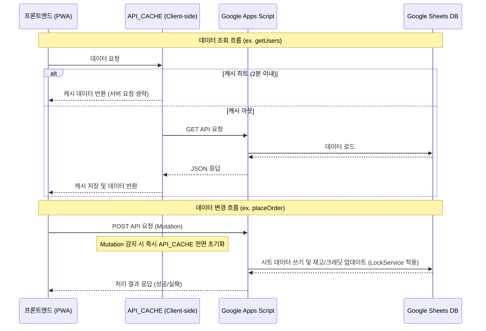

# Kiosk Project Handoff Document (For AI Agents)

This document is compiled for AI agents (like Antigravity) to easily grasp the project context, technical architecture, recent updates, and continue working on this repository seamlessly across different environments.

---

## 0. Active Issues Quick Start

### Active Issues
* **Critical Issues**: None. There are no currently reproducible critical bugs or pending security failures.

### Monitoring
1. **구글 시트 API 연결 안정성 및 폴링 부하 모니터링**
   - **현황**: API 지연(콜드 스타트 20초 대응) 및 동시 실행 제한 우회를 위해 client-side `API_CACHE` (getUsers 2분 캐시) 및 순차 대기형(`setTimeout` 재귀) 폴링을 적용함.
   - **관찰사항**: 실제 다수 기기 운영 환경에서 구글 계정 동시 실행 한도 초과(HTTP 429/503)나 락 획득 대기 시간 초과 에러가 재발하지 않는지 모니터링 필요.
2. **특정 간식 주문 가능 상태 일회성 불일치 모니터링**
   - **현황**: 2026-07-06 운영 검증 중 `달콤커피는 현재 주문할 수 없는 간식입니다` 메시지가 1회 발생했으나, 재시도 시 정상 주문됨.
   - **판단**: 재현되지 않는 단발 사례라 즉시 수정하지 않는다. 동일 간식 또는 다른 간식에서 반복되면 `간식목록`의 판매여부/제공대상, 관리자 수정 직후 `getSnacks` 15초 표시 캐시, 최종 `placeOrder()` 판매상태 검증 시점을 함께 확인한다.

### Analysis Queue
1. **P1 - `placeOrder` 최소 멱등성 적용**
   - **배경**: API 연결 불안정 또는 응답 유실 상황에서 첫 주문은 서버에 저장되었지만 클라이언트가 성공 응답을 받지 못해 같은 주문을 다시 전송하면, 기존 버튼 잠금만으로는 중복 주문을 완전히 막을 수 없다.
   - **선택 방향**: 주문 생성 핵심 경로인 `placeOrder`에만 먼저 최소 멱등성을 적용한다. 취소/후기/이미지 업로드까지 한 번에 확대하지 않는다.
   - **데이터 구조**: 운영자가 `주문내역` W열에 `idempotencyKey` 컬럼을 추가했다. GAS `ensureOrderHeaders()`도 W열에 `idempotencyKey`가 없으면 보정한다.
   - **적용 결과**
     - `confirm.html`은 주문 버튼을 누르는 시점에 주문 시도별 `idempotencyKey`를 생성하고, 같은 사용자/장바구니/수령방식/배달지 조합의 재시도에서는 같은 키를 유지한다.
     - `placeOrder()`는 락 획득 후 주문 생성 전 `idempotencyKey`가 이미 성공 기록된 주문을 찾으면 새 주문을 만들지 않고 기존 `orderNo`, `orderToken`, 잔여 크레딧, 주문 품목 결과를 반환한다.
     - 정상 주문 처리에서는 주문 행/재고/크레딧 처리가 끝난 뒤 W열에 `idempotencyKey`를 기록한다. 이렇게 하여 중간 실패 주문을 성공 처리된 요청으로 오인하지 않게 한다.
     - 주문 성공 또는 재고/크레딧/마감 등 명확한 실패 후에는 프론트의 대기 키를 제거한다. 네트워크 오류처럼 성공 여부가 애매한 경우에는 같은 키로 재시도한다.
     - `js/config.js` Mock도 같은 키 재전송 시 기존 주문 결과를 반환하도록 동기화했다.
     - 정적 파일 반영을 위해 `service-worker.js` 캐시 버전을 `kiosk-cache-v126`으로 상향했다.
   - **검증**: GAS 새 버전 배포 후 일반 키오스크/로컬 게스트/카카오 게스트에서 일반 주문이 정상 접수되는지, 같은 `idempotencyKey`로 `placeOrder`를 두 번 호출해 주문내역/재고/크레딧이 한 번만 반영되는지 확인한다.

2. **P2 - `placeOrder` 트랜잭션 정합성 검토 (후속 보류)**
   - **목적**: 주문 행 기록, 재고 차감, 일반/게스트 크레딧 차감 사이에 중간 오류가 났을 때 복구/롤백 가능한 구조가 필요한지 별도 검토한다.
   - **판단**: 이번 멱등성 작업과 한 번에 섞지 않는다. 멱등성은 동일 요청 재전송 방지이고, 트랜잭션은 부분 성공/부분 실패 복구 문제이므로 분리한다.
   - **우선순위**: 운영 중 부분 실패 사례가 재발하거나, 주문 행은 있는데 크레딧/재고 반영이 불일치하는 증거가 나오면 P1으로 올려 별도 설계한다.

3. **P1 - 브라우저 저장소 개인정보/이용 안내 정비**
   - **배경**: 현재 앱은 `localStorage`/`sessionStorage`에 `guestDeviceId`, `guestOrders`, `lastOrderSummary`, `selectedUser`, `guestAuth`, `localGuestDisplayName`, 장바구니/주문 진행 상태 등을 저장한다.
   - **판단**: 쿠키 배너까지는 과할 수 있으나, 닉네임/주문토큰/기기식별값/주문내역은 특정 이용자와 연결될 수 있으므로 개인정보 처리방침 또는 이용 안내에 브라우저 저장소 사용 목적, 저장 항목, 보관 범위, 삭제 방법을 명시하는 것이 안전하다.
   - **권장 범위**: 광고/외부 추적 목적이 없고 주문 편의, 중복 주문 방지, 주문 조회, 게스트 크레딧 중복 사용 방지가 목적임을 명확히 적는다. 배달지/카카오 식별자/크레딧 정보 등 민감도가 높은 값은 불필요하게 새로 로컬 저장하지 않는다.
   - **다음 작업**: 개인정보 처리방침 또는 배달왔삼 이용 안내 문구 초안을 만들고, 운영자가 실제 고지 위치(README, 앱 내 안내, 기관 문서)를 선택한 뒤 반영한다.

4. **P2 - 비회원 게스트 주문표시명 하루 1회 원칙 검토/구현**
   - **배경**: 같은 비회원 게스트가 하루 동안 주문마다 다른 주문표시명을 사용하면 주방/전광판/배달/주문조회에서 같은 사람인지 식별하기 어려워 운영 안정성이 떨어진다.
   - **추천 방향**: `localGuestDisplayName`을 날짜 단위로 확정해 같은 날짜의 두 번째 주문부터 자동 적용한다. 단, 오타 수정 가능성을 고려해 완전 잠금이 아니라 `표시명 변경` 같은 예외 경로를 둘지 검토한다.
   - **구현 기준**: 첫 주문 완료 또는 주문표시명 확정 시 `{ dateKey, displayName }` 형태로 저장하고, 오늘 날짜와 일치하면 확인 화면에 자동 적용한다. 다음 날에는 새 표시명을 정할 수 있게 한다.
   - **주의사항**: 진행 중 주문이 있거나 동일 기기에서 이미 오늘 주문이 있는 경우 표시명 변경이 주문조회/배달 혼선을 만들 수 있으므로 변경 버튼 노출 조건과 안내 문구를 함께 설계한다.

5. **P1 - 이미지 업로드/표시 성능 개선 (완료)**
   - **현황**: DevTools Network 기준 첫 로드에서 Drive 썸네일 이미지가 개당 약 300~700KB로 확인되어, `getSnacks` GAS 호출과 함께 간식 목록 표시 체감 속도에 영향을 줄 수 있다.
   - **우선순위 판단**: 현재 다음 작업 1순위로 둔다. 운영자가 기존 이미지는 PhotoScape 등으로 일괄 리사이즈하고, 신규 등록 이미지는 관리자 페이지에서 자동으로 800px 이하 WebP로 변환한다.
   - **권장 순서**: 기존 Drive 원본 이미지 리사이즈/교체 → 관리자 신규 업로드 자동 리사이즈 적용 → Network `Img` 탭에서 전송 크기 재측정 → 그래도 메뉴 첫 로드가 느리면 `getSnacks` 짧은 캐시를 별도 재논의한다.
   - **1단계 적용 결과**
     - `admin.html`의 이용자/간식 사진 업로드 흐름에서 JPEG/PNG/WebP 파일을 업로드 전에 브라우저 canvas로 최대 800px, WebP 품질 0.82로 자동 변환하도록 적용한다.
     - GIF는 애니메이션 손실을 피하기 위해 기존 파일 그대로 업로드한다.
     - GAS `uploadImage()`는 이미 WebP를 허용하므로 백엔드 수정은 하지 않는다.
     - 정적 파일 반영을 위해 `service-worker.js` 캐시 버전을 `kiosk-cache-v124`로 상향한다.
     - 검증: 관리자에서 신규/수정 이용자 사진, 신규/수정 간식 이미지를 업로드하고 URL 저장 후 메뉴/관리자 목록 썸네일이 정상 표시되는지 확인한다.
   - **2단계 적용 결과**
     - `css/style.css`의 Pretendard CDN `@import`를 제거해 첫 로드 시 `Pretendard-*.woff2` 웹폰트를 내려받지 않도록 했다.
     - `font-family`에는 `Pretendard` 이름을 남겨, 기기에 Pretendard가 설치되어 있으면 로컬 폰트를 쓰고 없으면 `Apple SD Gothic Neo`, `Malgun Gothic`, `맑은 고딕`, 시스템 기본 폰트로 fallback한다.
     - 정적 파일 반영을 위해 `service-worker.js` 캐시 버전을 `kiosk-cache-v125`로 상향한다.
     - 검증: 배포 후 Network 탭에서 `Pretendard-Regular.woff2`, `Pretendard-Bold.woff2`, `Pretendard-ExtraBold.woff2`, `Pretendard-Black.woff2` 요청이 사라졌는지 확인한다.
   - **3단계 적용 결과**
     - `getSnacks()`에 Apps Script `CacheService` 기반 15초 서버 캐시를 추가한다.
     - 일반 키오스크와 배달왔삼 게스트 메뉴가 모두 같은 `getSnacks` API를 사용하므로, 양쪽 메뉴 진입에 동일하게 적용된다.
     - 첫 호출은 기존처럼 `간식목록` 시트를 읽지만, 15초 안에 다른 디바이스가 일반 키오스크 또는 게스트 메뉴에 진입하면 같은 서버 캐시를 공유해 반복 시트 읽기를 줄인다.
     - 30초보다 15초를 선택한 이유는 메뉴 진입 속도 개선과 재고 표시 최신성 사이의 균형 때문이다. 일반 키오스크는 현장 재고 정합성 기대치가 더 높고, 배달왔삼도 재고 수량이 작을 수 있어 표시용 재고가 오래 stale 되지 않는 쪽을 우선한다.
     - 이 캐시는 메뉴 표시용이며, 최종 주문은 `placeOrder()`가 `간식목록` 원본 시트를 다시 읽어 재고/판매상태를 검증하므로 실제 없는 재고가 주문되는 것은 방어한다.
     - 주문 성공, 관리자/이용자 주문 취소 재고 복구, 간식 추가/수정/재고 변경/판매상태 변경/표시순서 변경/빈 간식ID 자동 채우기 시 `clearSnackReadCache()`로 즉시 무효화한다.
     - 검증: GAS 새 버전 배포 후 일반 키오스크와 게스트 메뉴 첫 진입, 15초 내 다른 브라우저/디바이스 메뉴 재진입, 주문 후 재고 반영, 관리자 재고/판매상태 수정 후 메뉴 반영을 확인한다.

6. **P1 - Apps Script 성능 점검 (완료)**
   - Google Sheets 읽기/쓰기 호출 최적화 가능성, 반복 조회, CacheService 적용 후보, 주문 처리 병목을 분석한다.
   - 구현 전 분석과 우선순위 제안이 목적이다.
   - **권장 방향**: 바로 최적화 코드를 넣지 말고, 성능 감사와 안전한 후보 선별부터 진행한다.
   - **안전한 진행 로드맵**
     1. 함수별 시트 호출 지도를 만든다: `placeOrder`, `getGuestSettings`, `getGuestCreditStatus`, `resolveGuestCreditWallet`, `getSnacks`, `getUsers`, `getOrdersToday`, `getGuestOrderByToken`, `getReviewsForAdmin`, `archiveOldOrders`를 우선 확인한다.
     2. 각 함수별로 읽는 시트, 쓰는 시트, `getValue/getValues/setValue/setValues/appendRow` 사용, 락 사용 여부, 실시간성 필요 여부, 캐시 가능 여부를 표로 정리한다.
     3. 위험도를 나눈다: 운영설정/간식목록/이용자목록/후기 목록 같은 조회는 저위험, 오늘 주문/게스트 주문/운영 결과 집계는 중위험, `placeOrder`/재고 차감/게스트 크레딧 차감·환불/주문 취소/주문 보관은 고위험으로 본다.
     4. 저위험 후보부터 검토한다: `getGuestSettings()` 짧은 캐시(30~60초)와 설정 변경 시 캐시 무효화, 같은 요청 안의 반복 조회 제거, `getValues()` 1회 읽기 후 메모리 필터링, 여러 셀 쓰기 묶기.
     5. `placeOrder`는 별도 설계로 다룬다: 주문 생성 중 설정 조회 횟수, 주문내역 전체 조회 필요성, 간식 재고 확인/차감의 락 일관성, 게스트 크레딧 계산과 주문 행 작성 사이 실패 가능성, 주문 행 일괄 쓰기 가능성을 검토한다.
     6. 적용 순서는 분석표 작성 → 캐시 금지 데이터 명시 → 저위험 조회 함수 개선 후보화 → 후기/통계 조회 최적화 → `placeOrder` 별도 설계 → 복사본 또는 낮은 운영 시간 검증 → GAS 새 배포 순으로 진행한다.
   - **금지선**: 주문내역, 크레딧, 재고를 긴 TTL로 캐시하지 않는다. 성능 이유만으로 `placeOrder`를 크게 리팩터링하지 않는다. 락 범위를 줄이기 전에 동시 주문 시나리오를 먼저 검토한다. 운영 시트 컬럼을 성능 개선 명목으로 재배열하지 않는다.
   - **1단계 호출 지도 결과 (완료)**
     | 함수 | 시트 접근/쓰기 요약 | 위험도/메모 |
     | --- | --- | --- |
     | `getUsers` | `이용자목록` 전체를 `getValues()` 1회 읽음. 쓰기/락 없음. | 저위험. 화면 표시용 짧은 캐시 후보이나 관리자 크레딧 변경 직후 반영성은 주의. |
     | `getSnacks` | `간식목록` 전체를 `getValues()` 1회 읽음. 쓰기/락 없음. | 저~중위험. 메뉴 표시 캐시는 가능하지만 재고 표시는 stale 가능. 주문 시 `placeOrder`가 재고를 재검증해야 함. |
     | `getGuestSettings` | `운영설정` 전체를 `getValues()` 1회 읽고, 누락 기본값이 있으면 `appendRow()`/`upsertSettingValue()`로 쓸 수 있음. | 저위험처럼 보이나 순수 조회가 아님. 캐시 전 기본값 보정/설정 저장 시 무효화 정책 필요. |
     | `resolveGuestCreditWallet` | `게스트크레딧` 전체를 `getValues()` 1회 읽고, 사용/환불/병합 시 `setValues()`/`appendRow()`/`deleteRow()` 수행. | 고위험. 지갑 데이터는 캐시 금지. 크레딧 정확성과 중복 병합 우선. |
     | `getGuestCreditStatus` | `resolveGuestCreditWallet(create:false)` 래퍼. 결과적으로 `운영설정`과 `게스트크레딧`을 읽을 수 있음. | 중~고위험. 시작 화면 체감에 영향은 있지만 지갑 캐시는 금지. 설정 캐시만 별도 후보. |
     | `placeOrder` | 락 사용. `간식목록`, `주문내역`, 게스트 설정/크레딧, 일반 이용자 크레딧을 함께 읽고 주문 행/재고/크레딧을 씀. 상품 수만큼 `appendRow()`와 재고 `setValue()` 반복. | 최고위험/최우선 분석 대상. 속도보다 재고·크레딧·중복 주문 일관성이 우선. |
     | `getOrdersToday` | `ensureOrderHeaders()` 후 `주문내역` 전체를 `getValues()` 1회 읽고 오늘 주문만 메모리 필터링. | 중위험. 주방/전광판 폴링 체감에 영향. 주문 데이터라 긴 캐시는 부적절. |
     | `getGuestOrderByToken` | `ensureOrderHeaders()` 후 `주문내역` 전체를 `getValues()` 1회 읽고 토큰 매칭. | 중위험. 토큰 수는 작지만 주문 행이 늘면 전체 스캔 비용 증가. |
     | `getReviewsForAdmin` | `후기내역` 전체를 `getValues()` 1회 읽고 최신순 변환. | 저위험. 짧은 캐시나 프론트 캐시 후보. 답글/공개상태 변경 시 무효화 필요. |
     | `archiveOldOrders` | 락 사용. `주문내역` 전체 읽기 1회, `주문보관` 일괄 `setValues()`, `주문내역` `clearContent()` 후 일괄 `setValues()`. | 고위험이지만 저빈도. 이미 bulk 처리라 성능보다 백업/검증/낮은 운영 시간 실행이 중요. |
   - **1단계 관찰**: Apps Script `CacheService`는 현재 사용되지 않는다. 반복 호출이 잦은 조회 함수는 대부분 `getValues()` 1회 구조라 기본 형태는 나쁘지 않지만, `ensureOrderHeaders()`가 조회 API마다 붙어 헤더 검사 비용이 반복되고, `placeOrder`는 주문시트 전체 읽기와 상품별 쓰기가 겹쳐 가장 큰 병목 후보이다.
   - **2단계 개선 후보 선별 결과 (완료)**
     1. **1순위 후보 - 주문 조회 API의 반복 헤더 보정 비용 줄이기**
        - 대상: `getOrdersToday`, `getOrderStatus`, `getGuestOrdersToday`, `getGuestOrderByToken`, `getGuestOrdersByGuestKey`.
        - 이유: 이 함수들은 읽기 API인데 `ensureOrderHeaders()`가 먼저 실행되어 주문 시트 전체 헤더 확인/보정 흐름이 반복된다. 이후 각 함수가 다시 `getDataRange().getValues()`를 호출하므로, 정상 운영 시에도 중복 읽기 비용이 생긴다.
        - 호출 빈도: `board.html`은 `getOrdersToday`를 10초마다, `kitchen.html`은 `getOrdersToday`를 30초마다, `complete.html`은 `getOrderStatus`를 5초마다 호출한다. 일반 키오스크 취소 알림도 `getOrdersToday`를 반복 확인한다.
        - 안전한 방향: 읽기 API에서 무조건 헤더 보정을 실행하지 말고, 쓰기/관리/진단 경로에서만 보정하거나, 헤더가 이미 정상이라는 전제하에 읽기 전용 헤더 해석 헬퍼를 따로 둔다. 단, 실제 운영 시트가 정상이라는 진단 결과를 먼저 확인하고 적용한다.
     2. **2순위 후보 - `getGuestSettings()`의 짧은 캐시 또는 요청 내 재사용**
        - 대상: `getGuestSettings`, `getGuestCreditStatus`, `placeOrder`, 게스트/주방/관리자 설정 로딩.
        - 이유: 운영설정은 자주 읽히고 상대적으로 작지만, 현재 함수가 누락 기본값을 자동으로 쓰는 부작용을 가질 수 있다.
        - 안전한 방향: 먼저 기본값 보정이 끝난 운영 시트를 기준으로 `getGuestSettings()`를 순수 조회에 가깝게 만들 수 있는지 확인한다. 캐시를 적용한다면 15~60초 짧은 TTL만 사용하고, `updateGuestSettings()`에서 반드시 캐시를 무효화한다.
     3. **3순위 후보 - `getOrdersToday` 계열의 매우 짧은 서버 캐시 검토**
        - 대상: 전광판/주방/일반 키오스크가 반복 조회하는 오늘 주문 목록.
        - 이유: 여러 화면이 동시에 같은 주문 데이터를 읽으면 Google Sheets 전체 스캔이 겹칠 수 있다.
        - 안전한 방향: 주문 상태 반영성이 중요하므로 긴 캐시는 금지한다. 검토하더라도 2~5초 이하의 초단기 캐시 또는 프론트 호출 간격 조정만 후보로 둔다. 주문 생성/취소/제공 처리 직후에는 stale 데이터가 보일 수 있음을 반드시 수용 가능한지 확인해야 한다.
     4. **보류 후보 - `placeOrder` 쓰기 최적화**
        - 대상: 상품 수만큼 반복되는 `appendRow()`와 재고 `setValue()`, 오늘 주문 전체 읽기, 게스트 크레딧 갱신.
        - 이유: 실제 병목 가능성은 가장 크지만, 재고·크레딧·중복 주문 일관성이 걸린 최고위험 구간이다.
        - 안전한 방향: 바로 구현하지 않는다. 별도 설계에서 주문 행 일괄 쓰기, 재고 차감 일괄 쓰기, 오늘 주문 번호 계산 범위 축소를 각각 독립 검토한다.
   - **2단계 판단**: 첫 실제 개선은 `placeOrder`가 아니라 주문 조회 API의 반복 `ensureOrderHeaders()` 비용 제거/분리 설계가 가장 안전하다. 그 다음 `getGuestSettings()` 짧은 캐시를 검토하고, 주문 목록 캐시는 반영 지연 위험 때문에 마지막까지 보수적으로 다룬다.
   - **3단계 1순위 적용 결과 (완료)**
     - `getOrdersToday`, `getOrderStatus`, `getGuestOrdersToday`, `getGuestOrderByToken`, `getGuestOrdersByGuestKey`에서 읽기 전 `ensureOrderHeaders()` 호출을 제거했다.
     - 의도: 조회 API 1회마다 주문내역을 헤더 보정용으로 먼저 읽고, 다시 실제 데이터 조회로 읽는 중복 비용을 줄인다.
     - 영향 범위: 주문 생성, 취소, 제공 처리, 후기 등록, 보관 처리 같은 쓰기/관리 경로의 `ensureOrderHeaders()` 호출은 유지했다.
     - 검증: `node check_syntax.js` 통과. GAS 배포 후 전광판, 주방, 완료 화면, 게스트 주문조회에서 주문 상태가 정상 표시되는지 수동 확인 필요.
   - **4단계 2순위 적용 결과 (완료)**
     - `getGuestSettings()`에 Apps Script `CacheService` 기반 30초 캐시를 추가했다.
     - 캐시는 최종 응답 전체가 아니라 원시 설정값만 저장한다. `isGuestOpenNow`, `remainingSeconds`, 운영 메시지는 매 호출마다 `buildGuestSettingsResponse()`에서 현재 시각 기준으로 다시 계산한다.
     - `updateGuestSettings()` 성공 시 `clearGuestSettingsCache()`를 호출해 게스트 운영 열기/닫기, 기본 크레딧, 배달비, 기본 배달지, 배달팀 설정 변경이 즉시 다음 조회에 반영되도록 했다.
     - 의도: `guest.html`, `admin.html`, `kitchen.html`, `getGuestCreditStatus`, `placeOrder` 등에서 반복되는 운영설정 시트 읽기 부담을 줄인다.
     - 검증: `node check_syntax.js` 통과. GAS 배포 묶음 검증 시 게스트 운영 열기/닫기, 기본 배달지/배달팀 설정 저장 후 즉시 재조회, 게스트 시작 화면 크레딧 표시, 주문 가능/마감 판단을 확인한다.
   - **5단계 3순위 적용 결과 (완료)**
     - 주문 조회 함수들이 공유하는 `getOrderValuesForRead()`를 추가하고, `CacheService` 기반 2초 캐시를 적용했다.
     - 대상: `getOrdersToday`, `getOrderStatus`, `getGuestOrdersToday`, `getGuestOrderByToken`, `getGuestOrdersByGuestKey`.
     - 주문 생성, 제공 상태 변경, 관리자 취소, 이용자 직접 취소, 후기 등록의 `reviewed` 업데이트, 지난 주문 보관, 주문 헤더 보정 성공 시 `clearOrderReadCache()`를 호출해 stale 데이터를 최소화했다.
     - 캐시 저장 실패(예: 주문 데이터가 커져 CacheService 크기 제한에 걸리는 경우)는 로그만 남기고 기존처럼 시트 직접 조회로 동작한다.
     - 의도: 전광판/주방/완료 화면/게스트 주문조회가 짧은 시간 안에 같은 주문 데이터를 반복해서 읽을 때 Google Sheets 전체 스캔을 줄인다.
     - 검증: `node check_syntax.js` 통과. GAS 배포 묶음 검증 시 신규 주문 후 주방/전광판 반영, 제공 완료 후 완료 화면 상태 변경, 게스트 주문조회, 취소 후 상태 반영, 후기 등록 후 `reviewed` 반영을 확인한다.
   - **6단계 `placeOrder` 별도 설계 결과 (완료, 코드 변경 없음)**
     - 현재 병목 후보: `ensureOrderHeaders()` 후 다시 주문시트 전체에서 헤더를 읽고, 주문번호 생성을 위해 주문시트 전체를 한 번 더 읽는다. 게스트 주문은 크레딧 지갑을 확인용/차감용으로 두 번 읽을 수 있고, 상품 수만큼 주문 행 `appendRow()`와 재고 `setValue()`가 반복된다.
     - 낮은 위험 후보: 주문번호 생성에는 A열 주문시간과 B열 주문번호만 필요하므로, 전체 행/열 대신 A:B 범위만 읽도록 줄일 수 있다. 헤더 확인도 전체 데이터가 아니라 1행 범위만 읽는 헬퍼로 줄일 수 있다.
     - 중간 위험 후보: 여러 상품 주문의 주문 행 쓰기를 `appendRow()` 반복 대신 한 번의 `setValues()`로 묶는 방안. 단, 행 길이와 S~V 선택 컬럼 채움, 실패 시 부분 기록 가능성 검토가 필요하다.
     - 높은 위험/보류 후보: 게스트 크레딧 확인과 차감을 한 번으로 합치거나, 크레딧 차감 순서를 주문 행 쓰기보다 앞으로 이동하는 변경. 실패 시 “주문은 없는데 크레딧만 차감” 또는 “주문은 있는데 실패 응답” 같은 정합성 문제가 생길 수 있어 별도 롤백/복구 설계 전에는 하지 않는다.
     - 권장 다음 행동: `placeOrder` 실제 코딩은 현재 적용한 조회/설정 캐시 묶음을 GAS에 배포해 기본 주문/조회 흐름을 확인한 뒤 진행한다. 이후 첫 코드 후보는 A:B 범위 읽기와 헤더 1행 읽기처럼 데이터 의미를 바꾸지 않는 읽기 범위 축소만 선택한다.
   - **배포 전후 검증 결과**
     - 1~5단계 GAS 성능 개선 묶음은 운영자가 수동검증했으며, 주문/조회/설정/후기/취소 흐름은 정상 동작으로 확인했다.
     - GitHub Pages 반영 후 카카오 연동 주문조회/프로필 흐름도 정상 동작으로 확인했다.
     - 정적 파일 반영을 위해 `service-worker.js` 캐시 버전을 `kiosk-cache-v120`으로 올렸다.
   - **7단계 `placeOrder` 저위험 읽기 범위 축소 적용 결과 (완료)**
     - `placeOrder`에서 주문 헤더를 다시 확인할 때 주문시트 전체를 읽지 않고 `getSheetHeaderRow()`로 1행만 읽도록 변경했다.
     - 주문번호 시퀀스 계산 시 주문시트 전체 A~V 데이터를 읽지 않고 A:B 범위(`주문시간`, `주문번호`)만 읽도록 변경했다.
     - `ensureOrderHeaders()` 내부도 헤더 확인 시 전체 데이터 대신 1행만 읽도록 변경했다.
     - 주문 행 쓰기, 재고 차감, 일반/게스트 크레딧 처리, 카카오 프로필 저장 순서는 변경하지 않았다.
     - 검증: `node check_syntax.js` 통과 후 GAS 배포 묶음 검증 시 일반 주문, 게스트 포장/배달 주문, 카카오 연동 주문 각각 주문번호가 정상 증가하고 주방/전광판에 표시되는지 확인한다.
   - **8단계 `placeOrder` 주문 행 일괄 쓰기 적용 결과 (완료)**
     - 여러 상품 주문 시 `주문내역`에 상품 수만큼 `appendRow()`를 반복하지 않고, 주문 행 배열을 만든 뒤 한 번의 `setValues()`로 기록하도록 변경했다.
     - 기존 S~U 선택 컬럼(`guestDeviceId`, `authProvider`, `guestKey`)과 운영 시트의 현재 마지막 열 길이를 기준으로 행 길이를 맞춘 뒤 기록한다.
     - `setValues()`로 기록한 새 행의 A열 `주문시간`이 날짜만 표시되는 사례가 있어, 주문 행 기록 직후 A열 서식을 `yyyy. m. d AM/PM h:mm:ss`로 지정하도록 보완했다. 주문시간 값 자체는 기존처럼 `Date` 객체로 저장한다.
     - 재고 차감, 일반/게스트 크레딧 처리, 카카오 프로필 저장 순서는 변경하지 않았다. 재고 `setValue()` 반복과 게스트 크레딧 확인/차감 분리는 정합성 위험 때문에 그대로 둔다.
     - 위험도: 중간. 주문 상품이 여러 개인 경우 주문 행 쓰기 호출은 줄지만, 주문 생성 핵심 경로이므로 GAS 배포 후 다중 상품 주문 검증이 필요하다.
     - 검증: 일반 사용자 2개 이상 상품 주문, 로컬 게스트 2개 이상 상품 주문, 카카오 게스트 2개 이상 상품 주문에서 주문 행 수, 주문번호 동일성, 재고 차감, 크레딧 차감, 주방/전광판 표시를 확인한다.
   - **P1 성능 점검 마무리 판단**
     - 권장 구현 범위는 7~8단계까지로 본다. 조회 캐시/헤더 비용/주문번호 읽기 범위/다중 상품 주문 행 쓰기는 성능 개선 효과 대비 위험도가 관리 가능한 범위다.
     - 게스트 크레딧 확인과 차감 통합, 재고 차감 일괄 쓰기, 주문/크레딧/재고 트랜잭션 순서 재설계는 고위험 항목으로 보류한다.
     - 일반 사용자와 로컬 게스트의 7~8단계 수동검증은 정상 동작으로 확인했다.
     - GitHub Pages 반영 후 카카오 게스트의 7~8단계 수동검증도 정상 동작으로 확인했다.

7. **P2 - 배달왔삼 주문 흐름 UX 재설계 검토**
   - 닉네임 입력과 배달지 입력을 `주문자 정보` 화면으로 통합하는 변경이 UX와 기존 데이터 흐름에 적절한지 검토한다.
   - 카카오 로그인, 로컬 게스트 크레딧, 주문 생성/조회/취소/후기 영향까지 확인한다.
   - **선택 방향**: 시작 단계에서 `guestDeviceId`/카카오 `guestKey` 기반 크레딧 조회는 유지하고, 닉네임 입력만 주문 확인 화면으로 늦추는 절충안을 적용한다.
   - **1단계 적용 결과**
     - `guest.html`의 새 주문 시작은 닉네임 입력 화면을 거치지 않고 메뉴로 진입하도록 변경했다. 크레딧 조회, 카카오 프로필 조회, `selectedUser` 저장 흐름은 유지한다.
     - `menu.html`은 닉네임 미입력 상태를 `주문자 정보 입력 전`으로 표시하고, 기존 크레딧/재고 기반 담기 제한은 유지한다.
     - `confirm.html`의 게스트 수령 방식 박스에 `주문자 정보` 영역을 추가했다. 포장은 주문표시명만, 배달은 주문표시명과 배달지를 확인한다.
     - 카카오 저장 프로필이 있는 경우에는 주문표시명 입력칸을 생략하고 저장된 이름을 사용한다. 저장 프로필이 없는 카카오/로컬 게스트는 확인 화면에서 주문표시명을 입력해야 한다.
     - 주문 제출 직전에 주문표시명을 확정해 `placeOrder`로 전달하며, 최종 크레딧/재고 검증은 기존처럼 서버에서 수행한다.
     - 정적 파일 반영을 위해 `service-worker.js` 캐시 버전을 `kiosk-cache-v122`로 올렸다.
     - 로컬 게스트 포장/배달 주문, 크레딧 부족 안내, 배달비 포함 잔액 계산, 주문 후 표시 흐름은 수동검증에서 정상 동작으로 확인했다.
     - 카카오 게스트 흐름은 GitHub Pages 반영 후 별도 확인한다.
   - **2단계 적용 결과**
     - 비회원 로컬 게스트가 주문 확인 화면에서 확정한 주문표시명을 `localStorage`의 `localGuestDisplayName`에 저장한다.
     - 다음 비회원 게스트 주문 시작 시 저장된 표시명을 `selectedUser.nickname`으로 다시 넣어, 두 번째 주문에서도 확인 화면에 바로 표시되도록 했다.
     - 카카오 `guestKey`가 있는 게스트는 기존 카카오 저장 프로필/저장 동의 흐름을 우선하며, 이번 로컬 표시명 저장과 섞지 않는다.
     - 배달지, 카카오 식별자, 크레딧 정보는 새로 저장하지 않고 표시명만 같은 기기 안에 보존한다.
     - 정적 파일 반영을 위해 `service-worker.js` 캐시 버전을 `kiosk-cache-v127`로 올렸다.

8. **P3 - Apps Script 백엔드 구조 유지보수성 개선 (1차 파일 분리 완료)**
   - 약 3,809줄, 함수 73개의 단일 GAS 백업본을 `gas/*.gs` 기능별 파일로 분리했다.
   - 함수 내용과 `doGet`/`doPost` 액션은 변경하지 않고 파일만 이동했으며, 분리 전후 함수 73개 일치 및 결합 구문 검사를 확인했다.
   - `00_Config`, `01_Router`, 카카오/게스트, 이용자, 간식, 게스트 크레딧, 주문, 미디어, 운영설정, 후기, 진단 영역으로 나눴다.
   - **파일 번호 체계**: 앞의 숫자는 GAS 실행 순서를 강제하기 위한 값이 아니라 편집기와 저장소에서 파일을 역할 순서대로 정렬하고, 관련 코드를 빠르게 찾기 위한 분류 번호다.
     - `00~01`: 전역 설정, 일회성 설정, 외부 요청 라우터
     - `10~11`: 카카오/게스트 인증과 관리자 로그 같은 운영 기반
     - `20~21`: 이용자와 간식 기본 데이터
     - `30~31`: 게스트 크레딧과 주문 공통 처리
     - `40`: 주문 생성·조회·취소·제공·보관 핵심 업무
     - `50~70`: 미디어, 운영설정, 후기
     - `90`: 진단과 점검 도구
   - 번호 사이를 비워 둔 것은 이후 `41_OrderStats.gs`, `32_Cache.gs`처럼 관련 영역에 새 파일을 끼워 넣기 위한 것이다. 파일을 추가할 때 이 번호 체계를 유지한다.
   - `00_Setup.gs`는 비밀값이 없는 안내용 파일만 GitHub에서 관리한다. 실제 `setKakaoPropertiesOnce()`와 키 값은 새 GAS 프로젝트 설정 시 GAS 편집기에만 임시로 추가한다.
   - **운영 원칙**: 파일 분리는 성능 개선이 아니라 탐색성과 변경 안전성을 위한 조치다. 같은 Apps Script 프로젝트 안에서는 기존 Script Properties가 유지되므로 파일 분리만으로 카카오 설정을 다시 실행하지 않는다.
   - **검증 완료**: 분리본을 같은 GAS 프로젝트에 반영하고 새 버전 배포 후 일반 키오스크, 비회원 게스트, 카카오 게스트, 주방/전광판, 관리자 재고·로그, 후기 흐름이 모두 정상 동작함을 수동 확인했다.
   - **후속 보류**: 함수 인자, 시트 접근 계층, 서비스/저장소 경계를 바꾸는 구조 리팩터링은 이번 작업에 포함하지 않는다. Firebase 이전을 실제 결정할 때 별도 설계한다.

9. **P1 - GAS 안정성 후속 작업 (Claude 조언 검토 결과, 완료)**
   - **진행 대상**
     1. `updateOrderServed()`에 `LockService`를 추가해 주방 제공 상태 변경의 동시 쓰기 경합을 방지한다.
     2. 가능하면 같은 흐름에서 `updateOrderServed()`의 읽기 범위를 전체 시트에서 필요한 주문번호/상태/닉네임 범위 중심으로 축소한다. 관리자 로그에 필요한 이전 상태와 닉네임은 유지해야 한다.
     3. 주문 아카이빙은 개발보다 운영 루틴으로 문서화한다. 주문내역 행이 커지면 `getOrderValuesForRead()`의 2초 캐시 효과가 줄어들 수 있으므로 정기 보관을 권장한다.
   - **1단계 적용 결과**
     - `updateOrderServed()`에 `LockService.getScriptLock()`을 추가했다. 제공 상태 변경 중 다른 쓰기 작업이 들어오면 잠시 후 재시도 메시지를 반환한다.
     - 제공 상태 변경 대상 탐색은 주문시트 전체가 아니라 B:I 범위(`주문번호`, `별명`, `제공여부` 포함)만 읽도록 줄였다.
     - 관리자 로그 기록과 `clearOrderReadCache()` 호출은 유지했다.
     - 수동검증 결과: 주방 화면에서 제공 완료(Y)와 대기(N) 되돌리기가 정상 동작하는 것으로 확인했다.
   - **지금 하지 않는 항목**
     - `placeOrder()`의 중복 `clearOrderReadCache()` 제거: 첫 번째 호출은 주문 행 기록 후 크레딧 처리 중 예외가 나도 주문 조회 캐시를 비우는 방어선 역할을 할 수 있어 유지한다.
     - `getGuestSettings` 클라이언트 캐시 확대: 호출 수는 줄일 수 있지만 영업상태 표시가 stale 될 수 있어 현재 증상 없이는 우선순위를 낮춘다. `getSnacks`는 이미지/폰트 경량화 이후에도 GAS 호출이 병목으로 남아 15초 서버 캐시만 제한적으로 적용했다.
     - 전광판 적응형 폴링: 비영업 시간 부하는 줄일 수 있으나 현재 안정성 후속 작업보다 후순위다. 운영 시간 외 부하가 문제로 확인되면 진행한다.
     - GAS 워밍업 트리거: 콜드 스타트가 반복적으로 운영 문제를 만들 때만 적용한다. 시간 기반 트리거는 코드 변경이 아니라 운영 정책이므로 별도 결정이 필요하다.
     - `getSnacks` TTL 확대(30초 이상): 15초 서버 캐시는 적용했지만, 현장 재고 표시가 오래 stale 될 수 있어 더 긴 TTL은 운영 측정 후에만 재검토한다.

### Manual Verification
* **Optional deep check**: 같은 `idempotencyKey`로 동일 `placeOrder` 요청을 강제로 2회 전송할 수 있는 환경이 있을 때, 주문내역 행 수, 재고 차감, 일반/게스트 크레딧 차감이 1회만 반영되는지 확인한다. 일반 화면의 버튼 잠금과 정상 주문 흐름은 수동검증 완료.
* **Completed field checks**: double-order prevention, kitchen new-order sound/filter behavior, order-token guardrails for cancel/review/photo upload, archive sheet column alignment, latest service-worker cache reflection through `kiosk-cache-v127`, P1 GAS performance 7~8 validation for regular users/local guests/Kakao guests, P2 local guest pickup/delivery UX flow, local guest display-name persistence across repeat orders, Kakao-linked guest display code recheck for kitchen/board/guest-orders/print-bills, `updateOrderServed()` lock/range validation, `getSnacks` 15초 서버 캐시 validation for regular kiosk/guest menu, post-order stock reflection, admin stock/sale-state reflection, order-cancel stock restoration, Pretendard webfont request removal, and admin image upload thumbnail validation.

### Recently Resolved (최근 해결 항목)
* **P1 - 카카오 연동 게스트 (비회원) 꼬리 재노출 해결 및 말풍선 이모지 접두사 변경** (Development Log - 54)
* **P2 - 후기 상세 모달 너비 확장 및 답글 영역 여백/정렬 수정** (Development Log - 53)
* **P2 - 관리자 대리 입력식 후기 답글 기능 및 게스트 노출 1~3단계 구현** (Development Log - 52)
* **P2 - 주문하기 버튼 더블 클릭 시 비동기 레이스 컨디션에 따른 이중 주문 방지** (Development Log - 51)
* **P2 - 빌지 인쇄 페이지 내 일반 빌지 / 애니라벨 V3050 라벨지 선택 인쇄 기능 추가** (Development Log - 50)
* **P2 - 카카오 연동 게스트 (비회원) 문구 생략 및 말풍선(💬) 이모지 표시 연동** (Development Log - 49; recurrence addressed by Development Log - 54)
* **P2 - admin화면 이용자 크레딧 단축 버튼 추가 및 API 요청 시 행 단위 락 처리** (Development Log - 48)
* **P2 - GAS 콜드 스타트 대응을 위한 API 타임아웃 20초 연장** (Development Log - 45)
* **P2 - 관리자 화면 내 비활성 이용자 및 숨긴 간식 완전 숨김 처리** (Development Log - 44)
* **P2 - 후기 이미지 업로드 상태/중복 검증 GAS 하드닝 배치** (Development Log - 39)
* **P2 - 주방 화면 주문 통계 중복 카운트 버그 수정** (Development Log - 34)
* **P1 - 공개 조회 API 주문 토큰 노출 마스킹 (보안 경계 분리)** (Development Log - 29)
* **P1 - 주문 시트 P~V열 표준화 및 진단 오탐 방지 해결** (Development Log - 28)

### Stable Decisions (기본 결정 사항)
* **간식 제공 대상 제한**: 간식의 제공대상(`target`)은 오직 `user` 또는 `guest`만 사용합니다. 과거의 `both` 설정은 사용이 금지되었습니다.
* **게스트 주문의 사용자 식별자 고정**: 게스트 주문 시 `userId`는 항상 `'guest'` 문자열로 고정하여 일반 회원 주문과 물리적으로 구분하며, 카카오 고유 ID 등으로 대체하지 않습니다.
* **개인정보 보호 원칙**: 실명, 이메일, 전화번호 등의 개인정보는 일절 수집하지 않으며, 카카오톡 로그인 연동 시에도 원본 카카오 ID나 토큰은 Sheets에 저장하지 않고 솔트가 가미된 단방향 암호화 값인 `guestKey`만 생성하여 저장합니다.
* **브라우저 저장소 최소화 원칙**: `localStorage`/`sessionStorage`는 주문 편의, 중복 주문 방지, 주문 조회, 게스트 크레딧 중복 사용 방지처럼 필요한 목적에 한해 사용합니다. 표시명은 로컬 기기 안에만 저장하고, 배달지/실명/연락처/원본 카카오 식별자 등은 불필요하게 추가 저장하지 않습니다.
* **수동 마이그레이션 및 시트 구조 변경 원칙**: 시트 구조 자동 복구나 마이그레이션 함수를 `onOpen` 등의 트리거에 바인딩하여 자동으로 실행시키는 것을 엄격히 금지합니다. 모든 시트 복구/변경은 백업 확보 후, 정확한 레이아웃을 검증한 뒤 앱스 스크립트에서 수동으로만 실행합니다.
* **주문 아카이빙 운영 루틴**: 주문내역 행 수가 늘어나면 조회 캐시 효과와 시트 읽기 성능이 떨어질 수 있으므로, 운영이 없는 시간에 주방 화면 `운영 도구` -> `지난 주문 보관`을 수동 실행합니다. 기준은 주 1회 또는 주문내역이 약 50건 이상 쌓였을 때를 권장합니다. 시간 기반 자동 트리거는 시트 구조 변경/보관 원칙과 운영 리스크 때문에 별도 결정 전에는 만들지 않습니다.
* **백엔드 보안 하드닝 수준 보류**: 기관 내부의 비식별 환경 특성상 트랜잭션 롤백 및 동시성 락을 과도하게 도입하는 것은 장애 발생 위험 대비 실익이 낮아 보류(사실상 폐기)하였습니다.
* **실제 운영 DB 구조 보호**: 코드 assumptions에 맞추기 위해 실제 구글 시트 구조를 임의로 재배열하거나 컬럼을 삭제하지 않습니다. 진단 도구는 구버전 호환 구조를 모두 정상으로 판단할 수 있도록 alias 매핑을 유지해야 합니다.
* **운영점검 경고 처리**: 운영점검 진단 도구의 경고 메시지만 보고 실제 구글 시트의 열을 수동으로 재배열하거나 이동하지 마십시오.
* **후기 답글 작성 주체 및 경로**: 게스트 후기에 대한 답글은 주방 태블릿 화면 대신 관리자 전용 후기 게시판([reviews.html](file:///c:/Users/sec/Desktop/키오스크/reviews.html))에서 관리자(교사)가 훈련생에게 후기를 소개한 뒤 의견을 취합하여 대리로 작성 및 저장합니다. 훈련생의 정서적 피호 보호 및 소통 교육을 위해 실시간 직접 작성을 차단합니다.
* **화면별 기능 소유권 유지**:
  - `admin.html`: 이용자 정보, 간식 정보, 이용자 크레딧, 간식 표시 순서 관리.
  - `kitchen.html`: 실시간 주문 운영, 당일 주문 통계 및 다운로드, 빌지/체크리스트 인쇄, 지난 주문 보관(아카이빙), 게스트 영업 제어 및 배달팀 설정.
  - `reviews.html`: 게스트 작성 후기 확인 및 공개/숨김 여부 관리.

---

## 1. Project Overview & Context

이 프로젝트는 발달장애인 주간보호센터 회원들을 위한 **PWA Kiosk 시스템**입니다.
* **목적**: 회원들이 자신의 별명과 크레딧을 이용해 스스로 간식을 주문하고, 주문/배달/수령 과정을 직업 훈련의 일환으로 경험할 수 있도록 돕습니다.
* **핵심 가치 및 UX**: 큰 터치 영역, 음성 안내(TTS), 직관적인 동전/크레딧 그래픽, 풍부한 감각 피드백(효과음, 진동)을 통해 사용 편의성을 극대화합니다.
* **화면 모드**:
  1. **일반 키오스크**: 등록 회원이 로그인하여 크레딧으로 주문.
  2. **게스트(배달왔삼)**: 외부 방문자/체험자가 가상 크레딧을 지급받아 포장/배달 주문을 테스트.
  3. **주방 운영 (오늘 주문 운영)**: 실시간 주문 처리 및 게스트 영업 제어.
  4. **전광판 (호출판)**: 실시간 대기/준비 완료 번호 표시 및 음성 호출.
  5. **후기 관리**: 작성된 후기 모더레이션(공개 여부 제어).

---

## 2. Technical Stack

* **Frontend**: HTML5, Vanilla CSS3 (CSS 변수 활용 디자인 시스템 적용), Vanilla JavaScript. TailwindCSS나 React 등 무거운 프레임워크나 외부 라이브러리는 일절 배제하여 가볍고 독립적인 구조 유지.
* **Backend (Google Apps Script - Web App)**: 스프레드시트를 데이터베이스로 활용하여 API 게이트웨이 및 백엔드 컨트롤러 역할 수행.
  - 보호 액션(ADMIN_ACTIONS)은 `ADMIN_TOKEN` 인증 가드로 보호.
* **PWA & Offline Support**: 서비스 워커(`service-worker.js`)를 통해 정적 리소스 프리캐싱 및 오프라인 대응 지원. 각 모드에 최적화된 6개의 독립 Manifest 파일 존재.

---

## 3. Directory Map & File Structures

```
├── index.html            # 일반 키오스크 로그인/이름 선택 화면
├── menu.html             # 간식 선택 및 장바구니 화면
├── confirm.html          # 주문 확인 및 최종 제출 화면
├── complete.html         # 주문 완료 및 실시간 트래킹 화면 (후기 작성)
├── guest.html            # 게스트 로그인 및 배달왔삼 메인 화면 (후기 모달 뷰어)
├── guest-orders.html     # 게스트 주문 이력 조회 및 상태 추적 화면
├── board.html            # 호출 전광판 화면 (음성 안내)
├── admin.html            # 이용자 및 간식 기초 데이터 관리 화면
├── kitchen.html          # 주방 실시간 주문 운영 및 게스트 제어 화면
├── reviews.html          # 후기 목록 및 노출 모더레이션 화면
├── print-bills.html      # 빌지 및 배달 체크리스트 인쇄 화면 (라벨지 대응)
├── google-apps-script.md # GAS 분리 구조 및 배포 안내
├── gas/                  # 기능별 Apps Script 백엔드 소스
│   ├── 00_Config.gs
│   ├── 00_Setup.gs
│   ├── 01_Router.gs
│   ├── 10_KakaoGuests.gs
│   ├── 11_AdminLog.gs
│   ├── 20_Users.gs
│   ├── 21_Snacks.gs
│   ├── 30_GuestCredits.gs
│   ├── 31_OrderShared.gs
│   ├── 40_Orders.gs
│   ├── 50_Media.gs
│   ├── 60_Settings.gs
│   ├── 70_Reviews.gs
│   └── 90_Diagnostics.gs
├── handoff.md            # 본 파일 (프로젝트 핸드오프 및 개발 기록)
├── service-worker.js     # PWA 서비스 워커 (캐시 제어)
├── manifest-*.json       # 모드별 PWA 설정 파일 (6종)
├── css/
│   └── style.css         # 공통 스타일시트
├── js/
│   ├── config.js         # API 설정, Mock 데이터, 공통 API 호출기
│   └── app.js            # 공통 상태 관리, 진동/오디오 피드백, TTS
├── sounds/               # 신규 주문 유형별 알림음 (3종)
├── assets/               # 로고, 캐릭터 이미지 등 정적 에셋
└── icons/                # 앱 실행 아이콘 에셋
```

---

## 4. Current Database Schema (Google Sheets)

실제 운영 엑셀 파일(`주간보호 매점DB.xlsx`)의 시트 1행 헤더와 매칭되는 최신 운영 스키마입니다. 과거 스냅샷 설명은 제거되었습니다.

* **`이용자목록`**: `이용자ID`, `별명`, `크레딧`, `사용여부`, `사진url`
* **`간식목록`**: `간식ID`, `이름`, `포인트`, `사진URL`, `판매여부`, `재고`, `표시순서`, `제공대상`, `범주`
  - `제공대상` 필드는 `user` 또는 `guest` 값만 가집니다.
* **`주문내역`**: (총 23개 열, A~W열)
  - `주문시간`(A), `주문번호`(B), `이용자ID`(C), `별명`(D), `간식ID`(E), `간식명`(F), `수량`(G), `차감포인트`(H), `제공여부`(I), `cancelTimestamp`(J), `orderToken`(K), `deliveryType`(L), `deliveryFee`(M), `totalCredit`(N), `reviewed`(O), `deliveryPlace`(P), `cancelReason`(Q), `cancelReasonDetail`(R), `guestDeviceId`(S), `authProvider`(T), `guestKey`(U), `deliveryAddress`(V), `idempotencyKey`(W)
* **`주문보관`**: (총 18개 열, A~R열)
  - `주문시간`(A), `주문번호`(B), `이용자ID`(C), `별명`(D), `간식ID`(E), `간식명`(F), `수량`(G), `차감포인트`(H), `제공여부`(I), `cancelTimestamp`(J), `orderToken`(K), `deliveryType`(L), `deliveryFee`(M), `totalCredit`(N), `reviewed`(O), `deliveryPlace`(P), `cancelReason`(Q), `cancelReasonDetail`(R)
* **`관리자로그`**: `timestamp`, `action`, `targetType`, `targetId`, `targetName`, `beforeValue`, `afterValue`, `memo`
* **`운영설정`**: `key`, `value`
* **`후기내역`**: `createdAt`, `orderId`, `guestName`, `stamp`, `tags`, `comment`, `isPublic`, `imageUrl`, `replyText`, `replyCreatedAt`
* **`게스트프로필`**: `guestKey`, `displayName`, `deliveryPlace`, `updatedAt`
* **`게스트크레딧`**: `periodKey`, `guestDeviceId`, `guestKey`, `baseCredit`, `bonusCredit`, `creditLimit`, `usedCredit`, `remainingCredit`, `updatedAt`
* **`설정`**: (미사용 시트로 헤더가 비어 있으며, 시스템 흐름에 영향을 미치지 않음)

### 코드 필드명과 실제 DB 헤더 차이 설명
* **배송지 데이터**: 코드 내 API 응답 객체는 `deliveryPlace` 변수명을 사용해 화면에 렌더링하지만, 실제 주문 테이블의 P열 헤더명도 `deliveryPlace`로 일치되어 있습니다. 주문내역 V열에 과거 legacy 호환용으로 `deliveryAddress`가 남아있지만, GAS는 두 필드를 동적으로 판단 및 매핑하므로 강제 물리 마이그레이션(열 위치 변경)은 필요하지 않으며 금지됩니다.
* **주문보관 헤더 생성 차이**: GAS의 주문 보관(아카이브) 시트 신규 생성 코드(`archiveOldOrders` 함수 내부)에는 16번째 열이 `'deliveryAddress'`로 하드코딩되어 있습니다. 그러나 실제 운영 엑셀의 `주문보관` 시트 16번째 열은 `deliveryPlace`로 일치되어 있습니다. 실제 운영 상에서는 기존에 있는 `주문보관` 시트에 데이터를 덧붙이므로 문제가 없지만, 코드가 새로 시트를 만들 때는 불일치가 일어날 수 있음을 인지해야 합니다.

### 주문내역과 주문보관 정합성 확인 결과
* **열 범위 비교**: `주문내역`은 총 23개 열(A~W열), `주문보관`은 총 18개 열(A~R열)을 사용합니다.
* **아카이브 복사 범위**: `archiveOldOrders` 함수 실행 시 주문내역에서 18개 열(`slice(0, 18)`)을 잘라내어 주문보관 시트에 복사합니다.
* **정합성 검증**: 주문내역의 A~R열과 주문보관의 A~R열은 열 순서와 의미가 완전히 동일합니다. 따라서 보관 처리 시 데이터 열이 밀리거나 꼬일 위험은 없습니다.
* **의도적 제외 필드**: 주문보관 처리 시 게스트 개인 식별 정보(S열 `guestDeviceId`, T열 `authProvider`, U열 `guestKey`), legacy 호환용 배송지(V열 `deliveryAddress`), 멱등성 키(W열 `idempotencyKey`)는 슬라이싱에 의해 의도적으로 아카이브에서 제외됩니다.

---

## 5. Current Operational Architecture

시스템을 구성하는 각 화면별 역할 분담과 API 통신 및 동기화 설계 구조입니다.



### 1) 화면별 책임
- **일반 키오스크 (index, menu, confirm, complete)**: 등록 회원들의 간식 주문을 담당하며, TTS 안내와 손쉬운 터치 입력을 보장합니다.
- **게스트 화면 (guest, guest-orders)**: 외부 방문자 체험 및 배달왔삼 배달 서비스를 처리하며, 카카오 선택 로그인과 간편한 배달지 조회를 제공합니다.
- **주방 화면 (kitchen)**: 실시간 대기 주문을 처리하고(접수/준비/완료), 당일 요약 및 지난 주문 보관(아카이브), 게스트 영업 시작/마감 및 배달팀 설정을 제어합니다.
- **전광판 (board)**: 주방에서 처리 완료된 주문 번호를 멀리서 보고 가져갈 수 있도록 호출 및 TTS 방송을 지원합니다.
- **후기 관리 (reviews)**: 게스트들이 올린 후기를 모니터링하여 공공 화면 노출 여부를 필터링합니다.

### 2) API 호출 구조
- **GET 방식**: 단순 조회 기능. `action`명을 URL 파라미터로 제공.
- **POST 방식**: 데이터 수정이 일어나는 모든 동작. GAS 파싱 호환성 및 CORS 프리플라이트 회피를 위해 바디 데이터 타입을 `text/plain` 형태의 JSON 문자열로 전송하며, 바디 내부에 `action` 속성을 반드시 포함합니다.

### 3) 캐시 및 폴링 정책
- **캐싱**: 갱신 빈도가 극히 낮은 이용자 목록(`getUsers`) 조회의 경우, 클라이언트 브라우저에서 2분 동안 서버 요청 없이 로컬 캐싱하여 사용합니다. 주문 생성, 크레딧 변경 등 상태 변경(Mutation) 요청이 정상 처리되면 즉시 클라이언트 캐시를 무효화(Clear)하여 정합성을 유지합니다.
- **정적 파일 캐싱**: 서비스 워커(`service-worker.js`)가 모든 정적 파일들을 강력하게 브라우저 캐싱합니다. 수정 파일이 배포될 때 반드시 캐시 버전을 상향 조정하여 클라이언트 업데이트를 강제해야 합니다.
- **지연(Backoff) 순차 폴링**: 구글 개인 계정 API 동시 처리 제한(HTTP 429/503) 우회를 위해 `setInterval` 기반 호출을 전면 폐기하고, 이전 API 통신 완료 시점에 비동기로 다음 주기를 예약 호출하는 `setTimeout` 재귀 기반 폴링 방식을 사용합니다.
  - **전광판 화면**: 10초 주기 순차 폴링.
  - **주문 상태 추적 화면**: 5초 주기 순차 폴링 (완료/취소 도달 시 타이머 자동 즉시 종료).
  - **주방 화면**: 30초 주기 자동 새로고침 (수정 모달창 활성화 시 타이머 일시정지 연동).
  - **공통 API 타임아웃**: GAS 콜드 스타트 및 네트워크 지연에 대비하여 20초(`20000ms`) 타임아웃 가드를 적용하고 초과 시 요청을 중단합니다.

### 4) GAS 배포 정책
- Apps Script의 배포 번들 수정 시 반드시 **[새 배포(New Deployment)]**를 생성하여 live 상태 of 웹앱 실행 URL을 획득해야 하며, 프론트엔드의 `js/config.js` 상의 `API_URL` 상수에 업데이트해야만 웹상의 기기들에 변경사항이 전파됩니다.

---

## 6. Implementation Notes & Cautions

* **로컬 Mock 테스트 지원**: 로컬 환경 개발 및 테스트 편의를 위해 `js/config.js` 내에 `USE_MOCK = true` 설정을 켜면 실제 API 호출 없이 로컬 스토리지 기반 가상 데이터베이스로 즉시 작동 테스트가 가능합니다. 실 운영 배포 시에는 반드시 `USE_MOCK = false`로 되돌려야 합니다.
* **이중 주문(더블 클릭) 방지**: 발달장애 이용자의 운동 조작 특성상 버튼을 연속해서 빠르게 터치할 위험이 높습니다. 주요 주문 확인 화면(`confirm.html`)에서는 클릭 즉시 버튼을 잠그고(`disabled = true`) 로딩 오버레이를 노출하여 이중 주문 발생을 방지합니다. 일반 화면에서는 터치 흔들림 보정이 적용된 `AppState.bindCardTap`을 활용합니다.
* **오디오 피드백**: 사운드 효과는 Web Audio API 신디사이저를 활용하여 브라우저에서 동적으로 파형을 합성해 재생합니다. 외부 MP3 로딩 오류나 파일 유실에 의한 UI 멈춤 현상을 완전히 방지합니다. (신규 주문 알림용 voice 음원은 예외적으로 sound 폴더 내 MP3 사용).
* **브라우저 오디오 재생 가드**: Chrome 등 브라우저 정책상 사용자 인터랙션이 없는 상태에서는 오디오 재생이 차단됩니다. 주방 화면 로드 시 반드시 화면 상단의 `🔊 알림` 버튼을 1회 클릭하여 재생 권한을 획득해 두어야 음성 알림이 누락되지 않습니다.

---

## 7. Asset Sources

* **주문 알림 음원**: 기관(주간보호센터) 담당자 및 훈련생이 직접 녹음하여 확보한 고유의 음원 파일을 사용합니다 (`sounds/new-order.mp3` 등).
* **캐릭터, 아이콘 및 정적 이미지**: OpenAI ChatGPT(DALL-E) 및 Google Gemini 이미지 생성 모델을 활용해 삼각지 매점/배달왔삼 브랜드 컨셉에 맞춰 자체 제작한 오리지널 그래픽 에셋입니다.
* **저작권 보호 원칙**: 외부 유명 캐릭터 또는 라이선스가 수반되는 외부 자산은 일절 복제하거나 사용하지 않았습니다.
* **UI 이모지**: 시스템의 UI 아이콘은 호환성 및 오프라인 접근성을 높이기 위해 별도 아이콘 패키지 없이 Unicode 이모지 기호(`🪙`, `💬`, `📦`, `🛵` 등)를 그대로 사용합니다.
* **폰트**: CSS font stack 상 Pretendard를 최우선으로 지정해 시스템 폰트가 표현되도록 하였으며, 외부 파일 로딩 오버헤드 방지를 위해 별도의 웹폰트 CDN이나 폰트 파일을 패키지에 포함하지 않았습니다.

---

## 8. Future Roadmap

1. **setTimeout 지연 폴링 및 2분 캐시 성능 모니터링 (P1)**
   - API 동시 요청 과부하(HTTP 429/503) 해결을 위해 도입한 캐싱/백오프 폴링 구조가 실 운영상 안정적으로 통신을 장기 유지하는지 관찰 및 정적 주기의 미세 조율 검토.
2. **관리자 대리 입력식 후기 답글 기능 2, 3단계 개발 (P2)**
   - **2단계**: [reviews.html](file:///c:/Users/sec/Desktop/키오스크/reviews.html) 관리자 화면 내 답글 입력 UI 및 저장 API 호출 기능 구현.
   - **3단계**: [guest.html](file:///c:/Users/sec/Desktop/키오스크/guest.html) 및 주문 트랙커 페이지 내 후기 답글 조회 렌더링 추가 및 배포.
3. **후기 상세 모달 작성자 참여 정보(작성 횟수 등) 표시 검토 (P4)**
   - 작성자의 카카오 연동 유무 및 당일 작성한 누적 후기 수량 정보를 간략히 보여주어 피드백 참여 동기를 제공하는 방안 검토.
4. **미사용 CSS 및 잔여 코드 정리 (P5)**
   - 화면 분할 과정에서 남은 미사용 레거시 CSS 선택자 및 비활성 리소스의 점진적 경량화 정리.

---

## 9. Completed Manual Verification Checklist

현재 운영상 아래 항목들은 정상 동작하는 것으로 확인되어 완료 처리되었습니다. 동일 증상이 재발하거나 배포 환경이 바뀌면 이 목록을 회귀 테스트 기준으로 다시 사용합니다.

### 1) 일반/게스트 주문 정상 접수 및 결제 흐름 검증
- 일반 키오스크(`index.html?type=kiosk`) 로그인 후 임의의 회원 카드를 선택하고 주문하여 잔여 크레딧 차감과 주방 화면 주문 카드가 접수되는지 확인합니다.
- 게스트 모드(`guest.html`) 진입 후 닉네임을 적고 포장/배달 주문을 완료하여, 정상 대기번호 및 complete 화면의 트래킹 배너가 뜨는지 확인합니다.

### 2) 이중 주문 방지 기능 검증
- `confirm.html` 화면에서 "주문하기" 버튼을 연속으로 여러 번 빠르게 클릭해 봅니다. 즉각적으로 로딩 오버레이가 화면을 덮고 주문 처리 비동기 지연 동안 추가 클릭이 완전히 무시되며, 최종적으로 스프레드시트와 주방에 단 1건의 주문 번호만 생성되는지 확인합니다.

### 3) 주방 신규 주문 감지 및 알림음 재생 검증
- 주방 화면(`kitchen.html`) 상단의 `🔊 알림` 버튼을 클릭하여 소리 권한을 해제한 상태에서, 일반 키오스크 주문(기본 알림음), 게스트 포장 주문(`new-pickup-order.mp3`), 게스트 배달 주문(`new-delivery-order.mp3`)을 각각 발생시켰을 때 주문 유형별로 분리된 효과음이 안정적으로 출력되는지 확인합니다. (주방 화면 필터가 포장 전용이나 배달 전용으로 설정되어 가려진 상황에서도 알림음이 누락 없이 작동해야 합니다.)

### 4) 사진 후기 업로드 및 보안 검증
- 수령 완료(`ServedYn === 'Y'`) 처리된 게스트 주문 건에 한해 후기 사진이 정상 업로드되는지 확인합니다.
- 대기중 또는 이미 후기가 등록 완료된 주문 토큰으로 사진 후기 업로드를 고의 시도할 때 백엔드 가드레일에 의해 "수령완료된 주문만", "이미 응원 메시지를 남긴 주문" 오류 창이 팝업되며 거절되는지 확인합니다.

### 5) 오늘의 운영 결과 분석 및 요약 복사 검증
- 주방 화면 우측 상단 `📊 오늘의 운영 결과` 버튼을 클릭하여 당일 집계(주문 건수, 완료/취소 비율, 인기 간식 품목, 작성된 후기 통계 및 파스텔 배지 기반 태그 집계)가 맞는지 봅니다.
- 복사 버튼을 눌러 클립보드 복사 얼럿을 확인하고, 메모장에 정상적인 포맷의 텍스트가 복사되는지 대조합니다.

### 6) 아카이브(주문보관) 처리 및 시트 밀림 예방 확인
- 주방 화면 `운영 도구` ➔ `지난 주문 보관` 실행 후, 완료 및 취소된 구버전 주문들이 주문내역에서 주문보관 시트로 밀림 없이 이관되는지 확인합니다.
- 스프레드시트의 두 탭에서 `deliveryPlace`, `cancelReason`, `cancelReasonDetail` 등의 열(P, Q, R열)의 물리적 위치가 정확히 일치하여 데이터 꼬임이나 깨짐 현상이 없는지 모니터링합니다.

### 7) 일반 키오스크 복귀 주소 안정성 검증
- 일반 키오스크 주문 결제 완료 후 10초 대기 시 항상 `index.html?type=kiosk` 주소로 정상 복귀하는지 검증합니다.

---

## 10. Development Log Archive

Detailed historical development logs were moved to [handoff-archive.md](handoff-archive.md). Keep current priorities, active decisions, and verification status in this file; append long resolved logs to the archive when they are no longer operationally useful at the top level.
